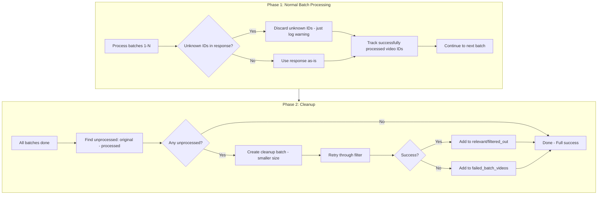

# Resilient Batch Filtering - Graceful Error Handling

## Root Cause Analysis

The error `unknown IDs: ['hqWgZXBOQBw']` happens when the **LLM hallucinates or mistypes a video ID**.

**What actually happened in batch 9:**

```
Sent to LLM:     {A, B, C, D, E, F, G, H, I, J}
LLM returned:    {A, B, C, D, E, F, G, H, I, hqWgZXBOQBw}

missing = {J}           -> LLM forgot video J
unknown = {hqWgZXBOQBw} -> LLM hallucinated this ID
```

**Current behavior:**

- Missing IDs (J) - Handled OK, marked as "Omitted from model response"
- Unknown IDs (hallucinated) - Raises ValueError, triggers retry, then stops everything

**The insight:** The videos exist and were validated. The LLM just made a mistake. We should:

1. Discard hallucinated IDs (they're noise)
2. Track which videos actually got evaluated
3. Retry unprocessed videos at the end in a cleanup batch

## Proposed Solution - Two-Phase Processing



## Implementation Changes

### 1. Change `_parse_and_validate_json_response()` - Ignore Unknown IDs

In [video_filter.py](src/bulk_transcribe/video_filter.py) lines 557-564:

```python
# BEFORE: Raise error on unknown IDs
if unknown:
    raise ValueError(f"ID validation failed: unknown IDs: {sorted(unknown)}")

# AFTER: Log warning and discard hallucinated IDs
if unknown:
    print(f"[AI Filter] Warning: Discarding hallucinated IDs: {sorted(unknown)}")
    for uid in unknown:
        del result[uid]
# Continue - missing IDs already handled above
```

This single change fixes most cases because the LLM typically evaluates most videos correctly.

### 2. Extend `FilteringResult` dataclass

Add fields to track cleanup and partial failures:

```python
@dataclass
class FilteringResult:
    relevant_videos: List[VideoSearchItem]
    filtered_out_videos: List[VideoSearchItem]
    total_processed: int
    success: bool
    error_message: Optional[str] = None
    batch_summaries: Optional[List[Dict[str, Any]]] = None
    # NEW FIELDS:
    failed_batch_videos: Optional[List[VideoSearchItem]] = None  # Videos that couldn't be evaluated
    cleanup_attempted: bool = False  # True if cleanup batch was run
    cleanup_recovered: int = 0  # Number of videos recovered in cleanup
```

### 3. Modify `filter_videos_by_relevance()` - Add Cleanup Phase

In [video_filter.py](src/bulk_transcribe/video_filter.py):

**Phase 1 changes (main loop):**

- Track `processed_ids: Set[str]` for all successfully evaluated videos
- On batch error, log and continue (don't stop)
- Collect unprocessed videos for cleanup

**Phase 2 (new cleanup logic after main loop):**

```python
# After main batch loop completes
all_input_ids = {v.video_id for v in videos}
processed_ids = {v.video_id for v in all_relevant + all_filtered_out}
unprocessed_ids = all_input_ids - processed_ids

if unprocessed_ids:
    unprocessed_videos = [v for v in videos if v.video_id in unprocessed_ids]
    if progress_callback:
        progress_callback(f"cleanup: retrying {len(unprocessed_videos)} unprocessed videos...")
    
    # Retry with smaller batch size for better reliability
    cleanup_batch_size = min(5, len(unprocessed_videos))
    cleanup_result = _retry_unprocessed_videos(
        unprocessed_videos, search_query, research_context, model, api_key, 
        cleanup_batch_size, required_terms
    )
    
    all_relevant.extend(cleanup_result.relevant)
    all_filtered_out.extend(cleanup_result.filtered_out)
    failed_batch_videos.extend(cleanup_result.failed)
```

### 4. Add helper function `_retry_unprocessed_videos()`

New function in [video_filter.py](src/bulk_transcribe/video_filter.py):

```python
def _retry_unprocessed_videos(
    videos: List[VideoSearchItem],
    search_query: str,
    research_context: str,
    model: str,
    api_key: str,
    batch_size: int = 5,
    required_terms: Optional[str] = None,
) -> CleanupResult:
    """
    Retry unprocessed videos with smaller batch size.
    Returns CleanupResult with relevant, filtered_out, and failed lists.
    """
    relevant = []
    filtered_out = []
    failed = []
    
    for i in range(0, len(videos), batch_size):
        batch = videos[i:i + batch_size]
        try:
            r, f, _ = _filter_video_batch(
                batch, search_query, research_context, model, api_key,
                batch_index=f"cleanup_{i // batch_size}",
                required_terms=required_terms
            )
            relevant.extend(r)
            filtered_out.extend(f)
        except Exception:
            # Final fallback - mark as failed
            failed.extend(batch)
    
    return CleanupResult(relevant, filtered_out, failed)
```

### 5. Update UI for partial success

In [01_YouTube_Search.py](pages/01_YouTube_Search.py) lines 1546-1557:

```python
if filter_result and filter_result.success:
    msg = f"Filtered {filter_result.total_processed} videos: {len(filter_result.relevant_videos)} relevant"
    if filter_result.cleanup_recovered > 0:
        msg += f" ({filter_result.cleanup_recovered} recovered in cleanup)"
    st.success(msg)
elif filter_result and filter_result.failed_batch_videos:
    # Partial success - some videos couldn't be evaluated
    st.warning(
        f"Filtered {filter_result.total_processed} videos: "
        f"{len(filter_result.relevant_videos)} relevant, "
        f"{len(filter_result.failed_batch_videos)} could not be evaluated"
    )
    st.rerun()
elif filter_result:
    st.error(f"Filtering failed: {filter_result.error_message}")
```

## Why This Approach Is Safe

1. **Minimal change to happy path**: When LLM returns valid IDs, behavior is unchanged
2. **Graceful degradation**: Hallucinated IDs are discarded, not fatal errors
3. **Automatic recovery**: Unprocessed videos get a second chance with smaller batches
4. **Clear tracking**: Users see exactly how many videos succeeded vs failed
5. **No data loss**: Failed videos are tracked, not silently dropped

## Files to Modify

1. **[src/bulk_transcribe/video_filter.py](src/bulk_transcribe/video_filter.py)**

   - Change unknown ID handling from raise to discard (line 563-564)
   - Extend `FilteringResult` dataclass with new fields
   - Add cleanup phase after main loop
   - Add `_retry_unprocessed_videos()` helper

2. **[pages/01_YouTube_Search.py](pages/01_YouTube_Search.py)**

   - Update success message to show cleanup recovery count
   - Handle partial success state with warning