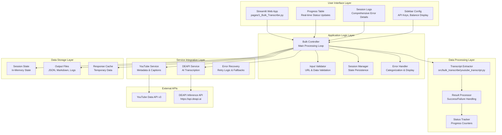
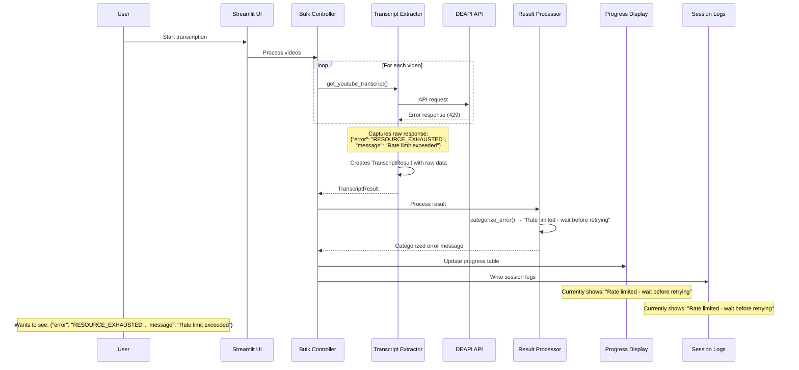
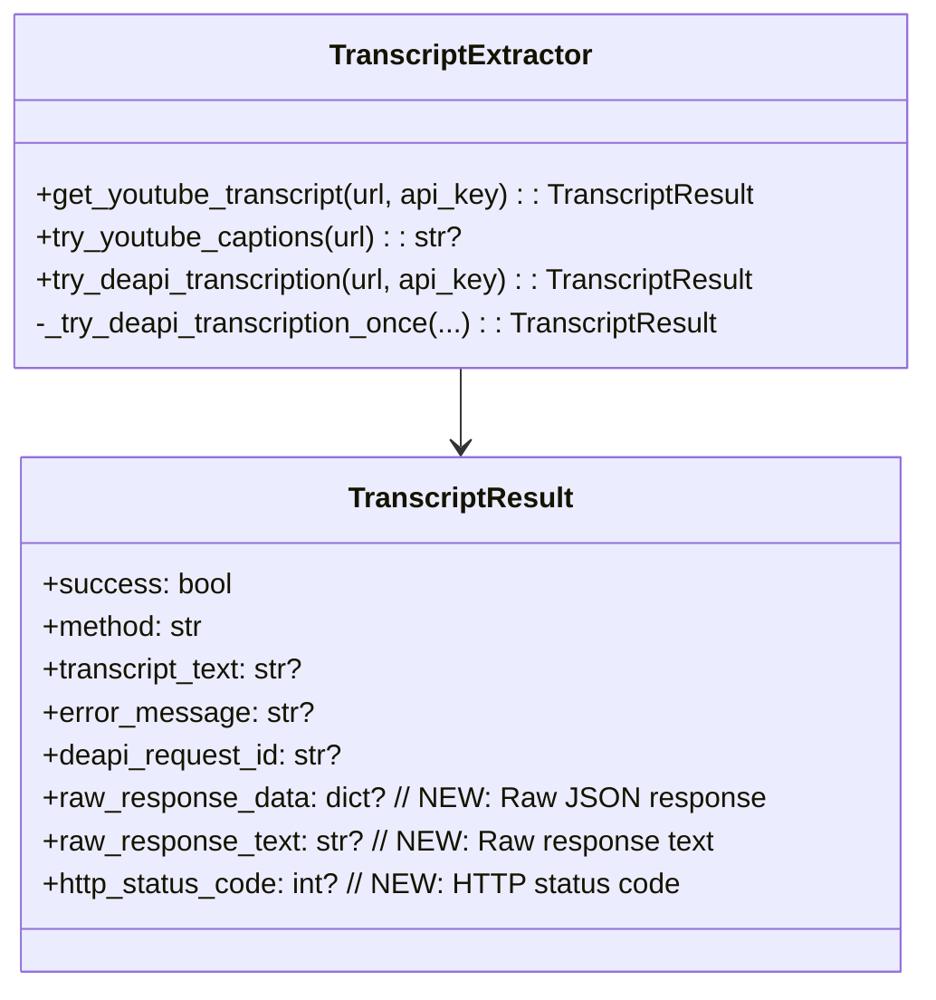
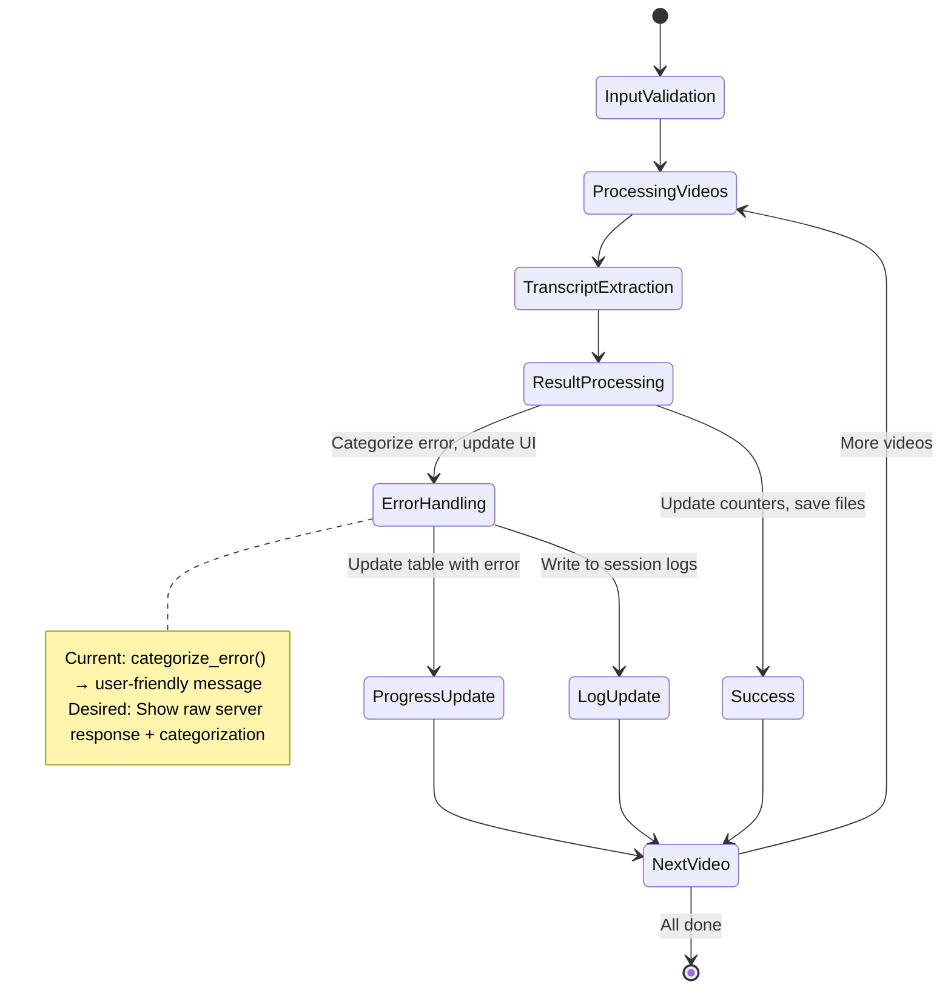
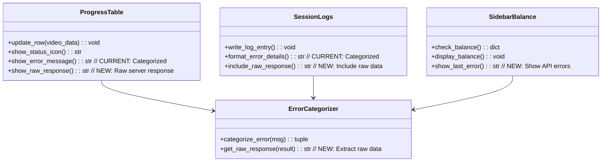

# Complete App Architecture - Bulk Transcribe Tool

## System Overview



## Error Message Flow Analysis

```mermaid
flowchart TD
    A[DEAPI API Call] --> B{HTTP Response}
    B -->|Success 200| C[Process Transcript]
    B -->|Error 4xx/5xx| D[Capture Raw Response]

    D --> E[Store in TranscriptResult]
    E --> F[Return to Controller]

    F --> G[Error Handler Processes]
    G --> H{Current Behavior<br/>Categorize Only}
    G --> I{Desired Behavior<br/>Show Raw + Categorized}

    H --> J[Display Categorized Message<br/>❌ "Rate limited"]
    I --> K[Display Raw Server Response<br/>✅ {"error": "RESOURCE_EXHAUSTED"}]

    J --> L[Progress Table]
    J --> M[Session Logs]
    J --> N[Sidebar Balance]
    J --> O[Console Output]

    K --> L
    K --> M
    K --> N
    K --> O
```

## Data Flow: Error Messages Through System



## Component Interaction Details

### 1. Transcript Extractor (`src/bulk_transcribe/youtube_transcript.py`)



### 2. Bulk Controller (`pages/1_Bulk_Transcribe.py`)



### 3. UI Display Components



## Error Display Locations (All Need Updates)

### 1. **Progress Table** (`pages/1_Bulk_Transcribe.py:635-640`)
```python
video_status.update({
    "Status": f"{status_icon} Failed",
    "Method": transcript_result.method,
    "Error": display_error,  # CURRENT: Categorized message
    "Time": f"{elapsed:.1f}s"
})
```

**Update needed**: Add raw response column or expandable details

### 2. **Session Logs** (`pages/1_Bulk_Transcribe.py:790-810`)
```python
log_lines = [
    f"Session: {session.session_id}",
    # ... other lines ...
    f"Retryable Failures: {rate_limited_count}",
    "",
    "=" * 80,
    "DETAILED STATUS LOG",
    "=" * 80,
]
```

**Update needed**: Include raw server responses in detailed log

### 3. **Console Output** (Terminal/debugging)
**Update needed**: Show raw responses in debug output

### 4. **Error Summary** (`pages/1_Bulk_Transcribe.py:755-760`)
```python
if rate_limited_count > 0:
    st.warning(f"⚠️ {rate_limited_count} videos hit rate limits. Wait 10-15 minutes and try again with just the failed videos.")
```

**Update needed**: Show which specific errors caused rate limiting

## Implementation Strategy

### Phase 1: Data Capture ✅
- [x] Modified `TranscriptResult` class to store raw responses
- [x] Updated all DEAPI function returns to include raw data
- [x] Added HTTP status codes and response text

### Phase 2: UI Updates (In Progress)
- [ ] Modify progress table to show raw responses
- [ ] Add expandable details for full response inspection
- [ ] Update session logs to include raw data
- [ ] Add raw response display in error summaries

### Phase 3: Error Enhancement
- [ ] Create hybrid display: "Rate limited (RESOURCE_EXHAUSTED)"
- [ ] Add "Show Raw Response" buttons/expanders
- [ ] Include request IDs and timestamps in logs
- [ ] Add error export functionality

## Key Technical Changes Required

### 1. Progress Table Enhancement
```python
# Add raw response column or expandable row
"Raw Response": transcript_result.raw_response_text or "N/A",
"Status Code": transcript_result.http_status_code or "N/A"
```

### 2. Session Log Enhancement
```python
# Include raw responses in detailed logs
for status in status_data:
    if "Failed" in status.get("Status", ""):
        log_lines.append(f"Raw Response: {status.get('raw_response', 'N/A')}")
```

### 3. Error Categorization Enhancement
```python
def categorize_error_with_raw(error_msg: str, transcript_result: TranscriptResult) -> dict:
    """Return both categorized message and raw response"""
    return {
        "categorized": categorize_error(error_msg),
        "raw_response": transcript_result.raw_response_text,
        "status_code": transcript_result.http_status_code,
        "request_id": transcript_result.deapi_request_id
    }
```

## Success Criteria

- [ ] **Progress Table**: Shows exact DEAPI server responses for all errors
- [ ] **Session Logs**: Include raw JSON responses in detailed error logs
- [ ] **Error Messages**: Display both user-friendly and exact server responses
- [ ] **Debugging**: Easy access to full API response details for troubleshooting
- [ ] **Transparency**: Users can see exactly what DEAPI servers are returning