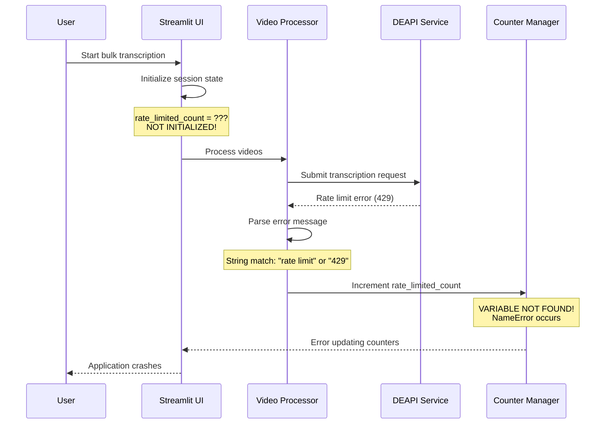
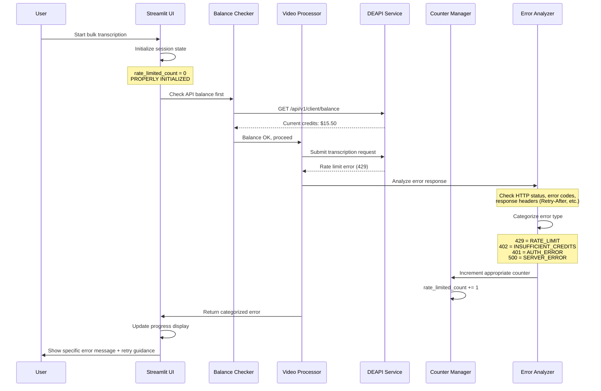
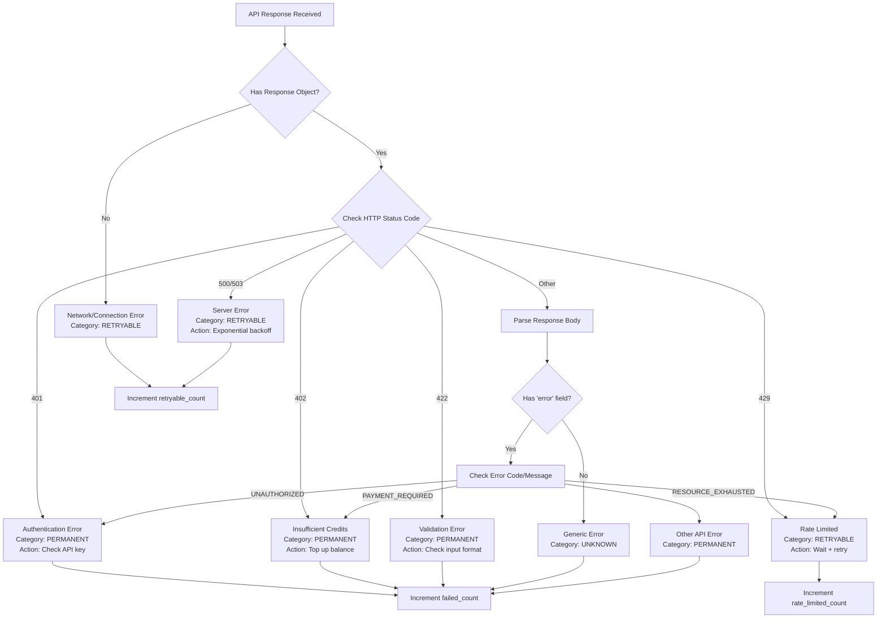
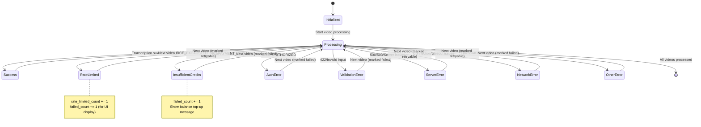
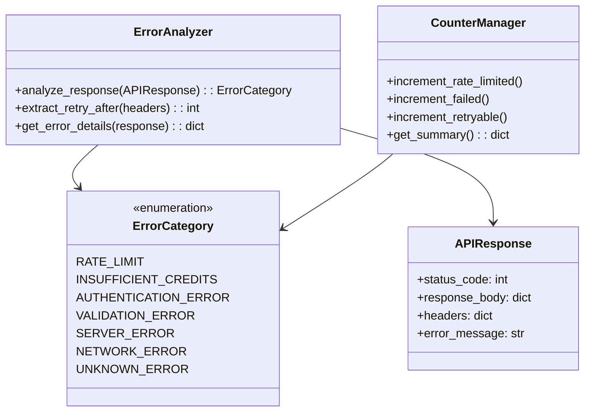

# Error Handling Sequence Analysis

## Current Error Flow (Broken)

```mermaid
sequenceDiagram
    participant User
    participant UI as Streamlit UI
    participant Processor as Video Processor
    participant DEAPI as DEAPI Service
    participant Counter as Counter Manager

    User->>UI: Start bulk transcription
    UI->>UI: Initialize session state
    Note over UI: rate_limited_count = ???<br/>NOT INITIALIZED!

    UI->>Processor: Process videos
    Processor->>DEAPI: Submit transcription request
    DEAPI-->>Processor: Rate limit error (429)

    Processor->>Processor: Parse error message
    Note over Processor: String match: "rate limit" or "429"

    Processor->>Counter: Increment rate_limited_count
    Note over Counter: VARIABLE NOT FOUND!<br/>NameError occurs

    Counter-->>UI: Error updating counters
    UI-->>User: Application crashes
```

## Proposed Fixed Error Flow

```mermaid
sequenceDiagram
    participant User
    participant UI as Streamlit UI
    participant Balance as Balance Checker
    participant Processor as Video Processor
    participant DEAPI as DEAPI Service
    participant Counter as Counter Manager
    participant Analyzer as Error Analyzer

    User->>UI: Start bulk transcription
    UI->>UI: Initialize session state
    Note over UI: rate_limited_count = 0<br/>PROPERLY INITIALIZED

    UI->>Balance: Check API balance first
    Balance->>DEAPI: GET /api/v1/client/balance
    DEAPI-->>Balance: Current credits: $15.50

    Balance->>Processor: Balance OK, proceed

    Processor->>DEAPI: Submit transcription request
    DEAPI-->>Processor: Rate limit error (429)

    Processor->>Analyzer: Analyze error response
    Note over Analyzer: Check HTTP status, error codes,<br/>response headers (Retry-After, etc.)

    Analyzer->>Analyzer: Categorize error type
    Note over Analyzer: 429 = RATE_LIMIT<br/>402 = INSUFFICIENT_CREDITS<br/>401 = AUTH_ERROR<br/>500 = SERVER_ERROR

    Analyzer->>Counter: Increment appropriate counter
    Counter->>Counter: rate_limited_count += 1

    Processor->>UI: Return categorized error
    UI->>UI: Update progress display
    UI->>User: Show specific error message + retry guidance
```

## Error Categorization Logic

```mermaid
flowchart TD
    A[API Response Received] --> B{Has Response Object?}

    B -->|No| C[Network/Connection Error<br/>Category: RETRYABLE]
    B -->|Yes| D{Check HTTP Status Code}

    D -->|401| E[Authentication Error<br/>Category: PERMANENT<br/>Action: Check API key]
    D -->|402| F[Insufficient Credits<br/>Category: PERMANENT<br/>Action: Top up balance]
    D -->|429| G[Rate Limited<br/>Category: RETRYABLE<br/>Action: Wait + retry]
    D -->|422| H[Validation Error<br/>Category: PERMANENT<br/>Action: Check input format]
    D -->|500/503| I[Server Error<br/>Category: RETRYABLE<br/>Action: Exponential backoff]
    D -->|Other| J[Parse Response Body]

    J --> K{Has 'error' field?}
    K -->|Yes| L[Check Error Code/Message]
    K -->|No| M[Generic Error<br/>Category: UNKNOWN]

    L -->|RESOURCE_EXHAUSTED| G
    L -->|PAYMENT_REQUIRED| F
    L -->|UNAUTHORIZED| E
    L --> N[Other API Error<br/>Category: PERMANENT]

    C --> O[Increment retryable_count]
    E --> P[Increment failed_count]
    F --> P
    G --> Q[Increment rate_limited_count]
    H --> P
    I --> O
    M --> P
    N --> P
```

## Counter State Management

```mermaid
stateDiagram-v2
    [*] --> Initialized

    Initialized --> Processing : Start video processing
    Processing --> Success : Transcription successful
    Processing --> RateLimited : 429/RESOURCE_EXHAUSTED
    Processing --> InsufficientCredits : 402/PAYMENT_REQUIRED
    Processing --> AuthError : 401/UNAUTHORIZED
    Processing --> ValidationError : 422/Invalid input
    Processing --> ServerError : 500/503/Server issues
    Processing --> NetworkError : Connection/timeout issues
    Processing --> OtherError : Unknown error types

    Success --> Processing : Next video
    RateLimited --> Processing : Next video (marked retryable)
    InsufficientCredits --> Processing : Next video (marked failed)
    AuthError --> Processing : Next video (marked failed)
    ValidationError --> Processing : Next video (marked failed)
    ServerError --> Processing : Next video (marked retryable)
    NetworkError --> Processing : Next video (marked retryable)
    OtherError --> Processing : Next video (marked failed)

    Processing --> [*] : All videos processed

    note right of RateLimited
        rate_limited_count += 1
        failed_count += 1 (for UI display)
    end note

    note right of InsufficientCredits
        failed_count += 1
        Show balance top-up message
    end note
```

## API Response Analysis

```mermaid
classDiagram
    class APIResponse {
        +status_code: int
        +response_body: dict
        +headers: dict
        +error_message: str
    }

    class ErrorAnalyzer {
        +analyze_response(APIResponse): ErrorCategory
        +extract_retry_after(headers): int
        +get_error_details(response): dict
    }

    class ErrorCategory {
        <<enumeration>>
        RATE_LIMIT
        INSUFFICIENT_CREDITS
        AUTHENTICATION_ERROR
        VALIDATION_ERROR
        SERVER_ERROR
        NETWORK_ERROR
        UNKNOWN_ERROR
    }

    class CounterManager {
        +increment_rate_limited()
        +increment_failed()
        +increment_retryable()
        +get_summary(): dict
    }

    ErrorAnalyzer --> ErrorCategory
    ErrorAnalyzer --> APIResponse
    CounterManager --> ErrorCategory
```