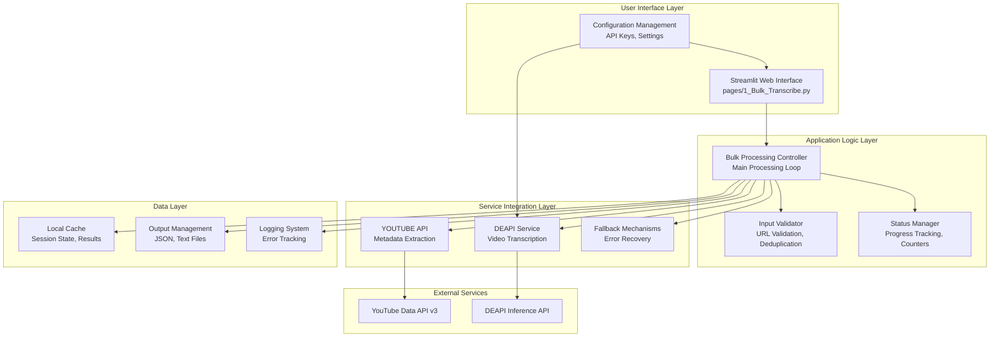
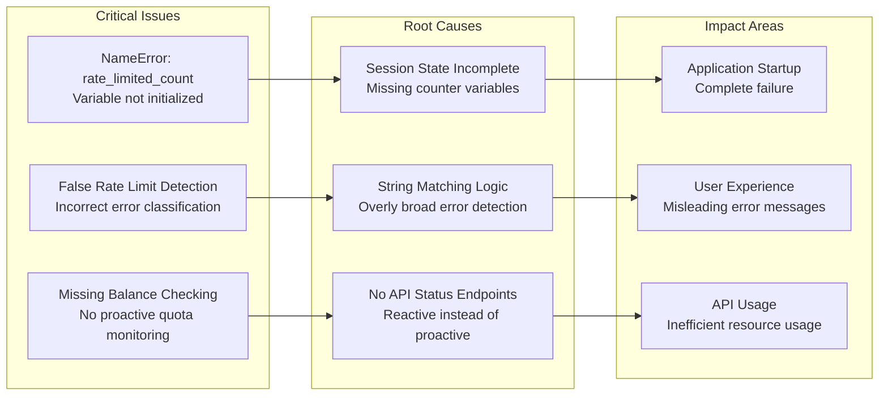
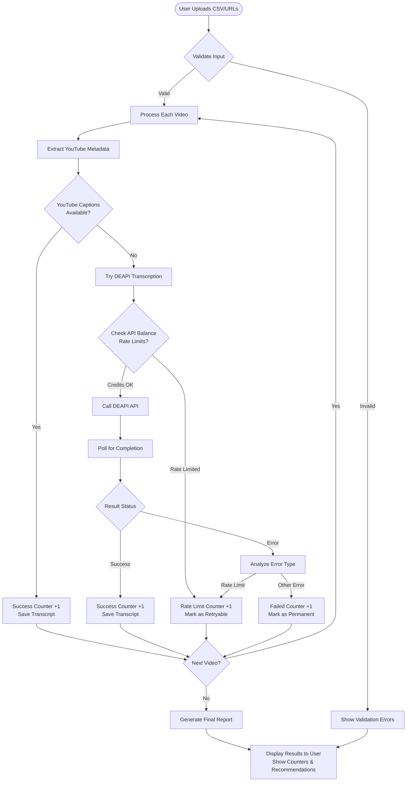
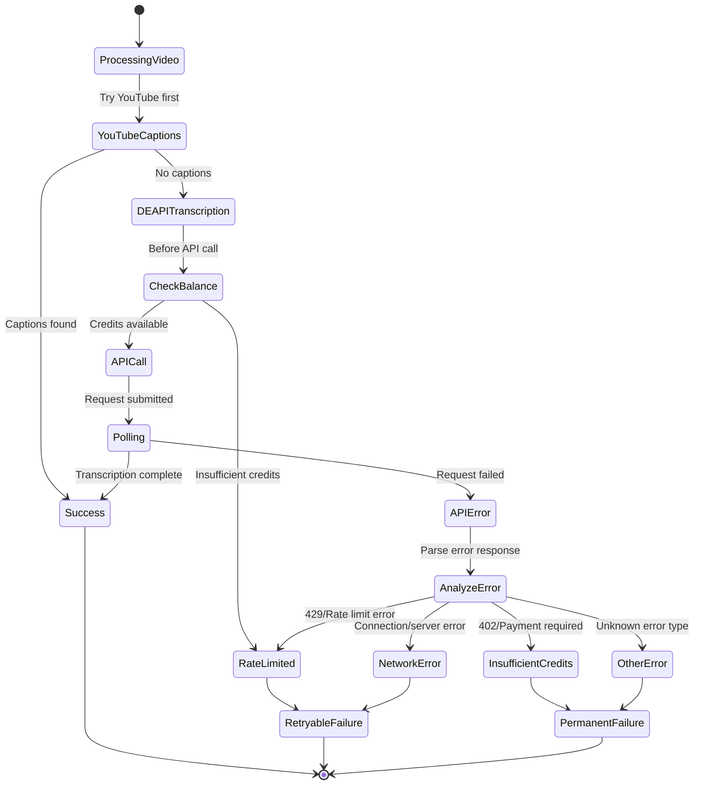
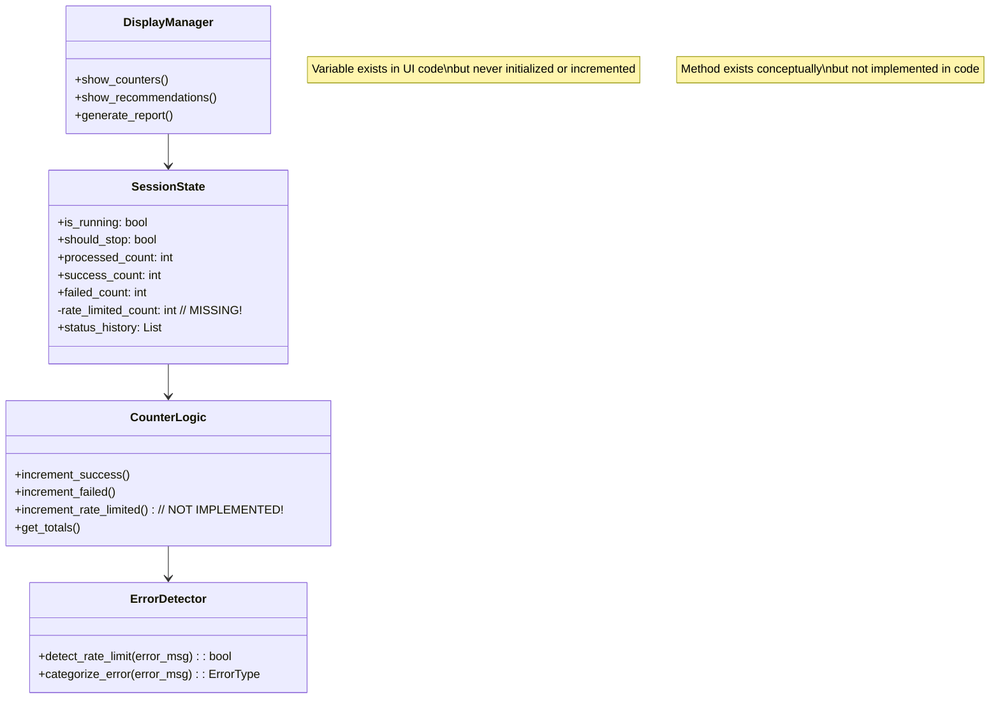
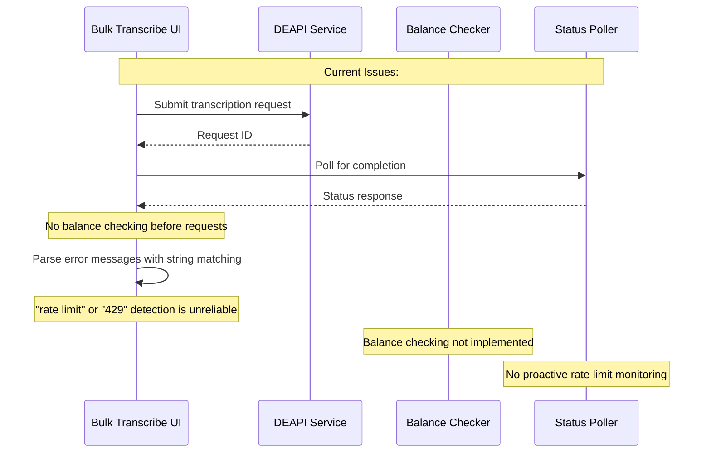

# System Architecture Overview - Bulk Transcribe Tool

## High-Level System Architecture

## Current Issues Mapping

## Data Flow Diagram

## Error Handling Flow

## Counter Management Issues

## DEAPI Integration Issues

