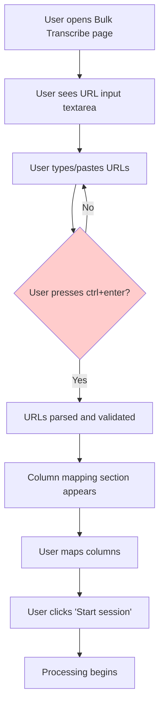
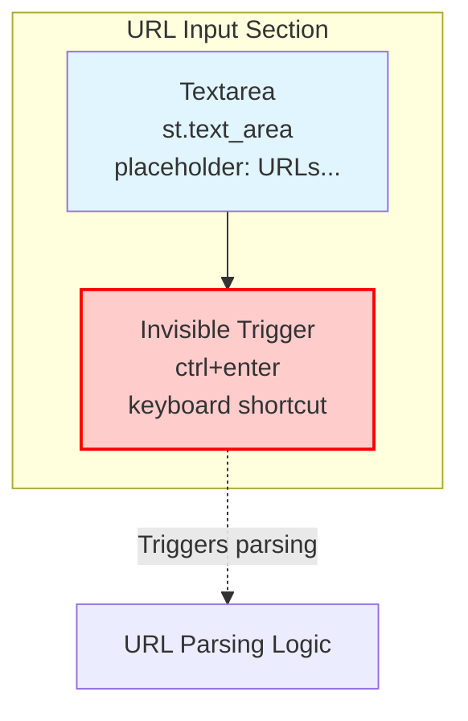

# Current URL Input Flow - UML Strategy

## Current User Interaction Flow



## Current UI Layout



## Problems with Current Design

1. **Hidden Functionality**: ctrl+enter is not visually indicated
2. **Poor Discoverability**: Users may not know how to submit
3. **Accessibility Issues**: Keyboard-only interaction may not be clear
4. **User Expectations**: Modern UIs typically have visible action buttons

## Current Code Structure

```mermaid
classDiagram
    class StreamlitApp {
        +text_area()
        +button()
        +columns()
    }

    class URLInput {
        +parse_urls()
        +validate_urls()
        +create_parsed_sheet()
    }

    StreamlitApp --> URLInput : triggers
    URLInput --> ParsedSheet : creates

    class ParsedSheet {
        +columns: List
        +rows: List
        +row_count: int
    }

    note for StreamlitApp : Current: Only text_area\nNo visible submit button\nctrl+enter = hidden trigger
```