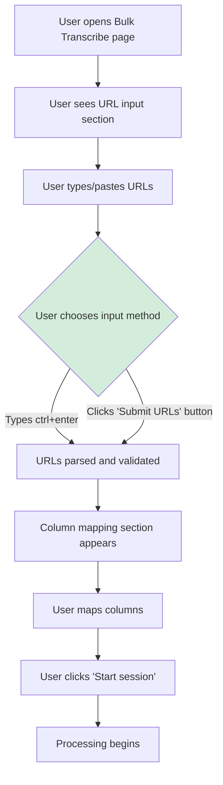
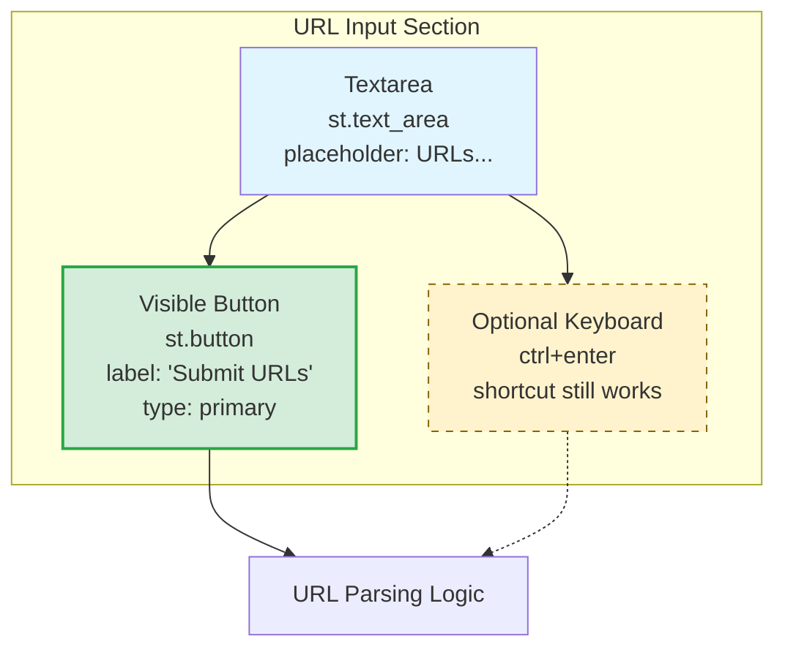
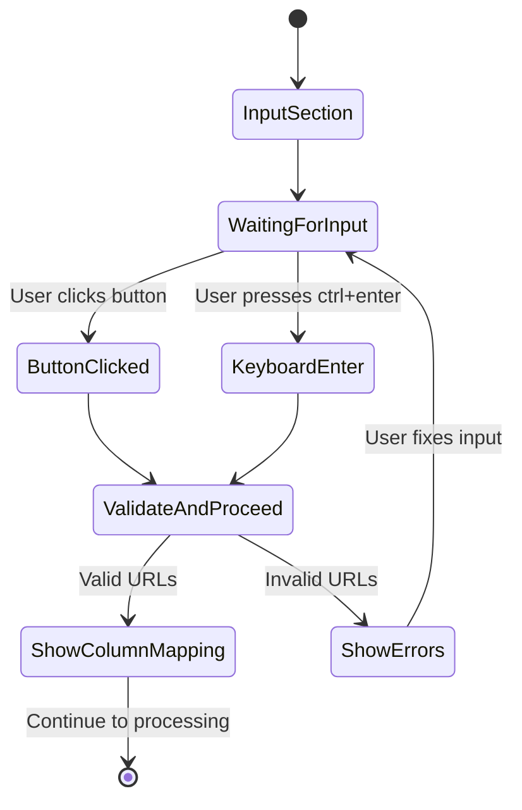

# Proposed URL Input Flow - UML Strategy

## Improved User Interaction Flow



## Proposed UI Layout



## Benefits of Proposed Design

1. **Visible Action**: Clear button indicates how to proceed
2. **Better UX**: Meets user expectations for interactive elements
3. **Accessibility**: Multiple interaction methods (click + keyboard)
4. **Progressive Enhancement**: Button enhances, doesn't replace keyboard shortcut
5. **Clear Intent**: Button text clearly communicates the action

## Proposed Code Structure

```mermaid
classDiagram
    class StreamlitApp {
        +text_area()
        +button()
        +columns()
    }

    class URLInput {
        +parse_urls()
        +validate_urls()
        +create_parsed_sheet()
    }

    class InputTriggers {
        +on_button_click()
        +on_keyboard_enter()
        +validate_and_proceed()
    }

    StreamlitApp --> InputTriggers : multiple triggers
    InputTriggers --> URLInput : unified processing
    URLInput --> ParsedSheet : creates

    class ParsedSheet {
        +columns: List
        +rows: List
        +row_count: int
    }

    note for InputTriggers : New: Unified trigger handling\nButton + Keyboard shortcuts\nConsistent validation flow
```

## Implementation Strategy

### Layout Options

**Option A: Vertical Stack**
```
[Textarea]
[Submit URLs Button]
```

**Option B: Horizontal Layout**
```
[Textarea] [Button]
```

**Option C: Button Below with Help Text**
```
[Textarea]
[Submit URLs Button]
[Help: or press ctrl+enter]
```

### Recommended Approach: Option A
- Clean, simple layout
- Button clearly associated with textarea
- Maintains existing help text in textarea
- Progressive enhancement (button adds clarity, doesn't replace functionality)

## Event Handling Strategy



## Error Handling

- **Empty Input**: Show warning, keep button enabled
- **Invalid URLs**: Show validation errors, allow retry
- **Network Issues**: Handle gracefully, show appropriate messages
- **Both Triggers**: Same error handling for button and keyboard input