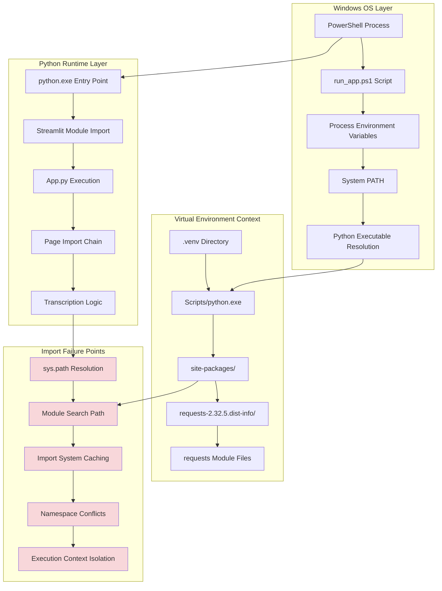
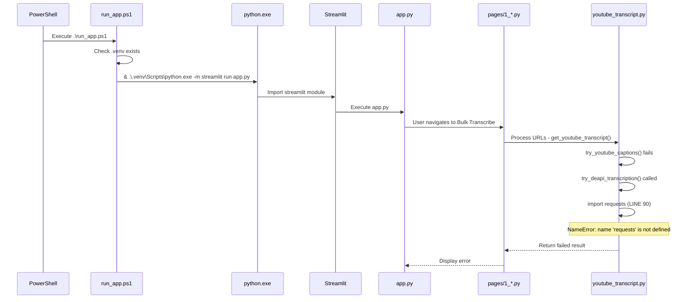
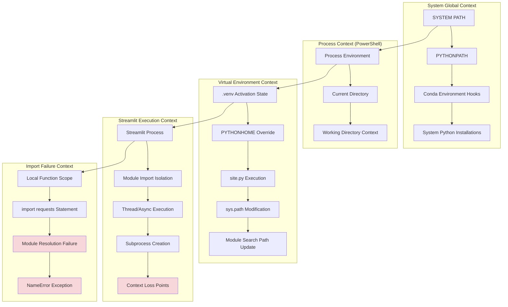
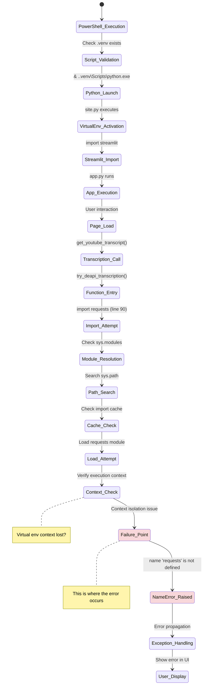
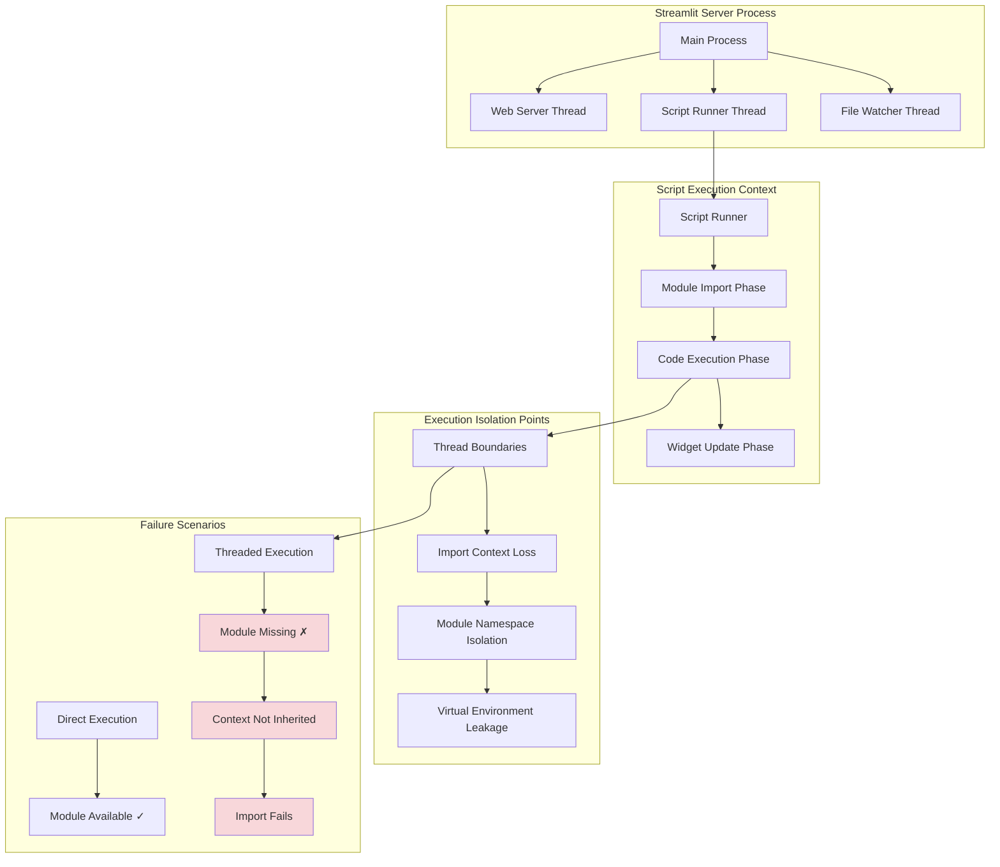
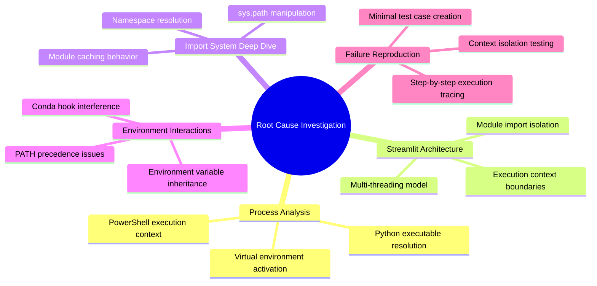

# Comprehensive System Architecture Analysis
## DEAPI Requests Import Error - Complete System View

## Process Execution Flow Analysis

## Environment Context Boundaries

## Module Loading Sequence Analysis

## Streamlit Internal Architecture

## Root Cause Hypothesis Matrix

| Hypothesis | Evidence | Test Method | Likelihood |
|------------|----------|-------------|------------|
| **Virtual Environment Context Loss** | run_app.ps1 uses correct path, but error still occurs | Check sys.executable in failing context | High |
| **Streamlit Thread Isolation** | Import happens in function scope within Streamlit execution | Test import in different thread contexts | High |
| **Module Caching Conflict** | Previous imports or cached modules interfering | Clear import cache and test | Medium |
| **PATH Resolution Issue** | Conda hooks interfering with executable resolution | Check PATH order and resolution | Medium |
| **Streamlit Configuration Override** | Streamlit configured to use different Python | Check .streamlit/config.toml | Low |

## Detailed Investigation Plan

