# Comprehensive UML System Diagrams - Bulk Transcribe Application

## 1. System Context Diagram

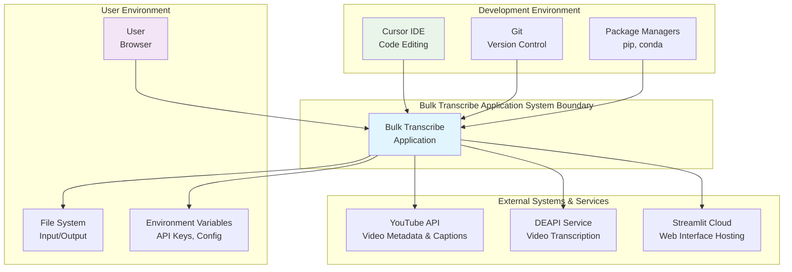

## 2. System Architecture - Component View

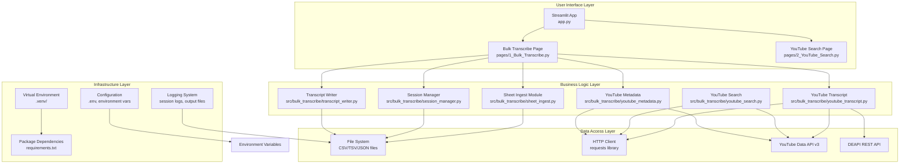

## 3. Process Execution Architecture

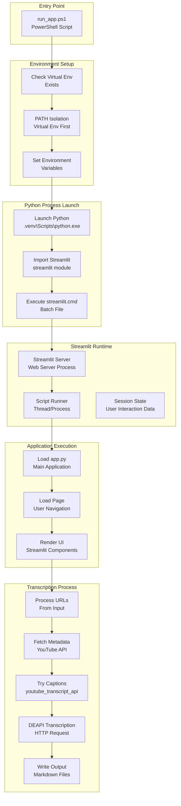

## 4. Component Relationship Diagram (Modules)

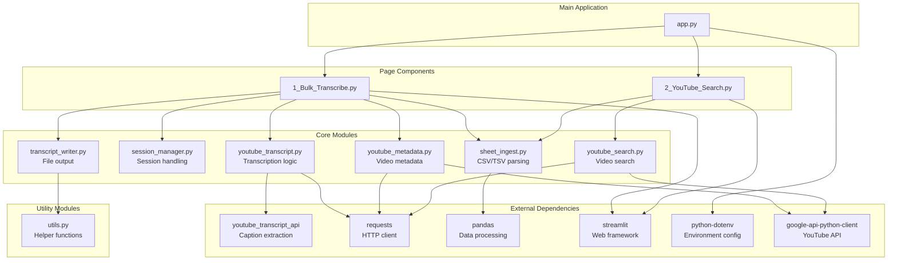

## 5. Data Flow Diagram

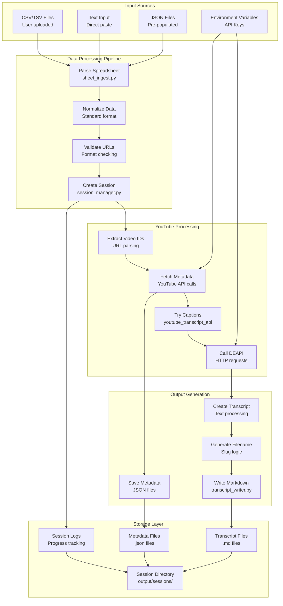

## 6. Environment Context Diagram

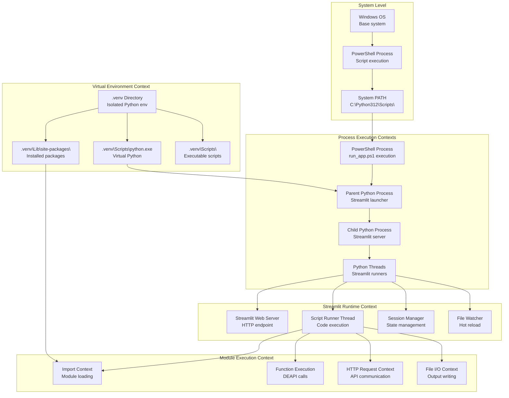

## 7. Error Propagation Diagram

```mermaid
graph TD
    subgraph "Entry Points"
        PS_SCRIPT_FAIL[run_app.ps1 Failure<br/>Virtual env not found]
        PY_LAUNCH_FAIL[Python Launch Failure<br/>Executable not found]
        IMPORT_FAIL[Import Failure<br/>Module not found]
    end

    subgraph "Streamlit Layer Errors"
        ST_START_FAIL[Streamlit Start Failure<br/>Port binding, config]
        ST_EXEC_FAIL[Script Execution Failure<br/>Syntax errors, runtime]
        ST_RENDER_FAIL[UI Render Failure<br/>Component errors]
    end

    subgraph "Application Layer Errors"
        FILE_PARSE_FAIL[File Parsing Failure<br/>Invalid CSV/TSV]
        URL_VALID_FAIL[URL Validation Failure<br/>Malformed URLs]
        API_KEY_FAIL[API Key Missing<br/>DEAPI_API_KEY not set]
    end

    subgraph "YouTube Processing Errors"
        YT_API_FAIL[YouTube API Failure<br/>Quota, auth, network]
        CAPTION_FAIL[Caption Extraction Failure<br/>No captions available]
        VID_PRIVATE[Video Privacy Failure<br/>Private/deleted videos]
    end

    subgraph "DEAPI Layer Errors"
        REQUESTS_IMPORT_FAIL[requests Import Failure<br/>Module resolution]
        HTTP_CONN_FAIL[HTTP Connection Failure<br/>Network, timeout]
        API_AUTH_FAIL[API Authentication Failure<br/>Invalid API key]
        API_QUOTA_FAIL[API Quota Failure<br/>Rate limits, credits]
    end

    subgraph "Output Layer Errors"
        FILE_WRITE_FAIL[File Write Failure<br/>Permissions, disk space]
        DIR_CREATE_FAIL[Directory Creation Failure<br/>Path issues]
        ENCODE_FAIL[Encoding Failure<br/>Unicode issues]
    end

    subgraph "User Experience"
        UI_ERROR_DISPLAY[UI Error Display<br/>Streamlit error messages]
        LOG_ERROR_WRITE[Log Error Writing<br/>Session log files]
        PARTIAL_SUCCESS[Partial Success<br/>Some URLs work, some fail]
    end

    PS_SCRIPT_FAIL --> UI_ERROR_DISPLAY
    PY_LAUNCH_FAIL --> UI_ERROR_DISPLAY
    IMPORT_FAIL --> LOG_ERROR_WRITE

    ST_START_FAIL --> UI_ERROR_DISPLAY
    ST_EXEC_FAIL --> UI_ERROR_DISPLAY
    ST_RENDER_FAIL --> UI_ERROR_DISPLAY

    FILE_PARSE_FAIL --> UI_ERROR_DISPLAY
    URL_VALID_FAIL --> UI_ERROR_DISPLAY
    API_KEY_FAIL --> UI_ERROR_DISPLAY

    YT_API_FAIL --> LOG_ERROR_WRITE
    CAPTION_FAIL --> DEAPI Layer Errors
    VID_PRIVATE --> LOG_ERROR_WRITE

    REQUESTS_IMPORT_FAIL --> LOG_ERROR_WRITE
    HTTP_CONN_FAIL --> LOG_ERROR_WRITE
    API_AUTH_FAIL --> LOG_ERROR_WRITE
    API_QUOTA_FAIL --> LOG_ERROR_WRITE

    FILE_WRITE_FAIL --> LOG_ERROR_WRITE
    DIR_CREATE_FAIL --> LOG_ERROR_WRITE
    ENCODE_FAIL --> LOG_ERROR_WRITE

    LOG_ERROR_WRITE --> PARTIAL_SUCCESS
```

## 8. Class Hierarchy Diagram

```mermaid
classDiagram
    class AppConfig {
        +output_root: str
        +deapi_api_key_present: bool
    }

    class ParsedSheet {
        +columns: List[str]
        +rows: List[Dict]
        +row_count: int
    }

    class ColumnMapping {
        +source_type: str
        +youtube_url: str
        +mp3_url: str
        +title: str
        +description: str
        +episode_url: str
    }

    class SessionConfig {
        +output_root: str
    }

    class SessionManager {
        +config: SessionConfig
        +create_session(): Session
        +write_items_csv(path, rows)
        +write_manifest(path, data)
        +read_manifest(path): Dict
    }

    class TranscriptResult {
        +success: bool
        +method: str
        +transcript_text: Optional[str]
        +error_message: Optional[str]
        +deapi_request_id: Optional[str]
    }

    AppConfig ||--o ParsedSheet
    ParsedSheet ||--o ColumnMapping
    SessionConfig ||--o SessionManager
    SessionManager --> Session

    note for TranscriptResult "Result of transcription attempts\nContains success status, method used,\nand either transcript text or error message"
```

## 9. Module Dependency Diagram

```mermaid
graph TD
    subgraph "Entry Points"
        APP_PY[app.py<br/>Main entry]
        RUN_PS1[run_app.ps1<br/>Launcher script]
    end

    subgraph "Core Application"
        BT_PAGE[pages/1_Bulk_Transcribe.py<br/>Main UI]
        YS_PAGE[pages/2_YouTube_Search.py<br/>Search UI]
    end

    subgraph "Business Logic"
        SHEET_ING[src/bulk_transcribe/sheet_ingest.py<br/>Data parsing]
        SESS_MGR[src/bulk_transcribe/session_manager.py<br/>Session mgmt]
        YT_TRANS[src/bulk_transcribe/youtube_transcript.py<br/>Transcription]
        YT_META[src/bulk_transcribe/youtube_metadata.py<br/>Metadata]
        YT_SEARCH[src/bulk_transcribe/youtube_search.py<br/>Search]
        TRANS_WR[src/bulk_transcribe/transcript_writer.py<br/>Output]
        UTILS[src/bulk_transcribe/utils.py<br/>Utilities]
    end

    subgraph "External Libraries"
        STREAMLIT[streamlit<br/>Web framework]
        PANDAS[pandas<br/>Data processing]
        REQUESTS[requests<br/>HTTP client]
        YT_TRANSCRIPT_API[youtube_transcript_api<br/>Caption extraction]
        GOOGLE_API[google-api-python-client<br/>YouTube API]
        DOTENV[python-dotenv<br/>Config]
        OPENPYXL[openpyxl<br/>Excel support]
    end

    subgraph "Standard Library"
        OS[os<br/>File system]
        JSON[json<br/>Data format]
        DATETIME[datetime<br/>Time handling]
        PATHLIB[pathlib<br/>Path handling]
        SUBPROCESS[subprocess<br/>Process execution]
        THREADING[threading<br/>Concurrency]
    end

    RUN_PS1 --> APP_PY
    APP_PY --> BT_PAGE
    APP_PY --> YS_PAGE

    BT_PAGE --> SHEET_ING
    BT_PAGE --> SESS_MGR
    BT_PAGE --> YT_TRANS
    BT_PAGE --> YT_META
    BT_PAGE --> TRANS_WR

    YS_PAGE --> YT_SEARCH
    YS_PAGE --> SHEET_ING

    YT_TRANS --> YT_TRANSCRIPT_API
    YT_TRANS --> REQUESTS

    YT_META --> REQUESTS
    YT_META --> GOOGLE_API

    YT_SEARCH --> REQUESTS
    YT_SEARCH --> GOOGLE_API

    SHEET_ING --> PANDAS
    SHEET_ING --> OPENPYXL

    TRANS_WR --> UTILS

    APP_PY --> DOTENV
    APP_PY --> STREAMLIT
    BT_PAGE --> STREAMLIT
    YS_PAGE --> STREAMLIT

    YT_TRANS --> OS
    YT_TRANS --> JSON
    YT_TRANS --> DATETIME
    YT_TRANS --> SUBPROCESS
    YT_TRANS --> THREADING

    SESS_MGR --> OS
    SESS_MGR --> JSON
    SESS_MGR --> DATETIME

    TRANS_WR --> OS
    TRANS_WR --> PATHLIB
```

## 10. State Transition Diagram (Transcription Process)

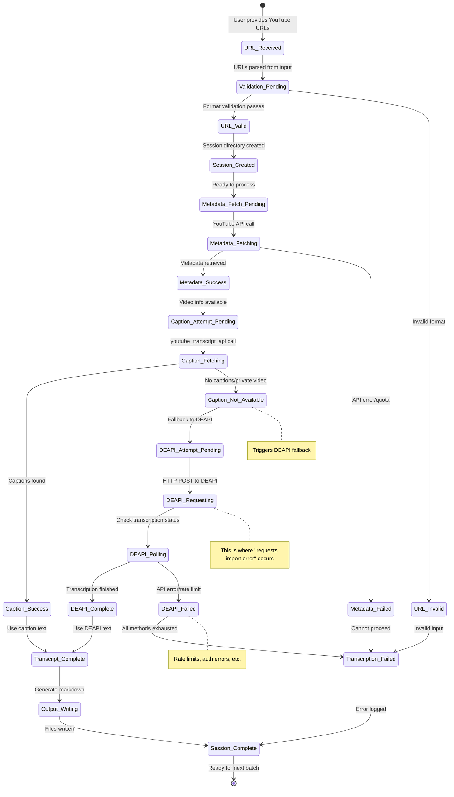

## 11. Sequence Diagram - Complete Request Flow

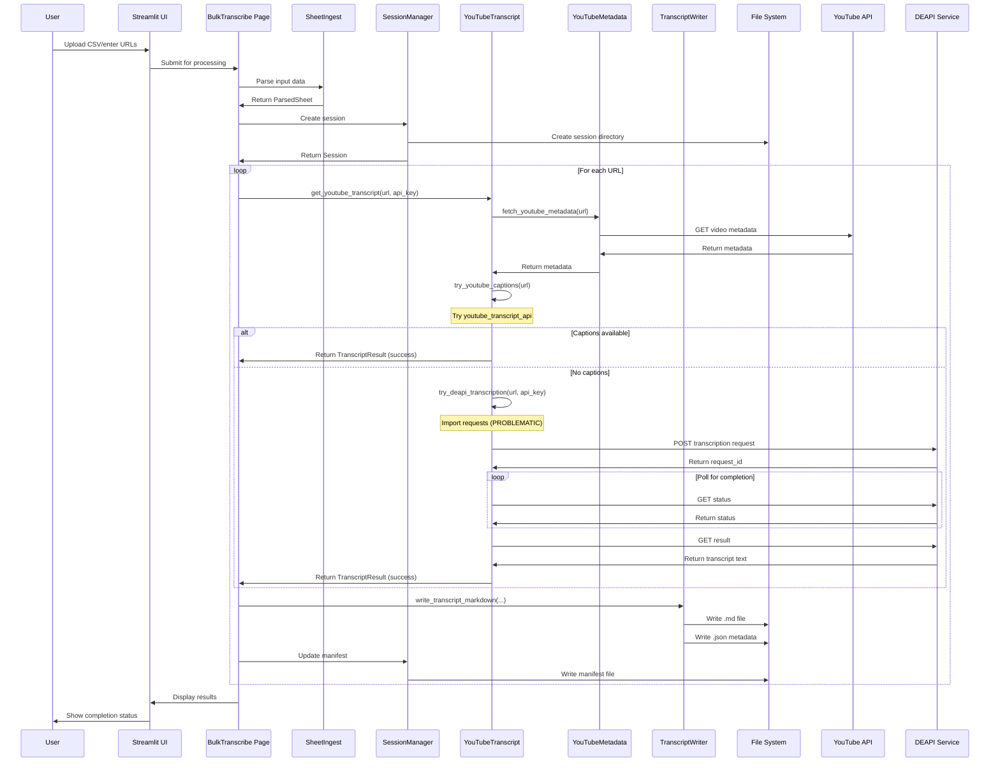

## 12. Deployment Architecture

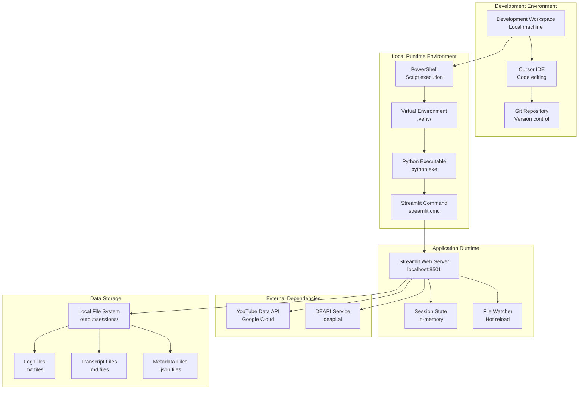

## 13. Security Architecture

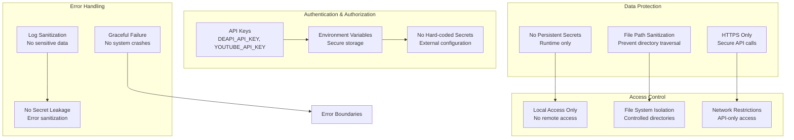

## 14. Performance Architecture

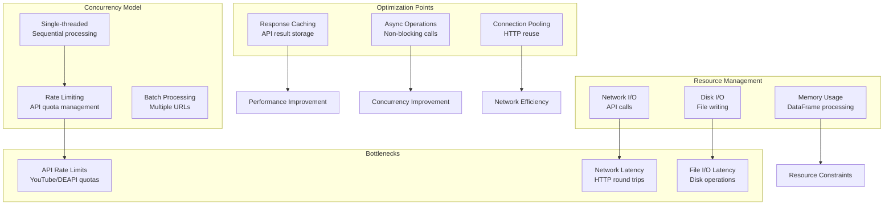

These comprehensive UML diagrams provide a complete view of the Bulk Transcribe application architecture, showing all components, their relationships, data flows, error paths, and execution contexts. This should help identify any remaining issues with the DEAPI import error that weren't addressed by the previous fix attempts.