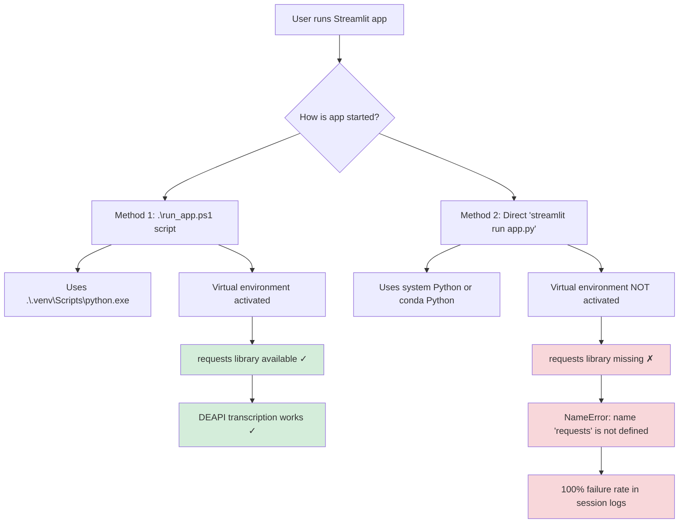
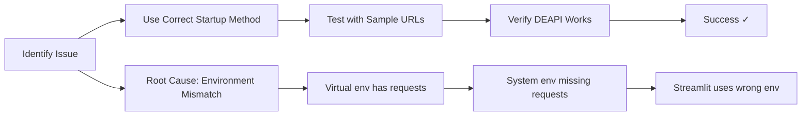

# DEAPI Requests Import Error - Root Cause Analysis

## Issue Flow Diagram

## Environment Setup Status

### ✅ What's Working
- Virtual environment exists at `.venv\`
- All dependencies installed in virtual environment
- `requests` library available (version 2.32.5)
- `run_app.ps1` script correctly uses virtual environment
- DEAPI integration code is correct

### ❌ What's Broken
- Streamlit app not running in virtual environment
- User likely running `streamlit run app.py` directly instead of `.\run_app.ps1`

## Solution Steps

## Prevention

To avoid this issue in the future:

1. **Always use the startup script**: `.\run_app.ps1`
2. **Never run directly**: Avoid `streamlit run app.py`
3. **Check environment**: Add environment validation in the app
4. **Document requirements**: Update README with proper startup instructions

## Testing Verification

After fix is applied:
- Run `.\run_app.ps1`
- Upload sample YouTube URLs from `tests/sample_youtube_URL_list.md`
- Verify transcription succeeds (not fails with requests error)
- Check session logs show success rate > 0%