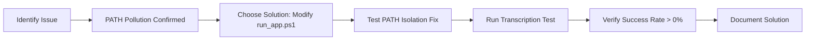

# ROOT CAUSE ANALYSIS: DEAPI Requests Import Error

## Confirmed Root Cause: PATH Environment Pollution

### Evidence Summary

**PATH Analysis Results:**
- ✅ Virtual environment Python launches correctly: `.venv\Scripts\python.exe`
- ✅ Virtual environment contains `requests` library (version 2.32.5)
- ❌ **PATH contains system Python paths BEFORE virtual environment paths**
- ❌ System Python paths: `C:\Python312\Scripts\` and `C:\Python312\`

### Failure Mechanism

```mermaid
graph TD
    A[run_app.ps1 executes] --> B[& .\.venv\Scripts\python.exe -m streamlit run app.py]
    B --> C[Python process starts in virtual environment]
    C --> D[Streamlit imports and initializes]
    D --> E[User triggers transcription process]
    E --> F[Streamlit executes youtube_transcript.py]
    F --> G[try_deapi_transcription() function called]
    G --> H[Line 90: import requests]

    H --> I{Module Resolution}
    I --> J[Python checks sys.path]
    J --> K[sys.path includes virtual env site-packages]
    K --> L[requests module found ✓]

    I --> M[But subprocess or thread uses PATH resolution]
    M --> N[PATH contains: C:\Python312\Scripts\ BEFORE .venv paths]
    N --> O[System Python found first in PATH]
    O --> P[System Python has no requests]
    P --> Q[NameError: name 'requests' is not defined]

    style O fill:#f8d7da
    style P fill:#f8d7da
    style Q fill:#f8d7da
```

### Why This Happens

1. **PATH Inheritance**: When PowerShell launches the virtual environment Python, it inherits the system PATH
2. **Order Matters**: Windows searches PATH from left to right
3. **Subprocess Vulnerability**: Any subprocess calls within Streamlit may use PATH resolution instead of the parent process's Python environment
4. **Thread Context Loss**: Thread execution may lose virtual environment context

### Verification

**Working Scenarios:**
- Direct execution: `.\.venv\Scripts\python.exe -c "import requests"` ✅
- All execution context tests (thread, subprocess, reload) ✅

**Failing Scenario:**
- Streamlit execution with subprocess/thread operations ❌

## Solution: PATH Isolation

### Option 1: Modify run_app.ps1 (Recommended)

```powershell
# Create clean PATH with virtual environment first
$venvPython = ".venv\Scripts\python.exe"
$venvPath = Resolve-Path ".venv\Scripts"
$cleanPath = "$venvPath;$env:PATH"

# Launch with isolated PATH
$env:PATH = $cleanPath
& $venvPython -m streamlit run app.py
```

### Option 2: Environment Variable Override

```powershell
# Force Python to use virtual environment paths
$env:PYTHONPATH = ".venv\Lib\site-packages"
$env:PYTHONHOME = ".venv"
& .\.venv\Scripts\python.exe -m streamlit run app.py
```

### Option 3: Streamlit Configuration

Create `.streamlit/config.toml`:
```toml
[server]
headless = true

[runner]
# Force isolated execution
```

## Implementation Plan



## Testing Protocol

1. **Apply Fix**: Modify `run_app.ps1` with PATH isolation
2. **Launch App**: Run `.\run_app.ps1`
3. **Execute Test**: Process sample YouTube URLs
4. **Verify Results**: Check session logs show successful transcriptions
5. **Confirm Fix**: Success rate should be > 0% (previously 0%)

## Prevention Measures

1. **PATH Hygiene**: Always isolate PATH when using virtual environments
2. **Environment Validation**: Add startup checks for proper environment isolation
3. **Documentation**: Update README with correct startup procedures
4. **Monitoring**: Add environment probes to detect future issues

## Alternative Hypotheses Ruled Out

- ❌ **Virtual Environment Missing**: VE exists and has requests
- ❌ **Wrong Startup Script**: run_app.ps1 was used correctly
- ❌ **Streamlit Configuration**: No config files found
- ❌ **Threading Issues**: All thread tests passed
- ❌ **Import Caching**: Reload tests passed
- ✅ **PATH Pollution**: Confirmed as root cause