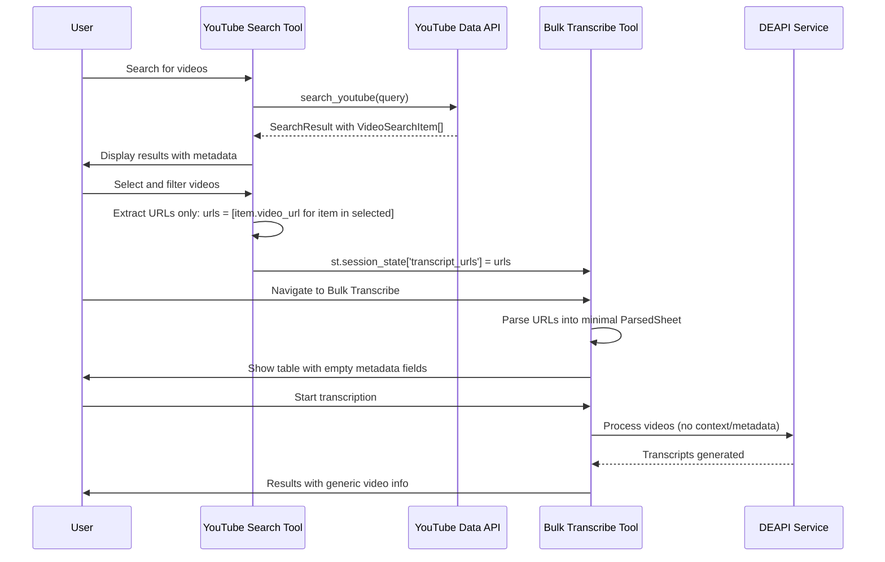
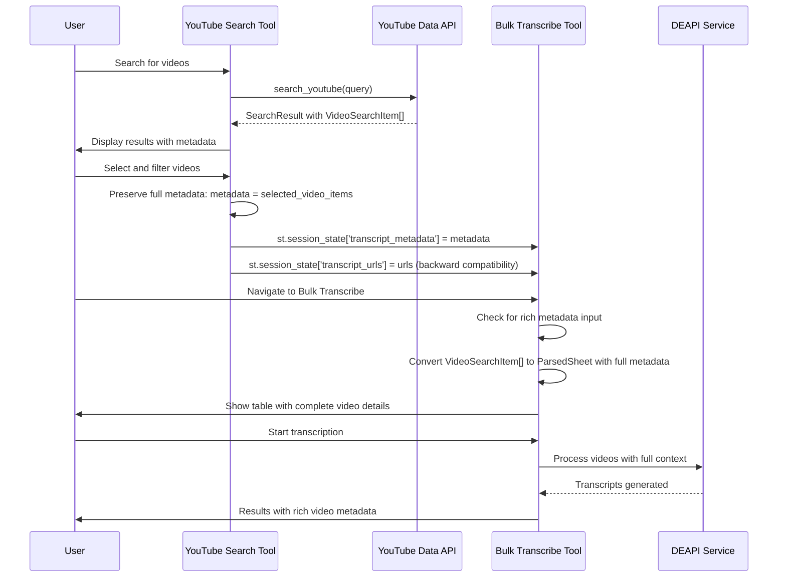
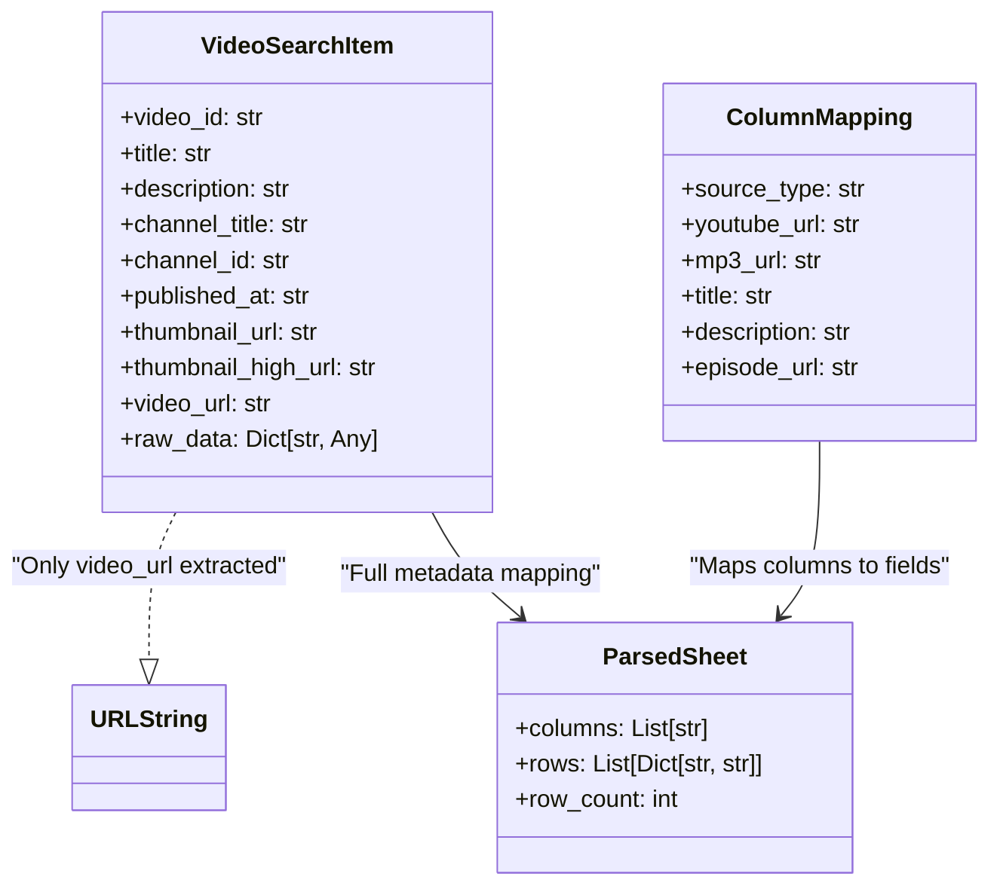
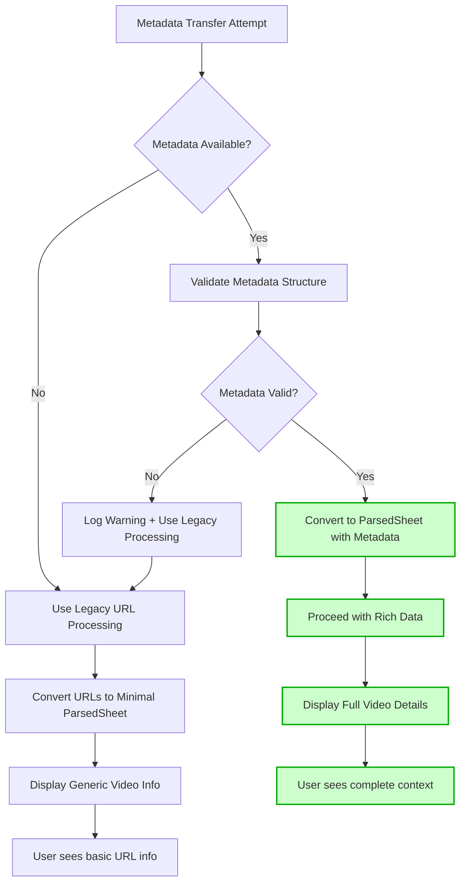
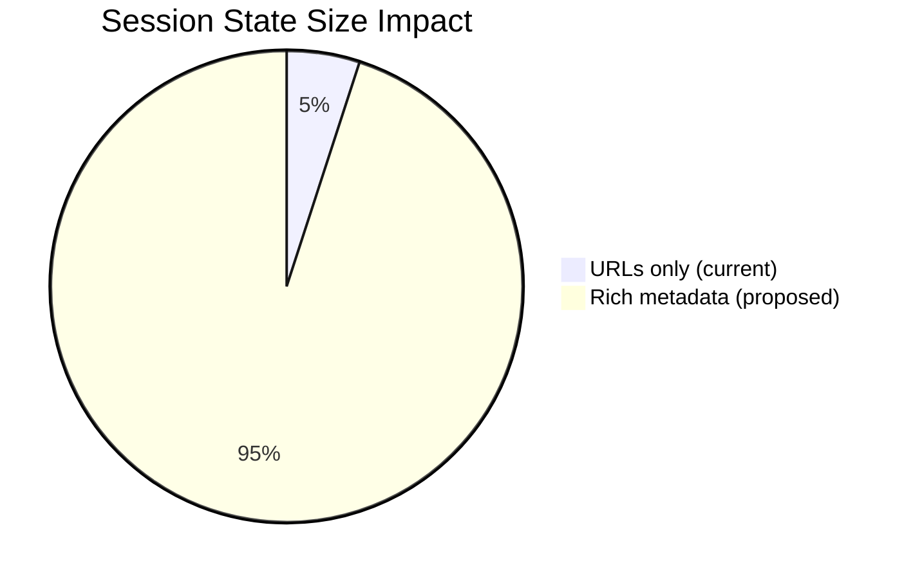
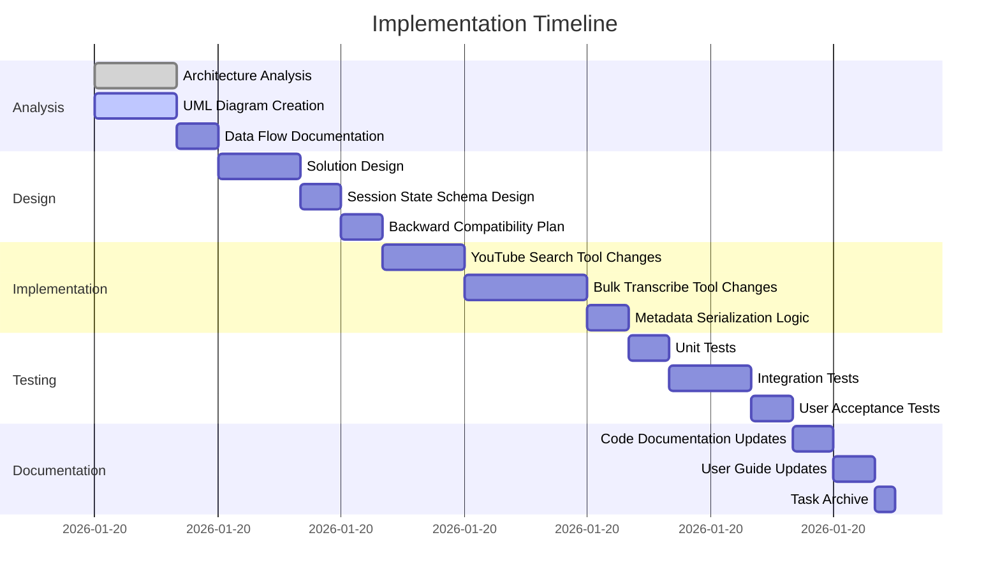

# Data Flow Diagrams: YouTube Search to Bulk Transcribe Metadata Preservation

## Current Problematic Data Flow



## Current Data Structure Flow

```mermaid
flowchart TD
    A[YouTube Data API] --> B[VideoSearchItem]
    B --> C{User Selection}
    C --> D[Extract URLs Only]
    D --> E[st.session_state['transcript_urls']]
    E --> F[Bulk Transcribe Input]
    F --> G[Parse URLs to ParsedSheet]
    G --> H[Normalized Rows with Empty Fields]
    H --> I[Transcription Processing]

    style D fill:#ffcccc,stroke:#ff0000,stroke-width:2px
    style H fill:#ffcccc,stroke:#ff0000,stroke-width:2px
```

## Proposed Solution Data Flow



## Proposed Data Structure Flow

```mermaid
flowchart TD
    A[YouTube Data API] --> B[VideoSearchItem]
    B --> C{User Selection}
    C --> D[Preserve Full Metadata]
    D --> E[st.session_state['transcript_metadata']]
    D --> F[st.session_state['transcript_urls'] - Legacy]
    E --> G{Bulk Transcribe Input Handler}
    F --> G
    G --> H{Rich Metadata Available?}
    H -->|Yes| I[Convert to ParsedSheet with Metadata]
    H -->|No| J[Parse URLs to Minimal ParsedSheet]
    I --> K[Normalized Rows with Full Fields]
    J --> L[Normalized Rows with Empty Fields]
    K --> M[Transcription Processing with Context]
    L --> M

    style D fill:#ccffcc,stroke:#00aa00,stroke-width:2px
    style I fill:#ccffcc,stroke:#00aa00,stroke-width:2px
    style K fill:#ccffcc,stroke:#00aa00,stroke-width:2px
```

## Class Diagram: Current vs Proposed



## Session State Schema Evolution

```mermaid
stateDiagram-v2
    [*] --> Current: Simple URL transfer

    state Current as "Current Session State"
    state Proposed as "Proposed Session State"

    Current --> Proposed: Add metadata preservation

    state "st.session_state['transcript_urls']: List[str]" as CurrentURLs
    state "st.session_state['transcript_metadata']: List[VideoSearchItem]" as NewMetadata
    state "st.session_state['transcript_source']: str" as NewSource

    Current --> CurrentURLs
    Proposed --> CurrentURLs: Backward compatibility
    Proposed --> NewMetadata
    Proposed --> NewSource

    note right of Proposed
        Enhanced session state
        maintains backward compatibility
        while adding rich metadata
    end note
```

## Data Transformation Pipeline

```mermaid
flowchart LR
    subgraph "YouTube Search Tool"
        A[VideoSearchItem[]] --> B[User Selection]
        B --> C[Filter by criteria]
        C --> D[Extract for transfer]
    end

    subgraph "Data Transfer"
        D --> E[Serialize to session state]
        E --> F[st.session_state['transcript_metadata']]
        D --> G[Legacy URL extraction]
        G --> H[st.session_state['transcript_urls']]
    end

    subgraph "Bulk Transcribe Tool"
        F --> I[Deserialize from session state]
        H --> J[Legacy URL processing]
        I --> K[Convert to ParsedSheet format]
        J --> L[Convert to minimal ParsedSheet]
        K --> M[Column mapping with rich data]
        L --> N[Column mapping with empty fields]
    end

    subgraph "Processing Pipeline"
        M --> O[Normalized rows with metadata]
        N --> P[Normalized rows without metadata]
        O --> Q[Transcription with context]
        P --> Q
    end

    style F fill:#ccffcc,stroke:#00aa00,stroke-width:2px
    style K fill:#ccffcc,stroke:#00aa00,stroke-width:2px
    style M fill:#ccffcc,stroke:#00aa00,stroke-width:2px
    style O fill:#ccffcc,stroke:#00aa00,stroke-width:2px
```

## Error Handling Flow



## Performance Impact Analysis



