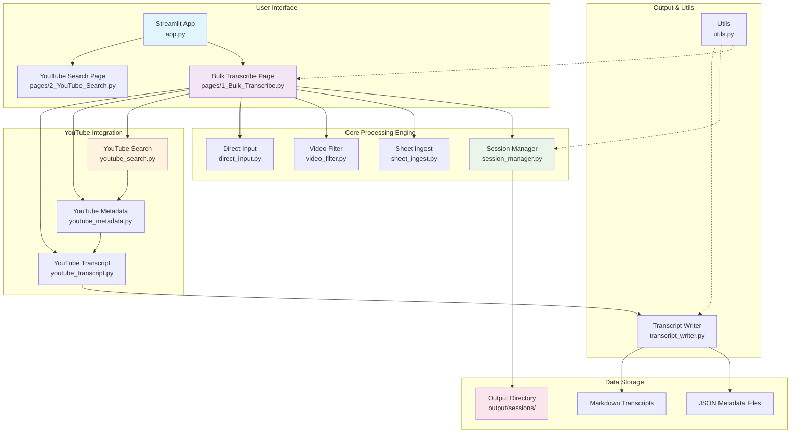
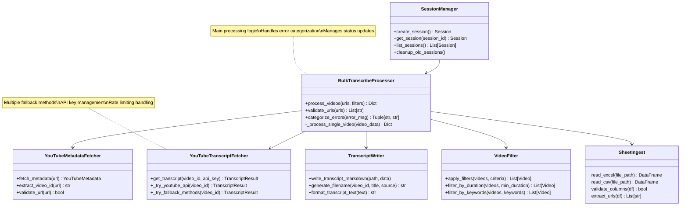
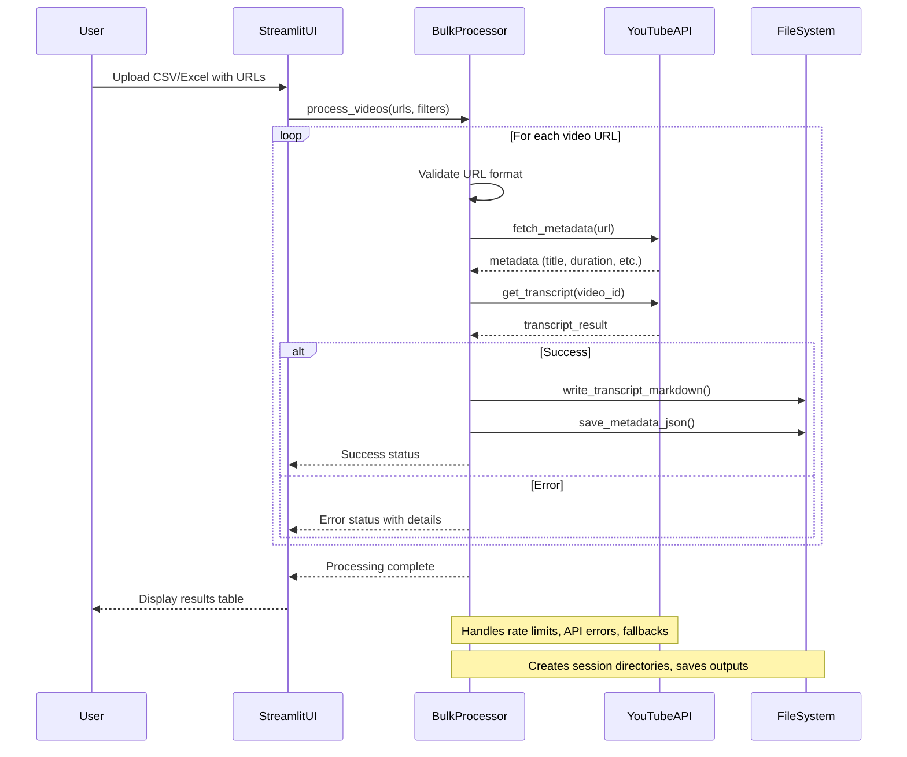
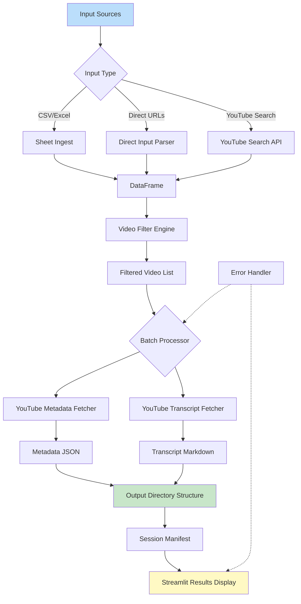
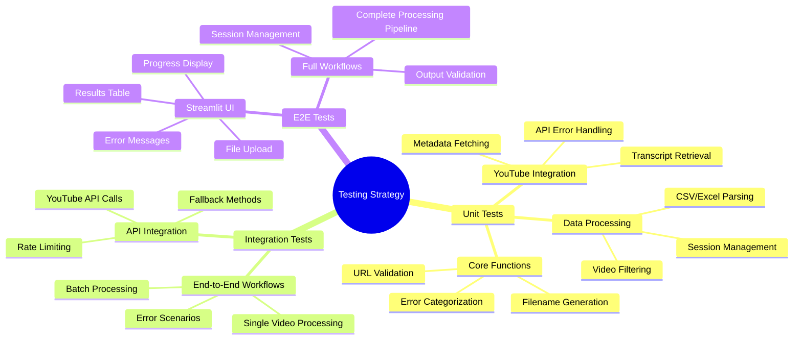
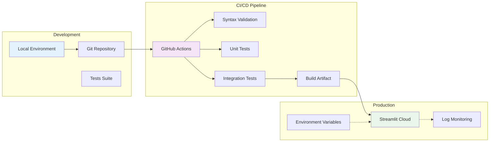
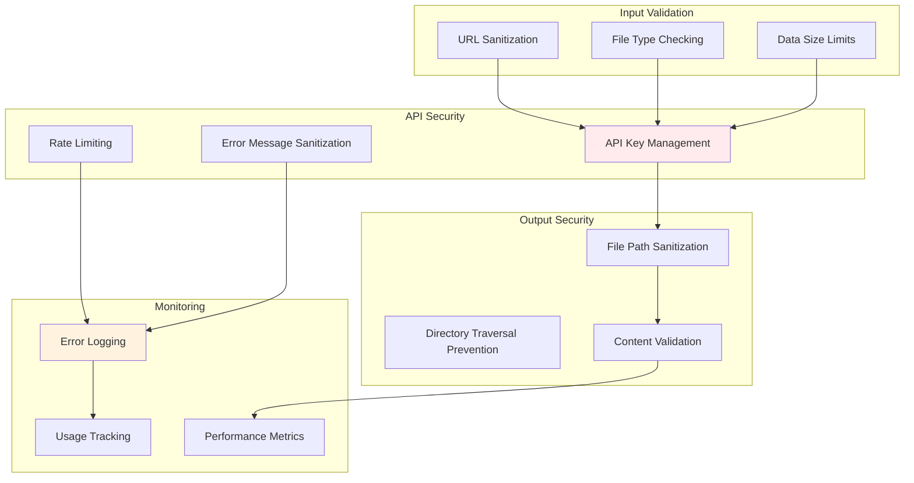

# Bulk Transcribe Application Architecture

## High-Level Component Diagram



## Class Diagram - Core Components



## Sequence Diagram - YouTube Video Processing Flow



## Data Flow Diagram



## Error Handling Flow

```mermaid
stateDiagram-v2
    [*] --> ProcessingVideo

    ProcessingVideo --> FetchMetadata : Valid URL
    ProcessingVideo --> InvalidURLError : Invalid URL

    FetchMetadata --> FetchTranscript : Metadata OK
    FetchMetadata --> MetadataError : API Error/Network Issue

    FetchTranscript --> WriteFiles : Transcript OK
    FetchTranscript --> TranscriptError : API/Rate Limit/Quota

    WriteFiles --> Success : Files written
    WriteFiles --> FileSystemError : Disk/IO Error

    InvalidURLError --> ErrorLogged
    MetadataError --> ErrorLogged
    TranscriptError --> ErrorLogged
    FileSystemError --> ErrorLogged

    ErrorLogged --> [*] : Continue to next video
    Success --> [*] : Video complete

    note right of ErrorLogged : Error categorization:\nRate limit, quota, timeout, etc.
    note right of Success : Update progress counters
```

## Testing Strategy Overview



## Deployment & CI/CD Architecture



## Security Considerations

