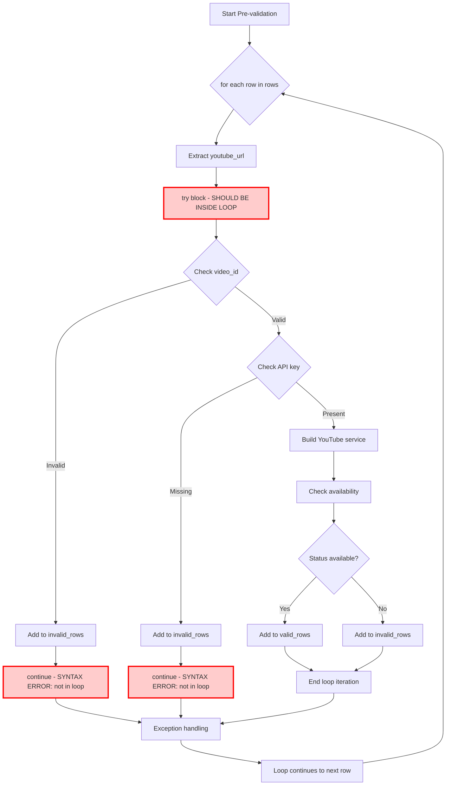

# UML Diagram: Syntax Error Analysis

## Code Flow Visualization



## Problem Explanation

### Current (Broken) Structure:
```
for idx, row in enumerate(rows):     # Loop Level
    youtube_url = ...
try:                                # WRONG: Same level as loop (outside loop!)
    if not video_id:
        continue                   # ERROR: continue not in loop
```

### Correct Structure:
```
for idx, row in enumerate(rows):     # Loop Level
    youtube_url = ...
    try:                            # CORRECT: Inside loop
        if not video_id:
            continue               # OK: continue is in loop
```

## Indentation Fix Required

The `try:` block on line 225 needs to be indented by 4 spaces to be inside the `for` loop that starts on line 220.

### Before (Broken):
```python
for idx, row in enumerate(rows):
    youtube_url = row.get("youtube_url", "").strip()
    # ... progress updates ...

try:  # <-- WRONG: Not indented inside loop
    # All validation logic here
    if not video_id:
        continue  # <-- SYNTAX ERROR: not in loop
```

### After (Fixed):
```python
for idx, row in enumerate(rows):
    youtube_url = row.get("youtube_url", "").strip()
    # ... progress updates ...

    try:  # <-- FIXED: Now inside loop
        # All validation logic here
        if not video_id:
            continue  # <-- OK: now in loop
```

## Impact Analysis

- **Scope**: Pre-validation section only
- **Risk**: Low (indentation fix)
- **Testing**: Verify app starts and validation works
- **Dependencies**: None