# Current System Architecture Analysis

## Streamlit App Structure

## Current Transcript Extraction Flow

## Current Error Handling Categories

```mermaid
flowchart TD
    A[Error Message] --> B{categorize_error<br/>function}

    B --> C{Resource<br/>Exhausted?}
    C -->|Yes| D[⏸️ Rate Limited]

    B --> E{Payment<br/>Required?}
    E -->|Yes| F[💰 Credits Exhausted]

    B --> G{Unauthorized<br/>401?}
    G -->|Yes| H[🔐 API Key Invalid]

    B --> I{Validation<br/>Error 422?}
    I -->|Yes| J[❌ Invalid Request]

    B --> K{Server Error<br/>5xx?}
    K -->|Yes| L[🔧 DEAPI Server Error]

    B --> M{Timeout?}
    M -->|Yes| N[⏰ Request Timeout]

    B --> O{Network<br/>Error?}
    O -->|Yes| P[🌐 Network Error]

    B --> Q{Video<br/>Unavailable?}
    Q -->|Yes| R[🚫 Video Unavailable]

    B --> S{Private<br/>Video?}
    S -->|Yes| T[🔒 Private Video]

    B --> U[Generic<br/>Error]
```

## Current Data Flow

## Current Component Responsibilities

| Component | Responsibility |
|-----------|----------------|
| `session_manager.py` | Manages output directories and session state |
| `video_filter.py` | Validates and filters input URLs |
| `youtube_transcript.py` | **Core extraction logic** - tries free first, falls back to paid |
| `transcript_writer.py` | Formats and writes transcript output files |
| `metadata_transfer.py` | Preserves video metadata in outputs |
| `youtube_metadata.py` | Fetches video title, duration, etc. |
| `direct_input.py` | Handles direct URL input processing |
| `sheet_ingest.py` | Processes spreadsheet/csv inputs |
| `youtube_search.py` | YouTube API search functionality |
| `utils.py` | Shared utility functions |

## Current API Dependencies

- **DEAPI**: Primary transcription service (paid)
- **YouTube Data API**: Metadata and search (potentially paid)
- **youtube-transcript-api**: Free caption extraction (already used)

## Current Limitations for Free Alternative

1. **Single Free Method**: Only uses youtube-transcript-api
2. **No Rate Limiting**: No built-in throttling for bulk operations
3. **No Proxy Support**: Vulnerable to IP blocks
4. **Limited Error Recovery**: Basic fallback to paid service only
5. **No Method Selection**: User cannot choose extraction approach