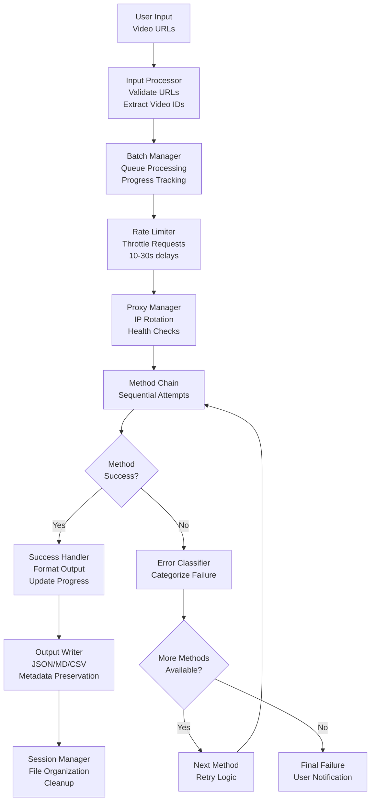
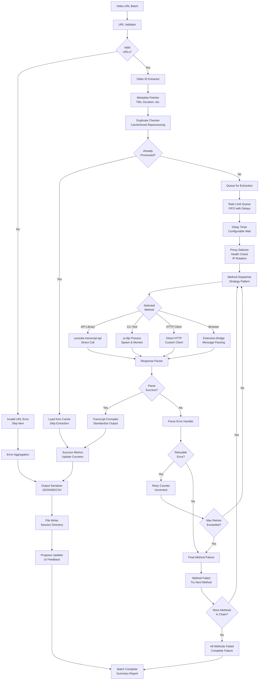
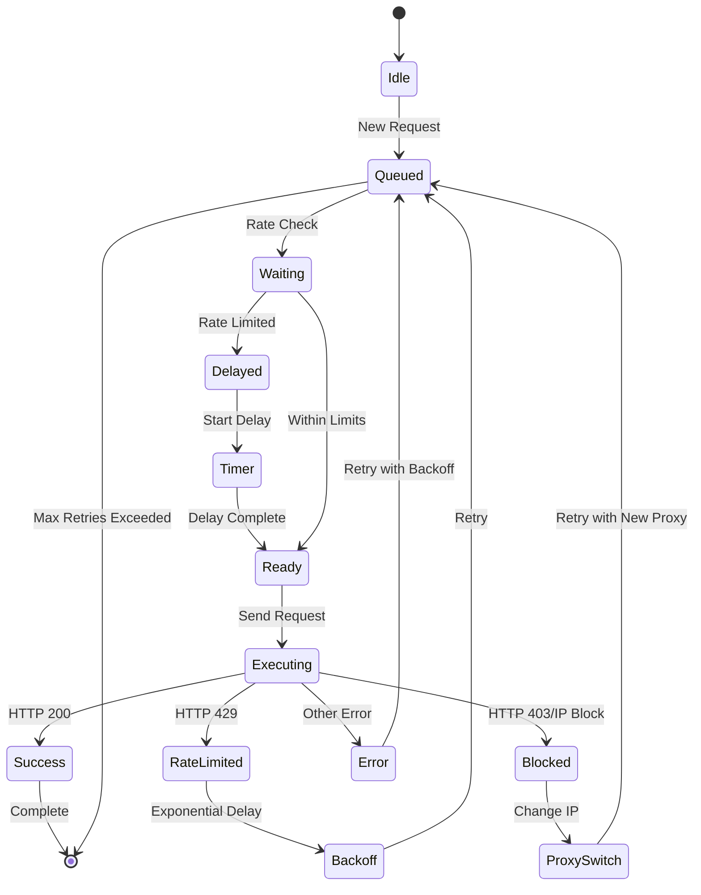
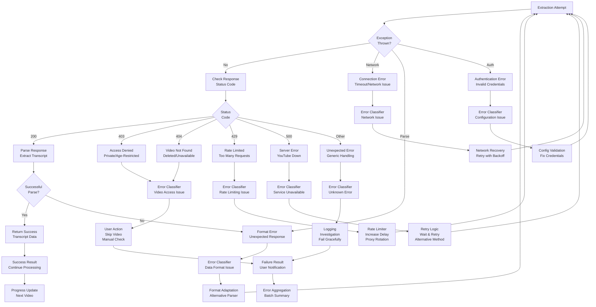
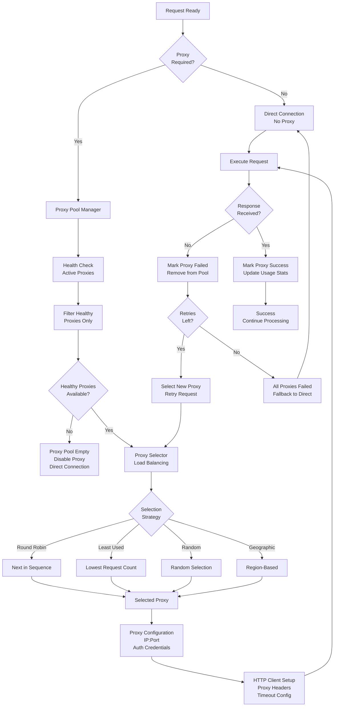
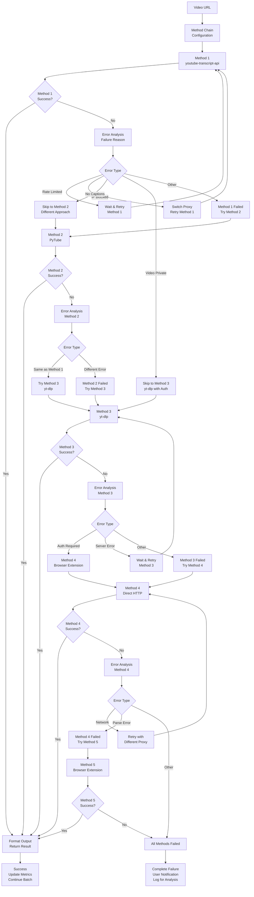
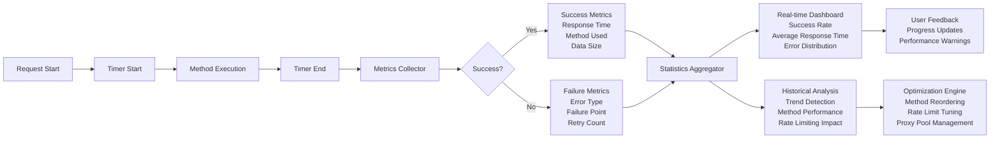
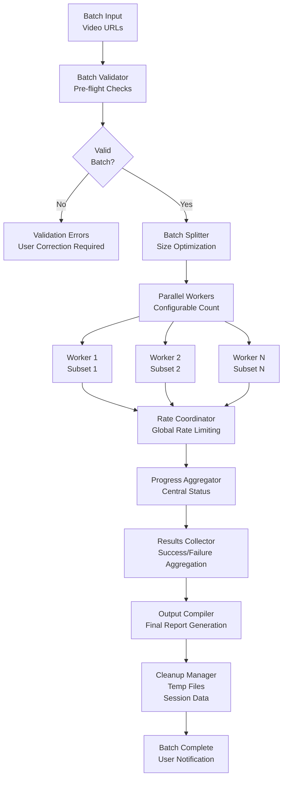

# Free Extraction Data Flow Architecture

## High-Level Data Pipeline



## Detailed Extraction Pipeline



## Rate Limiting Implementation



## Error Handling Flow



## Proxy Management Flow



## Method Chain Fallback Logic



## Configuration Data Structures

```json
{
  "rate_limiting": {
    "base_delay_seconds": 15,
    "jitter_range": [0.8, 1.2],
    "max_concurrent_requests": 1,
    "backoff_multiplier": 2.0,
    "max_backoff_seconds": 300,
    "proxy_rotation_threshold": 3
  },
  "proxy_config": {
    "enabled": true,
    "pool_size": 10,
    "rotation_strategy": "round_robin",
    "health_check_interval": 60,
    "timeout_seconds": 30,
    "retry_failed_proxies": true
  },
  "method_chain": [
    {
      "name": "youtube-transcript-api",
      "enabled": true,
      "priority": 1,
      "max_retries": 3,
      "timeout_seconds": 10
    },
    {
      "name": "yt-dlp",
      "enabled": true,
      "priority": 2,
      "max_retries": 2,
      "timeout_seconds": 30
    },
    {
      "name": "pytube",
      "enabled": true,
      "priority": 3,
      "max_retries": 2,
      "timeout_seconds": 15
    }
  ],
  "error_handling": {
    "log_all_errors": true,
    "aggregate_by_type": true,
    "user_notification_threshold": 5,
    "auto_retry_enabled": true,
    "max_total_retries": 10
  }
}
```

## Performance Monitoring



## Batch Processing Orchestration



This comprehensive data flow architecture ensures robust, scalable, and maintainable free YouTube transcript extraction with proper error handling, rate limiting, and intelligent fallback logic.