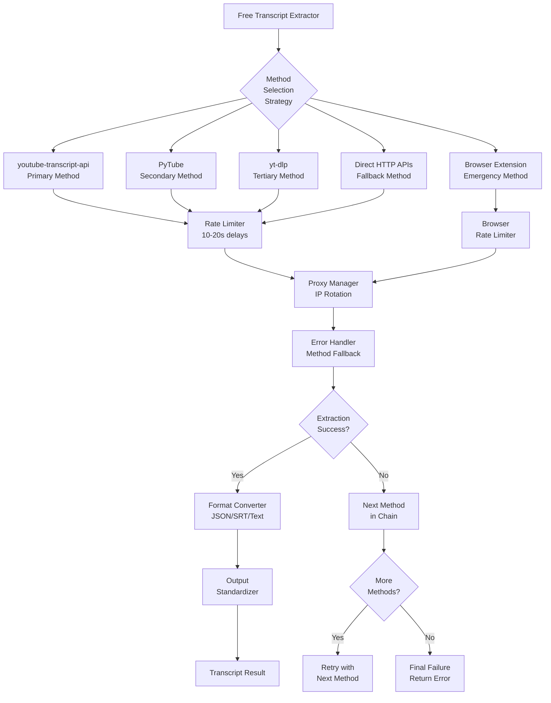
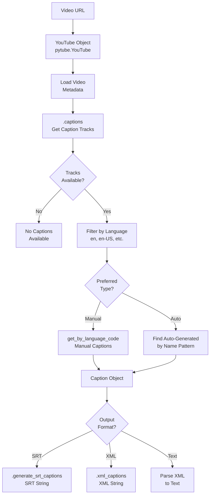
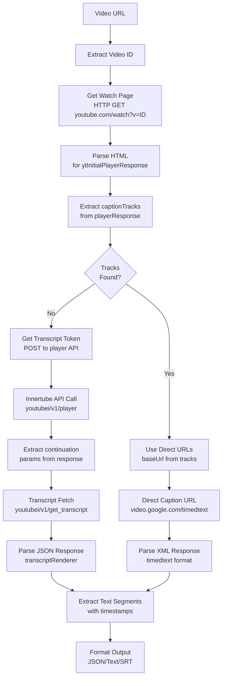
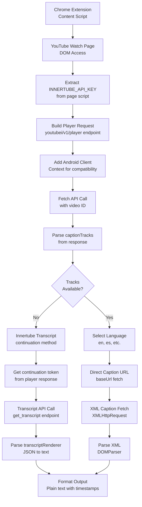
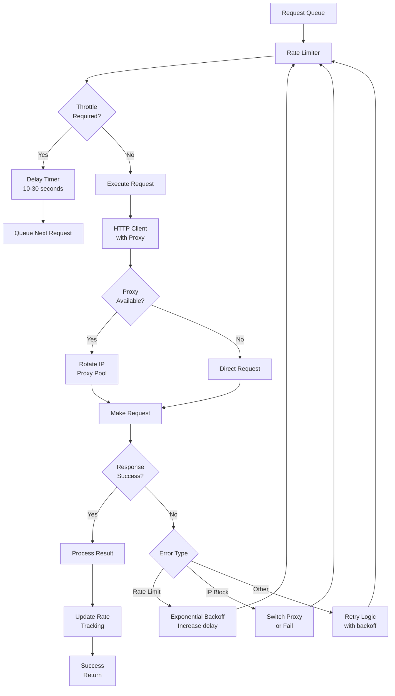
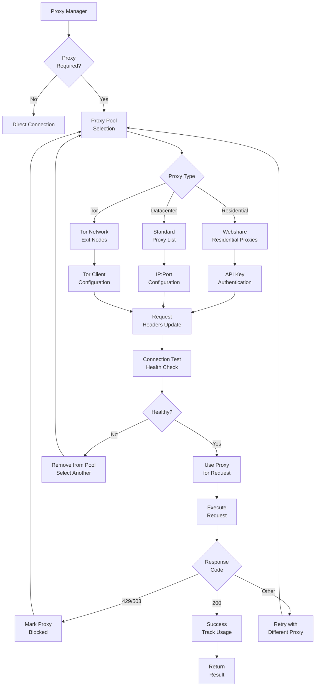
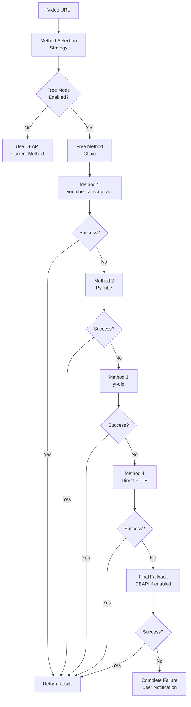

# Free YouTube Transcript Extraction Methods Architecture

## Method Comparison Matrix

| Method | Library/Tool | API Access | Rate Limiting | Age-Restricted | Proxy Support | Output Formats | Language Support |
|--------|-------------|------------|---------------|----------------|---------------|----------------|------------------|
| **youtube-transcript-api** | Python Library | Direct HTTP | Built-in retry | ❌ No | Basic proxy | JSON, SRT, VTT, Text | Multi-language |
| **PyTube** | Python Library | Direct HTTP | Manual implementation | ❌ No | Manual proxy | SRT, XML, Text | Multi-language |
| **yt-dlp** | CLI/Python Tool | Direct HTTP | Built-in delays | ✅ Yes | Extensive proxy | SRT, VTT, JSON | All languages |
| **Direct HTTP APIs** | Custom Implementation | YouTube Internal | Manual implementation | ⚠️ Partial | Manual proxy | XML, JSON | Multi-language |
| **Browser Extension** | JavaScript/CSS | Innertube API | Manual delays | ✅ Yes | Browser proxy | Text, JSON | Multi-language |

## Free Extraction Methods Architecture



## Method Capabilities Detail

### 1. youtube-transcript-api Method

```mermaid
flowchart TD
    A[Video URL] --> B[Extract Video ID]
    B --> C[YouTubeTranscriptApi.list_transcripts]
    C --> D{Transcripts<br/>Available?}

    D -->|Yes| E[Select Language<br/>en, es, de, etc.]
    D -->|No| F[NoTranscriptFound<br/>Exception]

    E --> G[YouTubeTranscriptApi.get_transcript]
    G --> H[Raw Transcript<br/>List[Dict]]

    H --> I{Translation<br/>Needed?}
    I -->|Yes| J[transcript.translate<br/>to target language]
    I -->|No| K[Format Output]

    K --> L[TextFormatter.format_transcript<br/>Plain Text]
    K --> M[JSONFormatter<br/>Structured Data]
    K --> N[SRTFormatter<br/>Subtitle Format]
    K --> O[VTTFormatter<br/>WebVTT Format]
```

### 2. PyTube Method



### 3. yt-dlp Method

```mermaid
flowchart TD
    A[Video URL] --> B[Configure Options<br/>ydl_opts Dict]
    B --> C{Content<br/>Type?}

    C -->|Public| D[Standard Options<br/>skip_download=true]
    C -->|Age-Restricted| E[Cookie Options<br/>--cookies-from-browser]

    D --> F[Subtitle Options<br/>writesubtitles=true<br/>writeautomaticsub=true<br/>subtitleslangs=['en']]
    E --> F

    F --> G[Output Format<br/>subtitlesformat='vtt'<br/>outtmpl='output.vtt']

    G --> H[YoutubeDL Object<br/>with ydl_opts]
    H --> I[.extract_info<br/>video_url, download=True]

    I --> J{Subtitles<br/>Downloaded?}
    J -->|Yes| K[Read Output File<br/>.vtt or .srt]
    J -->|No| L[Check auto_captions<br/>in info dict]

    K --> M[Parse VTT/SRT<br/>to Text]
    L --> N[Alternative<br/>Format Download]

    M --> O[Clean Transcript<br/>Remove Timestamps]
    N --> O
```

### 4. Direct HTTP APIs Method



### 5. Browser Extension Method



## Rate Limiting Architecture



## Proxy Management Architecture



## Integration Strategy Selection Logic



## Error Classification Matrix

| Error Type | youtube-transcript-api | PyTube | yt-dlp | Direct HTTP | Browser Ext |
|------------|----------------------|--------|--------|-------------|-------------|
| **Rate Limited** | RequestBlocked | Manual check | Built-in | Manual check | Manual check |
| **IP Blocked** | IpBlocked | HTTP 429 | Proxy rotation | HTTP 429 | Browser limit |
| **No Captions** | NoTranscriptFound | Empty captions | No subtitles | Empty tracks | No renderer |
| **Video Private** | VideoUnavailable | Exception | Download fail | HTTP 403 | DOM error |
| **Age Restricted** | NotSupported | NotSupported | ✅ Cookie support | Partial | ✅ Browser auth |
| **Network Error** | ConnectionError | RequestException | Network fail | Timeout | Fetch fail |
| **Parse Error** | JSONDecodeError | XMLParseError | Format error | Malformed response | DOM parse |

## Performance Characteristics

| Metric | youtube-transcript-api | PyTube | yt-dlp | Direct HTTP | Browser Ext |
|--------|----------------------|--------|--------|-------------|-------------|
| **Speed per video** | Fast (~2-5s) | Medium (~3-8s) | Slow (~5-15s) | Variable (2-10s) | Fast (~1-3s) |
| **Rate limit tolerance** | Low (blocks easily) | Low (blocks easily) | High (built-in delays) | Medium (configurable) | High (browser context) |
| **Success rate** | High (~80%) | High (~75%) | Very High (~90%) | High (~85%) | High (~85%) |
| **Maintenance burden** | Low | Medium | Medium | High | High |
| **Proxy requirement** | Recommended | Recommended | Optional | Recommended | Built-in |

## Recommended Strategy

1. **Primary**: youtube-transcript-api (fastest, most reliable for basic use)
2. **Secondary**: yt-dlp (best for age-restricted, highest success rate)
3. **Tertiary**: PyTube (good compatibility, multiple formats)
4. **Fallback**: Direct HTTP (most flexible, highest maintenance)
5. **Emergency**: Browser Extension (highest compatibility, complex integration)