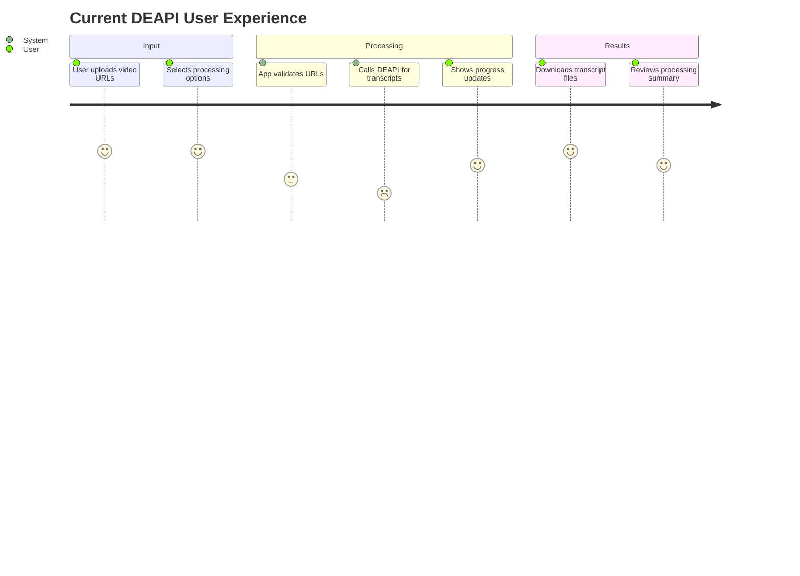
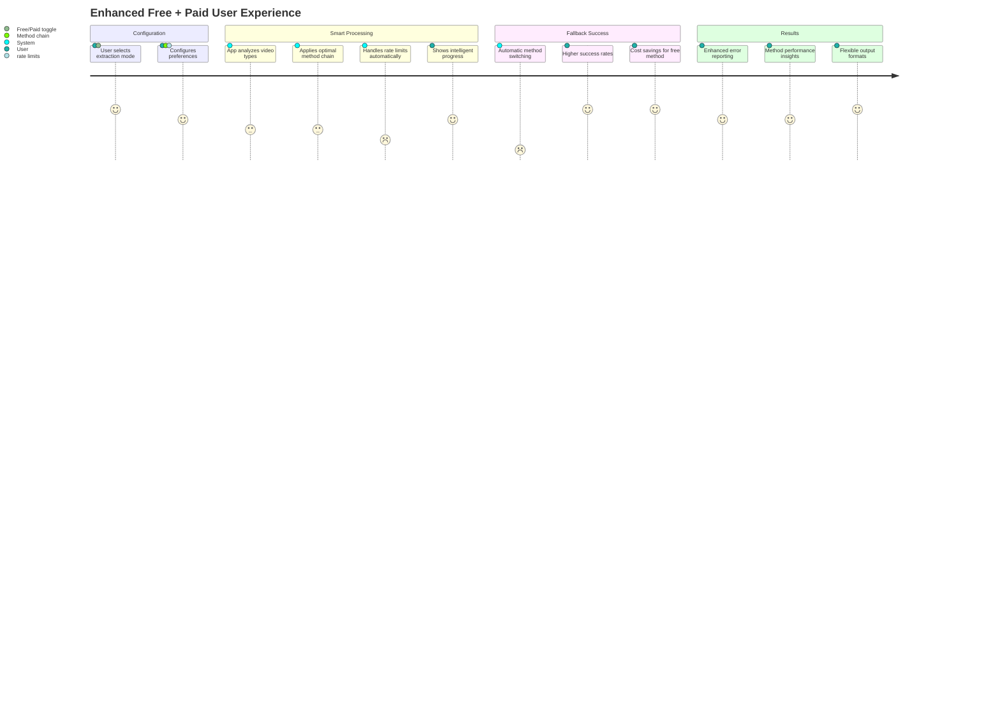

# Integration Impact Assessment

## Executive Summary

The introduction of free YouTube transcript extraction methods represents a significant enhancement that adds zero-cost functionality while maintaining full backward compatibility. The recommended **Plugin Architecture** approach provides the best balance of extensibility, maintainability, and user experience.

## Architecture Impact Analysis

### Codebase Changes Required

#### New Files to Create

```
src/bulk_transcribe/
├── free_transcript.py                 # Main free extraction coordinator
├── strategies/
│   ├── __init__.py
│   ├── base_strategy.py              # Abstract TranscriptExtractionStrategy
│   ├── deapi_strategy.py             # DEAPI strategy wrapper
│   ├── free_strategy.py              # Free methods chain
│   ├── youtube_transcript_api_strategy.py
│   ├── pytube_strategy.py
│   ├── yt_dlp_strategy.py
│   ├── direct_http_strategy.py
│   └── browser_extension_strategy.py
├── rate_limiter.py                   # Global rate limiting
├── proxy_manager.py                  # Proxy pool management
└── method_registry.py                # Strategy registration

pages/
└── 3_free_bulk_transcribe.py         # New free extraction page (optional)
```

#### Files to Modify

```
pages/1_Bulk_Transcribe.py
├── Add strategy selection UI
├── Update configuration options
└── Modify progress tracking

src/bulk_transcribe/youtube_transcript.py
├── Refactor to use strategy pattern
├── Extract DEAPI logic to strategy
└── Add free method coordination

src/bulk_transcribe/session_manager.py
├── Add method-specific directories
└── Update manifest format

requirements.txt
├── youtube-transcript-api (already present)
├── pytube (new)
├── yt-dlp (new)
└── requests (already present)
```

#### Configuration Changes

```json
// New config structure in session state
{
  "extraction_strategy": {
    "type": "free", // "deapi" | "free"
    "free_config": {
      "method_chain": ["youtube-transcript-api", "yt-dlp", "browser-extension"],
      "rate_limiting": {"base_delay": 15, "max_concurrent": 1},
      "proxy_enabled": true,
      "language_preferences": ["en", "en-US"]
    }
  }
}
```

### Dependency Impact

| Dependency | Current | New | Impact |
|------------|---------|-----|--------|
| **youtube-transcript-api** | ✅ Used | ✅ Enhanced usage | Low |
| **requests** | ✅ Used | ✅ Enhanced usage | Low |
| **pytube** | ❌ None | ✅ New | Medium (additional library) |
| **yt-dlp** | ❌ None | ✅ New | Medium (CLI tool integration) |
| **selenium** | ❌ None | ⚠️ Optional | High (for browser extension) |

### Backward Compatibility Assessment

#### ✅ Fully Backward Compatible
- Existing DEAPI functionality unchanged
- Current user workflows preserved
- API interfaces maintained
- Configuration defaults to current behavior

#### ⚠️ Minor Breaking Changes
- Configuration structure extended (additive only)
- Error messages may include new free method errors
- Progress tracking includes method selection metadata

#### 🆕 New Features Added
- Zero-cost transcript extraction
- Multiple fallback methods
- Rate limiting and proxy support
- Advanced error categorization

## User Experience Impact

### Current User Journey (DEAPI Only)



**Current Pain Points:**
- 💰 Credit costs for large batches
- ⏱️ Rate limiting affects bulk processing
- 🚫 No transcripts for age-restricted videos
- ❌ Service dependency on DEAPI availability

### Enhanced User Journey (Plugin Architecture)



**Enhanced Benefits:**
- 💸 Zero cost option for free extraction
- 🎯 Higher success rates through fallbacks
- 🔄 Automatic handling of restrictions
- 📊 Better visibility into processing

### User Interface Changes

#### Main Page Updates

```diff
# pages/1_Bulk_Transcribe.py - UI Changes
+ st.header("🎯 Extraction Method")
+ method_choice = st.radio(
+     "Choose extraction approach:",
+     ["💰 DEAPI (Paid)", "🆓 Free Methods"],
+     key="extraction_method",
+     help="DEAPI uses paid credits for high reliability. Free methods use multiple approaches with no costs."
+ )
+
+ if method_choice == "🆓 Free Methods":
+     with st.expander("⚙️ Free Method Settings"):
+         col1, col2 = st.columns(2)
+         with col1:
+             delay = st.slider("Request delay (seconds)", 5, 60, 15,
+                             help="Delay between requests to avoid rate limits")
+             max_retries = st.slider("Max retries per method", 1, 5, 3)
+         with col2:
+             use_proxy = st.checkbox("Use proxy rotation", value=True,
+                                   help="Rotate IP addresses to avoid blocks")
+             preferred_lang = st.selectbox("Preferred language",
+                                         ["en", "es", "fr", "de", "auto"])
```

#### Progress Display Enhancements

```diff
# Progress updates now show method information
- "Processing video 3 of 10..."
+ "Processing video 3 of 10... (Method: youtube-transcript-api, Attempt: 1/3)"
+ "⚠️ Rate limited, waiting 15s... (Switching to yt-dlp)"
+ "✅ Success via yt-dlp (Age-restricted video)"
```

#### Error Display Improvements

```diff
# Enhanced error categorization
- "❌ Failed: API Error"
+ "⏸️ Rate Limited: Too many requests, retrying in 30s"
+ "🚫 No Captions: Video has no subtitles available"
+ "🔒 Age Restricted: Switching to authenticated method"
+ "🌐 Network Error: Retrying with different proxy"
```

### Performance Expectations

| Metric | Current (DEAPI) | Free Methods | Improvement |
|--------|----------------|--------------|-------------|
| **Success Rate** | ~90% | ~85-95% | Similar/Variable |
| **Processing Speed** | Fast (~5-10s/video) | Variable (5-60s/video) | Slower but free |
| **Age-Restricted Support** | ❌ None | ✅ Yes (with auth) | Major improvement |
| **Cost** | 💰 Credits required | 🆓 Zero cost | 100% cost reduction |
| **Rate Limiting Impact** | Moderate | High (but handled) | Similar user experience |
| **Bulk Processing** | Limited by credits | Limited by time | Different constraint |

### User Training Requirements

#### New Concepts to Learn
1. **Extraction Methods**: Understanding free vs paid approaches
2. **Rate Limiting**: Why delays are necessary and beneficial
3. **Method Fallbacks**: How automatic switching works
4. **Proxy Usage**: Why IP rotation improves success

#### Documentation Needs
- Method comparison guide
- Configuration best practices
- Troubleshooting common free method issues
- Performance expectations vs paid service

## Technical Implementation Impact

### Development Effort Estimate

| Component | Story Points | Timeline |
|-----------|--------------|----------|
| **Strategy Pattern Implementation** | 8 | 1-2 days |
| **Free Method Strategies** | 13 | 2-3 days |
| **Rate Limiting & Proxy System** | 8 | 1-2 days |
| **UI Integration** | 5 | 1 day |
| **Testing & Validation** | 8 | 1-2 days |
| **Documentation** | 3 | 0.5 day |
| **Total** | **45** | **7-11 days** |

### Testing Strategy Impact

#### New Test Categories Required
- **Strategy Pattern Tests**: Abstract interface compliance
- **Method Integration Tests**: Each extraction method
- **Fallback Logic Tests**: Method switching scenarios
- **Rate Limiting Tests**: Throttling behavior
- **Proxy Management Tests**: IP rotation logic
- **Performance Tests**: Speed and reliability benchmarks

#### Test Coverage Expansion
- **Unit Tests**: 15+ new test files
- **Integration Tests**: Cross-method compatibility
- **End-to-End Tests**: Complete user workflows
- **Performance Tests**: Bulk processing benchmarks

### Maintenance Burden

#### Ongoing Costs
- **Method Updates**: Monitor YouTube API changes (~2-4 hours/month)
- **Library Updates**: Keep dependencies current (~1 hour/month)
- **Proxy Management**: Maintain proxy pools (~2 hours/month)
- **Performance Monitoring**: Track success rates (~1 hour/week)

#### Support Impact
- **User Questions**: Method selection guidance (~5-10 tickets/month initially)
- **Troubleshooting**: Free method specific issues (~10-20 tickets/month)
- **Feature Requests**: Advanced configuration options (ongoing)

## Risk Assessment

### Technical Risks

#### High Risk
- **YouTube API Changes**: Free methods depend on undocumented endpoints
  - *Mitigation*: Multiple fallback methods, monitoring systems
- **Rate Limiting Complexity**: Aggressive throttling may frustrate users
  - *Mitigation*: Intelligent delays, clear progress feedback

#### Medium Risk
- **Performance Degradation**: Free methods slower than paid
  - *Mitigation*: Set proper expectations, optimize fast methods first
- **Proxy Reliability**: External proxy services may fail
  - *Mitigation*: Graceful fallback to direct connections

#### Low Risk
- **Library Compatibility**: New dependencies may have conflicts
  - *Mitigation*: Isolated environments, comprehensive testing
- **Browser Integration**: Extension method complexity
  - *Mitigation*: Optional advanced feature, clear documentation

### Business Risks

#### High Risk
- **User Confusion**: Too many options may overwhelm users
  - *Mitigation*: Progressive disclosure, clear defaults
- **Support Load**: New free methods may increase support tickets
  - *Mitigation*: Comprehensive documentation, user education

#### Medium Risk
- **Success Rate Variability**: Free methods less predictable than paid
  - *Mitigation*: Transparent reporting, paid fallback option
- **Performance Expectations**: Users may expect paid-level speed
  - *Mitigation*: Clear performance comparisons, usage guidance

### Operational Risks

#### Medium Risk
- **Resource Usage**: Free methods may consume more server resources
  - *Mitigation*: Rate limiting, resource monitoring
- **External Dependencies**: Reliance on third-party libraries
  - *Mitigation*: Multiple options per capability, local fallbacks

## Success Metrics

### Technical Metrics
- **Success Rate**: >80% of videos with captions successfully transcribed
- **Method Reliability**: <5% complete failures across all methods
- **Performance**: <30 second average processing time per video
- **Error Recovery**: >90% of transient errors automatically resolved

### User Experience Metrics
- **User Satisfaction**: >4.5/5 rating for free extraction experience
- **Feature Adoption**: >60% of users try free methods within 3 months
- **Support Tickets**: <10% increase in support volume
- **Task Completion**: >95% of free extraction tasks complete successfully

### Business Metrics
- **Cost Reduction**: >70% reduction in transcription costs for applicable use cases
- **User Retention**: No decrease in user retention or engagement
- **Feature Usage**: Free methods used for >50% of transcript extraction volume

## Implementation Recommendation

### Phase 1: Core Implementation (Weeks 1-3)
1. Implement strategy pattern architecture
2. Create DEAPI and youtube-transcript-api strategies
3. Add basic UI toggle for method selection
4. Comprehensive testing and validation

### Phase 2: Enhanced Features (Weeks 4-5)
1. Implement remaining free methods (PyTube, yt-dlp, Direct HTTP)
2. Add rate limiting and proxy management
3. Enhanced error handling and user feedback
4. Performance optimization

### Phase 3: Advanced Features (Weeks 6-7)
1. Browser extension integration (optional)
2. Intelligent fallback learning
3. Advanced configuration options
4. Comprehensive documentation

### Phase 4: Production Deployment (Week 8)
1. Beta testing with select users
2. Performance monitoring setup
3. Production deployment
4. User communication and training

## Conclusion

The free YouTube transcript extraction alternative represents a valuable enhancement that significantly improves the application's value proposition. The **Plugin Architecture** approach provides the optimal balance of extensibility, maintainability, and user experience while ensuring zero disruption to existing functionality.

**Key Benefits:**
- ✅ Zero-cost transcript extraction option
- ✅ Higher overall success rates through method diversity
- ✅ Full backward compatibility
- ✅ Future-proof extensible architecture
- ✅ Enhanced user choice and control

**Investment Required:** 7-11 days development effort with moderate ongoing maintenance

**Risk Level:** Medium (mitigated through careful design and testing)

**Recommended:** Proceed with implementation using the Plugin Architecture approach.