# Integration Options Design

## Option 1: Toggle Mode Integration

### Architecture Overview


### UI Implementation

```mermaid
flowchart TD
    A[Page Load] --> B[Check User Preferences<br/>Local Storage / Config]

    B --> C{Previous<br/>Mode Selected?}
    C -->|Yes| D[Set Toggle to<br/>Previous Choice]
    C -->|No| E[Default to<br/>DEAPI Mode]

    D --> F[Display Toggle<br/>DEAPI 💰 | Free 🆓]
    E --> F

    F --> G[User Interaction<br/>Toggle Switch]

    G --> H{Mode<br/>Changed?}
    H -->|No| I[Continue with<br/>Current Mode]
    H -->|Yes| J[Update UI<br/>Show Mode-Specific Options]

    J --> K{Selected<br/>Mode}
    K -->|Free| L[Show Free Options<br/>Method Selection<br/>Rate Limit Config<br/>Proxy Settings]
    K -->|DEAPI| M[Show DEAPI Options<br/>API Key Status<br/>Balance Display]

    L --> N[Process with<br/>Free Methods]
    M --> O[Process with<br/>DEAPI]
```

### Configuration Schema

```json
{
  "extraction_mode": "free" | "deapi",
  "free_method_preferences": {
    "primary_method": "youtube-transcript-api",
    "fallback_chain": ["pytube", "yt-dlp", "direct-http"],
    "rate_limiting": {
      "delay_seconds": 15,
      "max_retries": 3,
      "proxy_enabled": true
    },
    "language_preferences": ["en", "en-US", "en-GB"]
  },
  "deapi_fallback": true
}
```

### Pros and Cons

**Pros:**
- ✅ Minimal UI changes - single toggle
- ✅ Zero breaking changes to existing workflow
- ✅ Easy A/B testing between modes
- ✅ User can switch per session
- ✅ Shared codebase for common functionality

**Cons:**
- ❌ Mode confusion for users
- ❌ UI clutter with mode-specific options
- ❌ Potential feature parity issues
- ❌ Increased complexity in single page

## Option 2: Separate Page Integration

### Architecture Overview



```mermaid
graph TB
    A[Streamlit App<br/>app.py] --> B[Main Menu]

    B --> C[📝 Bulk Transcribe<br/>1_Bulk_Transcribe.py<br/>DEAPI Mode]
    B --> D[🆓 Free Bulk Transcribe<br/>3_Free_Bulk_Transcribe.py<br/>Free Mode]

    C --> E[youtube_transcript.py<br/>DEAPI Primary]
    D --> F[free_transcript.py<br/>Free Methods Only]

    E --> G[DEAPI API]
    F --> H[Free Method Chain]

    G --> I[Common Processing<br/>transcript_writer.py<br/>metadata_transfer.py]
    H --> I

    I --> J[Output Directory<br/>Session Management]
```

### Page Structure

```
pages/
├── 1_Bulk_Transcribe.py          # Existing DEAPI page (renamed)
├── 2_YouTube_Search.py           # Existing search page
└── 3_Free_Bulk_Transcribe.py     # New free extraction page
```

### UI Implementation



```mermaid
flowchart TD
    A[Main Menu] --> B[Three Options]

    B --> C[📝 Bulk Transcribe<br/>DEAPI Mode]
    B --> D[🔍 YouTube Search]
    B --> E[🆓 Free Bulk Transcribe<br/>Free Mode]

    C --> F[Existing DEAPI Page<br/>Full Features<br/>Paid Service]
    E --> G[Free Extraction Page<br/>Limited Features<br/>Zero Cost]

    F --> H[API Key Required<br/>Balance Display<br/>Full Error Handling]
    G --> I[No API Key Needed<br/>Rate Limit Warnings<br/>Basic Error Handling]

    H --> J[Advanced Options<br/>Retry Logic<br/>Custom Settings]
    I --> K[Simple Options<br/>Method Selection<br/>Delay Configuration]
```

### Shared Components


### Pros and Cons

**Pros:**
- ✅ Clear separation of concerns
- ✅ No UI confusion or mode switching
- ✅ Independent feature development
- ✅ Easy to maintain different codebases
- ✅ Users understand cost implications upfront

**Cons:**
- ❌ Code duplication for shared functionality
- ❌ Separate maintenance burden
- ❌ Users need to choose upfront
- ❌ Potential feature parity confusion
- ❌ More complex navigation

## Option 3: Plugin Architecture Integration

### Architecture Overview


### Strategy Pattern Implementation

```python
# Abstract base class
class TranscriptExtractionStrategy(ABC):
    @abstractmethod
    def extract_transcript(self, video_url: str) -> TranscriptResult:
        pass

    @abstractmethod
    def get_method_name(self) -> str:
        pass

    @abstractmethod
    def get_capabilities(self) -> Dict[str, bool]:
        pass

# Concrete implementations
class DEAPIStrategy(TranscriptExtractionStrategy):
    def extract_transcript(self, video_url: str) -> TranscriptResult:
        return try_deapi_transcription(video_url, self.api_key)

class FreeStrategy(TranscriptExtractionStrategy):
    def __init__(self, config: FreeConfig):
        self.config = config
        self.methods = self._build_method_chain()

    def extract_transcript(self, video_url: str) -> TranscriptResult:
        for method in self.methods:
            result = method.extract(video_url)
            if result.success:
                return result
        return TranscriptResult(success=False, method="free_all_failed")
```

### Configuration System


### Dynamic Method Chain


### Pros and Cons

**Pros:**
- ✅ Clean abstraction and extensibility
- ✅ Easy to add new extraction methods
- ✅ Strategy pattern allows runtime switching
- ✅ Shared UI with different backends
- ✅ Testable component architecture

**Cons:**
- ❌ Higher initial development complexity
- ❌ Abstract interfaces may hide method differences
- ❌ Configuration complexity
- ❌ Potential performance overhead
- ❌ Steeper learning curve for maintenance

## Comparative Analysis

| Aspect | Toggle Mode | Separate Page | Plugin Architecture |
|--------|-------------|---------------|-------------------|
| **Complexity** | Medium | Low | High |
| **Code Reuse** | High | Medium | High |
| **UI Clarity** | Medium | High | High |
| **Maintenance** | Medium | Medium | Low |
| **Extensibility** | Low | Low | High |
| **User Experience** | Medium | High | High |
| **Testing** | Medium | Easy | Complex |
| **Breaking Changes** | None | None | None |

## Recommended Approach: Plugin Architecture

**Rationale:**
1. **Future-Proof**: Easy to add new extraction methods without UI changes
2. **Clean Separation**: Clear abstraction between UI and extraction logic
3. **Testability**: Each strategy can be tested independently
4. **Maintainability**: Changes to extraction methods don't affect UI
5. **User Experience**: Single interface with different capabilities

**Implementation Plan:**
1. Create abstract `TranscriptExtractionStrategy` interface
2. Implement `DEAPIStrategy` (wrap existing code)
3. Implement `FreeStrategy` with method chain
4. Add configuration system for strategy selection
5. Update UI to show capabilities based on selected strategy
6. Add comprehensive testing for all strategies

## Migration Strategy

