# Intelligent Fallback Logic Architecture

## Method Selection Decision Tree

```mermaid
flowchart TD
    A[New Video URL] --> B[Video Analysis<br/>Metadata Check]

    B --> C{Video Type<br/>Characteristics}
    C -->|Public, Regular| D[Standard Method Chain<br/>Fast → Robust → Fallback]
    C -->|Age-Restricted| E[Auth-Capable Methods<br/>yt-dlp → Browser → Direct]
    C -->|Live Stream| F[Limited Methods<br/>Browser → yt-dlp → None]
    C -->|Private/Deleted| G[Early Exit<br/>No Transcript Available]

    D --> H[Method 1<br/>youtube-transcript-api<br/>Fastest, Highest Success]
    E --> I[Method 3<br/>yt-dlp with Auth<br/>Handles Restrictions]
    F --> J[Method 5<br/>Browser Extension<br/>Real-time Compatible]
    G --> K[Skip Processing<br/>Return Unavailable]

    H --> L{Method 1<br/>Success?}
    L -->|Yes| M[Return Result<br/>Log Success Metrics]
    L -->|No| N[Error Analysis<br/>Failure Classification]

    N --> O{Error Type}
    O -->|Rate Limited| P[Rate Limit Handler<br/>Wait + Retry Method 1]
    O -->|IP Blocked| Q[Proxy Rotation<br/>Retry Method 1]
    O -->|No Captions| R[Skip to Method 2<br/>Different Data Source]
    O -->|Video Unavailable| S[Early Exit<br/>Video Issue]
    O -->|Parse Error| T[Method 1 Broken<br/>Try Method 2]
    O -->|Network Error| U[Retry with Backoff<br/>Same Method]

    P --> H
    Q --> H
    U --> H

    R --> V[Method 2<br/>PyTube<br/>Alternative API]
    T --> V

    V --> W{Method 2<br/>Success?}
    W -->|Yes| M
    W -->|No| X[Error Analysis<br/>Method 2]

    X --> Y{Error Type}
    Y -->|Same as Method 1| Z[Try Method 3<br/>yt-dlp - More Robust]
    Y -->|Different Error| AA[Method 2 Failed<br/>Try Method 3]

    Z --> BB[Method 3<br/>yt-dlp<br/>Heavy but Reliable]
    AA --> BB

    BB --> CC{Method 3<br/>Success?}
    CC -->|Yes| M
    CC -->|No| DD[Error Analysis<br/>Method 3]

    DD --> EE{Error Type}
    EE -->|Auth Required| FF[Method 5<br/>Browser Extension<br/>Full Auth Support]
    EE -->|Rate Limited| GG[Extended Wait<br/>Retry Method 3]
    EE -->|Format Error| HH[Method 4<br/>Direct HTTP<br/>Raw Parsing]
    EE -->|Other| II[Method 3 Failed<br/>Try Method 4]

    FF --> JJ[Method 5<br/>Browser Extension<br/>Most Compatible]
    GG --> BB
    HH --> KK[Method 4<br/>Direct HTTP<br/>Innertube API]
    II --> KK

    KK --> LL{Method 4<br/>Success?}
    LL -->|Yes| M
    LL -->|No| MM[Error Analysis<br/>Method 4]

    MM --> NN{Error Type}
    NN -->|Network| OO[Proxy Change<br/>Retry Method 4]
    NN -->|Parse Error| PP[Try Method 5<br/>Browser Extension]
    NN -->|Auth| QQ[Browser Method<br/>Method 5]
    NN -->|Other| RR[All Methods Failed]

    OO --> KK
    PP --> JJ
    QQ --> JJ

    JJ --> SS{Method 5<br/>Success?}
    SS -->|Yes| M
    SS -->|No| RR

    S --> K
    RR --> TT[Complete Failure<br/>Aggregate Error Report]
```



## Error Classification Intelligence


## Method Capability Matrix

| Method | Rate Limit<br/>Tolerance | IP Block<br/>Resistance | Age-Restricted<br/>Support | Auto Captions<br/>Support | Manual Captions<br/>Support | Private Video<br/>Handling | Speed | Reliability |
|--------|--------------------------|-------------------------|---------------------------|---------------------------|-----------------------------|---------------------------|-------|-------------|
| **youtube-transcript-api** | Low | Low | ❌ No | ✅ Yes | ✅ Yes | ❌ Skip | ⚡ Fast | 🟡 Medium |
| **PyTube** | Low | Low | ❌ No | ✅ Yes | ✅ Yes | ❌ Skip | ⚡ Fast | 🟡 Medium |
| **yt-dlp** | High | Medium | ✅ Yes | ✅ Yes | ✅ Yes | ⚠️ With auth | 🐌 Slow | 🟢 High |
| **Direct HTTP** | Medium | Medium | ⚠️ Partial | ✅ Yes | ✅ Yes | ❌ Skip | 🐌 Slow | 🟡 Medium |
| **Browser Extension** | High | High | ✅ Yes | ✅ Yes | ✅ Yes | ⚠️ With login | 🐌 Slow | 🟢 High |

## Intelligent Method Selection Algorithm

```python
def select_optimal_method(video_metadata, previous_failures, system_state):
    """
    Intelligent method selection based on video characteristics and failure history
    """

    # Extract video characteristics
    is_age_restricted = video_metadata.get('age_restricted', False)
    has_manual_captions = video_metadata.get('manual_captions_available', True)
    is_live = video_metadata.get('is_live', False)
    region_blocked = video_metadata.get('region_blocked', False)

    # Check system state
    rate_limited = system_state.get('recent_rate_limits', 0) > 5
    proxy_exhausted = system_state.get('healthy_proxies', 10) < 2
    network_unstable = system_state.get('network_errors', 0) > 3

    # Analyze failure patterns
    rate_limit_failures = sum(1 for f in previous_failures if f['type'] == 'rate_limit')
    ip_block_failures = sum(1 for f in previous_failures if f['type'] == 'ip_block')
    auth_failures = sum(1 for f in previous_failures if f['type'] == 'auth_required')

    # Decision logic
    if is_live:
        # Live streams need real-time methods
        return 'browser_extension'
    elif is_age_restricted or region_blocked:
        # Need authentication-capable methods
        if auth_failures == 0:
            return 'yt-dlp'  # Try yt-dlp with cookies first
        else:
            return 'browser_extension'  # Fall back to browser
    elif rate_limited or ip_block_failures > 2:
        # Rate limiting issues - use more robust methods
        if not proxy_exhausted:
            return 'yt-dlp'  # Better proxy support
        else:
            return 'browser_extension'  # Most resilient
    elif network_unstable:
        # Network issues - prefer methods with better error handling
        return 'yt-dlp'  # More mature error recovery
    else:
        # Standard case - use fastest method first
        if len(previous_failures) == 0:
            return 'youtube-transcript-api'  # Fastest for first attempt
        elif rate_limit_failures > ip_block_failures:
            return 'pytube'  # Different API endpoint
        else:
            return 'direct_http'  # Completely different approach

def calculate_confidence_score(method, video_metadata, system_state):
    """
    Calculate confidence score for method success (0-100)
    """
    base_scores = {
        'youtube-transcript-api': 85,
        'pytube': 80,
        'yt-dlp': 95,
        'direct_http': 75,
        'browser_extension': 90
    }

    score = base_scores.get(method, 50)

    # Adjust for video characteristics
    if video_metadata.get('age_restricted') and method not in ['yt-dlp', 'browser_extension']:
        score -= 50
    if video_metadata.get('is_live') and method != 'browser_extension':
        score -= 40

    # Adjust for system state
    if system_state.get('recent_rate_limits', 0) > 3:
        if method in ['youtube-transcript-api', 'pytube']:
            score -= 30
        elif method in ['yt-dlp', 'browser_extension']:
            score += 10

    return max(0, min(100, score))
```

## Adaptive Retry Strategy


## Failure Pattern Learning


## Real-time Adaptation Logic

```python
class AdaptiveFallbackController:
    def __init__(self):
        self.failure_patterns = {}
        self.success_patterns = {}
        self.rate_limit_history = []
        self.method_performance = {}

    def adapt_strategy(self, video_url, failed_methods, success_method=None):
        """Adapt extraction strategy based on recent history"""

        # Learn from failures
        for method, error_type in failed_methods.items():
            key = f"{method}_{error_type}"
            self.failure_patterns[key] = self.failure_patterns.get(key, 0) + 1

        # Learn from success
        if success_method:
            self.success_patterns[success_method] = self.success_patterns.get(success_method, 0) + 1

        # Detect rate limiting trends
        recent_limits = sum(1 for t in self.rate_limit_history[-10:] 
                          if time.time() - t < 3600)  # Last hour

        if recent_limits > 3:
            # Increase delays, prefer robust methods
            return self._get_conservative_strategy()
        elif recent_limits == 0:
            # No recent limits, can be more aggressive
            return self._get_aggressive_strategy()
        else:
            # Normal operation
            return self._get_balanced_strategy()

    def _get_conservative_strategy(self):
        """Conservative: slow but reliable"""
        return {
            'method_order': ['yt-dlp', 'browser_extension', 'direct_http'],
            'delays': {'base': 30, 'jitter': 0.5},
            'max_retries': 5,
            'proxy_required': True
        }

    def _get_aggressive_strategy(self):
        """Aggressive: fast but riskier"""
        return {
            'method_order': ['youtube-transcript-api', 'pytube', 'yt-dlp'],
            'delays': {'base': 10, 'jitter': 0.3},
            'max_retries': 2,
            'proxy_required': False
        }

    def _get_balanced_strategy(self):
        """Balanced: middle ground"""
        return {
            'method_order': ['youtube-transcript-api', 'yt-dlp', 'browser_extension'],
            'delays': {'base': 15, 'jitter': 0.4},
            'max_retries': 3,
            'proxy_required': 'auto'
        }
```

## Performance Optimization Rules


## Configuration Profiles

```json
{
  "profiles": {
    "conservative": {
      "description": "Slow but very reliable - for bulk processing",
      "method_chain": ["yt-dlp", "browser_extension", "direct_http"],
      "rate_limiting": {"base_delay": 30, "max_concurrent": 1},
      "proxy": {"required": true, "rotation": "frequent"},
      "retries": {"max_per_method": 5, "max_total": 15}
    },
    "balanced": {
      "description": "Good balance of speed and reliability",
      "method_chain": ["youtube-transcript-api", "yt-dlp", "browser_extension"],
      "rate_limiting": {"base_delay": 15, "max_concurrent": 2},
      "proxy": {"required": "auto", "rotation": "moderate"},
      "retries": {"max_per_method": 3, "max_total": 9}
    },
    "aggressive": {
      "description": "Fast but may hit rate limits - for small batches",
      "method_chain": ["youtube-transcript-api", "pytube", "yt-dlp"],
      "rate_limiting": {"base_delay": 8, "max_concurrent": 3},
      "proxy": {"required": false, "rotation": "minimal"},
      "retries": {"max_per_method": 2, "max_total": 6}
    },
    "age_restricted": {
      "description": "Optimized for restricted content",
      "method_chain": ["browser_extension", "yt-dlp", "direct_http"],
      "rate_limiting": {"base_delay": 20, "max_concurrent": 1},
      "proxy": {"required": true, "rotation": "frequent"},
      "retries": {"max_per_method": 4, "max_total": 12}
    }
  },
  "auto_selection": {
    "enable_learning": true,
    "profile_switch_threshold": 0.7,
    "performance_window": "1h",
    "minimum_samples": 10
  }
}
```

This intelligent fallback logic ensures optimal method selection, adaptive behavior based on real-time conditions, and continuous learning from success/failure patterns to maximize transcript extraction success rates.