# Implementation Strategy: Parallel Processing

## UI-Compatible Implementation Strategy

### Critical Design Principle: PRESERVE EXISTING UI

**The existing UI monitoring system MUST continue working:**
- Processing status table (shows all videos and their status)
- Global progress display (overall completion percentage)
- Current video information (what's being processed now)
- Real-time updates during processing

### Incremental Implementation Approach

```mermaid
graph TD
    A[Current Working System<br/>Sequential Processing<br/>✅ UI Works] --> B[Phase 1: Add Toggle<br/>Parallel OFF by default<br/>✅ UI Still Works]

    B --> C[Phase 2: Basic Parallel<br/>2 concurrent videos<br/>✅ UI Still Works<br/>🧪 Test UI Functionality]

    C --> D[Phase 3: Enhanced Parallel<br/>Rate limiting, better progress<br/>✅ UI Still Works<br/>🧪 Test UI Functionality]

    D --> E[Phase 4: Optimizations<br/>Video sorting, error handling<br/>✅ UI Still Works<br/>🧪 Test UI Functionality]

    style A fill:#e8f5e8
    style B fill:#e1f5fe
    style C fill:#fff3e0
    style D fill:#f3e5f5
    style E fill:#e8f5e8
```



## Configuration Management (UI-Compatible)


## Parallel Processing Engine


## UI Integration Strategy


## Code Structure Implementation

### 1. Configuration UI Component

```python
def render_parallel_config_section():
    """Render parallel processing configuration controls"""
    st.subheader("🚀 Parallel Processing (Premium Feature)")

    col1, col2, col3 = st.columns([2, 1, 1])

    with col1:
        enable_parallel = st.checkbox(
            "Enable parallel processing",
            value=False,  # Conservative default - user must opt-in
            help="Process multiple videos simultaneously using Premium account limits. Start with low concurrency and increase gradually."
        )

    with col2:
        if enable_parallel:
            max_concurrent = st.slider(
                "Concurrent processes",
                min_value=1,
                max_value=5,  # Conservative max to start
                value=2,  # Very conservative default
                help=f"Number of videos to process simultaneously. Start low and increase based on rate limit testing."
            )
        else:
            max_concurrent = 1

    with col3:
        if enable_parallel:
            # Show rate limit status based on conservative assumption
            rpm_limit = 300  # Premium
            effective_rate = min(rpm_limit, max_concurrent * 60)  # Conservative: shared pool
            st.metric("Effective Rate", f"{effective_rate} RPM")
            st.caption("Based on conservative rate limiting")

    return ParallelConfig(
        enable_parallel=enable_parallel,
        max_concurrent=max_concurrent,
        rate_limit_rpm=rpm_limit,
        rate_limit_mode="conservative"  # Start conservative
    )
```

### 2. Parallel Processor Core

```python
class ParallelVideoProcessor:
    def __init__(self, config: ParallelConfig, session_manager: SessionManager):
        self.config = config
        self.session_manager = session_manager

        # Initialize thread pool
        self.executor = ThreadPoolExecutor(
            max_workers=config.max_concurrent,
            thread_name_prefix="video_processor"
        )

        # Initialize rate limiter
        self.rate_limiter = DistributedRateLimiter(
            total_rpm_limit=config.rate_limit_rpm,
            num_threads=config.max_concurrent
        )

        # Initialize progress monitor
        self.progress_monitor = ConcurrentProgressMonitor(
            total_videos=0,  # Set when processing starts
            num_threads=config.max_concurrent
        )

    def process_video_batch(self, videos: List[VideoItem]) -> BatchResult:
        """Process a batch of videos in parallel, optimized for video length"""
        self.progress_monitor.total_videos = len(videos)

        # Sort videos by estimated processing time (shorter videos first for better throughput)
        sorted_videos = self._sort_videos_by_estimated_duration(videos)

        # Submit all videos to thread pool
        futures = []
        for video in sorted_videos:
            future = self.executor.submit(self._process_single_video, video)
            futures.append(future)

        # Collect results with progress monitoring
        results = []
        for future in as_completed(futures):
            result = future.result()
            results.append(result)

            # Update aggregate progress
            self.progress_monitor.update_aggregate_progress()

        return BatchResult.from_individual_results(results)

    def _sort_videos_by_estimated_duration(self, videos: List[VideoItem]) -> List[VideoItem]:
        """
        Sort videos by estimated processing duration (shorter first).
        This optimizes throughput by completing shorter videos first, freeing threads for new work.
        """
        def estimate_duration(video: VideoItem) -> float:
            """Estimate processing duration based on available metadata"""
            # If we have duration from previous metadata fetch, use it
            if hasattr(video, 'estimated_duration') and video.estimated_duration:
                return video.estimated_duration

            # Otherwise, try to fetch quick metadata for duration estimation
            try:
                # Quick YouTube API call to get duration (much faster than full metadata)
                duration = self._get_quick_duration_estimate(video.url)
                return duration
            except:
                # If we can't get duration, assume average (5 minutes)
                return 300.0  # 5 minutes in seconds

        # Sort by estimated duration (ascending - shorter videos first)
        return sorted(videos, key=estimate_duration)

    def _get_quick_duration_estimate(self, video_url: str) -> float:
        """Get quick duration estimate from YouTube API (faster than full metadata)"""
        try:
            from ..youtube_metadata import get_basic_video_info
            info = get_basic_video_info(video_url)
            # Convert duration string (e.g., "PT5M30S") to seconds
            return self._parse_duration_to_seconds(info.get('duration', 'PT5M'))
        except:
            return 300.0  # Default 5 minutes

    def _parse_duration_to_seconds(self, duration_str: str) -> float:
        """Parse YouTube duration format (PT5M30S) to seconds"""
        import re
        # Simple parsing - PT5M30S = 5 minutes 30 seconds = 330 seconds
        minutes = re.search(r'(\d+)M', duration_str)
        seconds = re.search(r'(\d+)S', duration_str)

        total_seconds = 0
        if minutes:
            total_seconds += int(minutes.group(1)) * 60
        if seconds:
            total_seconds += int(seconds.group(1))

        return max(total_seconds, 60)  # Minimum 1 minute

    def _estimate_processing_time(self, video_duration_seconds: float) -> float:
        """
        Estimate deAPI processing time based on video duration.
        Based on deAPI's actual performance: 20-80 seconds per video.
        """
        # deAPI processing times based on their documentation:
        # - Short videos (< 5 min): under 30 seconds
        # - Most videos: seconds to a few minutes
        # - Processing time scales roughly with video duration but with minimum overhead

        base_processing_time = 15.0  # Base API overhead
        per_minute_factor = 8.0     # Additional time per minute of video

        estimated_time = base_processing_time + (video_duration_seconds / 60.0) * per_minute_factor

        # Cap at reasonable maximum (deAPI supports up to 600 min videos)
        return min(estimated_time, 300.0)  # Max 5 minutes for very long videos

    def _process_single_video(self, video: VideoItem) -> VideoResult:
        """Process a single video with rate limiting and progress tracking"""
        thread_id = threading.get_ident()

        try:
            # Acquire rate limit permission
            self.rate_limiter.acquire_permission(thread_id)

            # Update progress: starting
            self.progress_monitor.update_thread_progress(
                thread_id, VideoState(video.url, "starting")
            )

            # Fetch metadata
            self.progress_monitor.update_thread_progress(
                thread_id, VideoState(video.url, "fetching_metadata")
            )
            metadata = self._fetch_metadata(video)

            # Request transcript
            self.progress_monitor.update_thread_progress(
                thread_id, VideoState(video.url, "transcribing")
            )
            transcript = self._request_transcript(video)

            # Save results
            self.progress_monitor.update_thread_progress(
                thread_id, VideoState(video.url, "saving")
            )
            self._save_results(video, metadata, transcript)

            # Update progress: completed
            self.progress_monitor.update_thread_progress(
                thread_id, VideoState(video.url, "completed")
            )

            return VideoResult.success(video, transcript)

        except Exception as e:
            # Update progress: failed
            self.progress_monitor.update_thread_progress(
                thread_id, VideoState(video.url, "failed", error=str(e))
            )
            return VideoResult.failure(video, str(e))

    def shutdown(self):
        """Clean shutdown of thread pool"""
        self.executor.shutdown(wait=True)
```

### 3. Adaptive Rate Limiter (Handles Both Interpretations)

```python
class AdaptiveRateLimiter:
    def __init__(self, total_rpm_limit: int, num_threads: int, rate_limit_mode: str = "conservative"):
        """
        Adaptive rate limiter that can handle both shared and independent limits

        Args:
            total_rpm_limit: Total RPM limit (300 for Premium)
            num_threads: Number of concurrent threads
            rate_limit_mode: "conservative" (shared pool) or "aggressive" (independent per endpoint)
        """
        self.total_rpm_limit = total_rpm_limit
        self.num_threads = num_threads
        self.rate_limit_mode = rate_limit_mode

        if rate_limit_mode == "conservative":
            # Interpretation 1: Shared 300 RPM pool across all endpoints
            self.per_thread_rpm = total_rpm_limit / num_threads
        elif rate_limit_mode == "aggressive":
            # Interpretation 2: Each endpoint has independent 300 RPM
            self.per_thread_rpm = total_rpm_limit  # Each thread can use full limit
        else:
            raise ValueError("rate_limit_mode must be 'conservative' or 'aggressive'")

        # Thread-specific tracking
        self.thread_locks = {i: threading.Lock() for i in range(num_threads)}
        self.thread_counters = {i: 0 for i in range(num_threads)}
        self.thread_reset_times = {i: time.time() for i in range(num_threads)}

    def acquire_permission(self, thread_id: int) -> bool:
        """Acquire permission to make a request for this thread"""
        with self.thread_locks[thread_id]:
            current_time = time.time()
            reset_time = self.thread_reset_times[thread_id]

            # Reset counter if minute has elapsed
            if current_time - reset_time >= 60:
                self.thread_counters[thread_id] = 0
                self.thread_reset_times[thread_id] = current_time

            # Check if thread is within its limit
            if self.thread_counters[thread_id] < self.per_thread_rpm:
                self.thread_counters[thread_id] += 1
                return True
            else:
                return False

    def wait_for_availability(self, thread_id: int):
        """Wait until this thread can make another request"""
        while not self.acquire_permission(thread_id):
            time.sleep(0.1)  # Small delay to prevent busy waiting

    def switch_mode(self, new_mode: str):
        """Switch between conservative and aggressive rate limiting modes"""
        self.rate_limit_mode = new_mode
        if new_mode == "conservative":
            self.per_thread_rpm = self.total_rpm_limit / self.num_threads
        elif new_mode == "aggressive":
            self.per_thread_rpm = self.total_rpm_limit
        # Reset counters when switching modes
        self.thread_counters = {i: 0 for i in range(self.num_threads)}
```

### 4. Progress Monitoring System

```python
@dataclass
class VideoState:
    url: str
    status: str
    progress: float = 0.0
    error: Optional[str] = None
    start_time: datetime = field(default_factory=datetime.now)

class ConcurrentProgressMonitor:
    def __init__(self, total_videos: int, num_threads: int):
        self.total_videos = total_videos
        self.num_threads = num_threads

        # Thread-safe state
        self.lock = threading.Lock()
        self.thread_states: Dict[int, VideoState] = {}
        self.completed_count = 0
        self.failed_count = 0
        self.progress_callbacks: List[Callable] = []

        # Start time for ETA calculations
        self.start_time = datetime.now()

    def update_thread_progress(self, thread_id: int, state: VideoState):
        """Update progress for a specific thread"""
        with self.lock:
            self.thread_states[thread_id] = state

            # Update counters
            if state.status == "completed":
                self.completed_count += 1
            elif state.status == "failed":
                self.failed_count += 1

            # Notify callbacks
            for callback in self.progress_callbacks:
                try:
                    callback(self.get_aggregate_progress())
                except Exception as e:
                    print(f"Progress callback error: {e}")

    def get_aggregate_progress(self) -> Dict:
        """Get aggregated progress across all threads"""
        with self.lock:
            active_threads = len([s for s in self.thread_states.values()
                                if s.status not in ["completed", "failed"]])

            return {
                "total": self.total_videos,
                "completed": self.completed_count,
                "failed": self.failed_count,
                "active": active_threads,
                "progress_pct": (self.completed_count + self.failed_count) / self.total_videos * 100,
                "thread_states": self.thread_states.copy(),
                "eta": self._calculate_eta()
            }

    def _calculate_eta(self) -> Optional[datetime]:
        """Calculate estimated time of completion"""
        if self.completed_count == 0:
            return None

        elapsed = (datetime.now() - self.start_time).total_seconds()
        videos_per_second = self.completed_count / elapsed
        remaining_videos = self.total_videos - (self.completed_count + self.failed_count)

        if videos_per_second > 0:
            eta_seconds = remaining_videos / videos_per_second
            return datetime.now() + timedelta(seconds=eta_seconds)

        return None
```

## Error Handling Strategy


## Testing Strategy

### Unit Tests
- **RateLimiter**: Test rate limit compliance across threads
- **ProgressMonitor**: Test thread-safe progress updates
- **ParallelProcessor**: Test thread pool management
- **ConfigValidator**: Test configuration validation

### Integration Tests
- **Full Workflow**: Process 5 videos concurrently
- **Rate Compliance**: Verify < 300 RPM across parallel operations
- **Error Recovery**: Test individual thread failures
- **Resource Usage**: Monitor memory/CPU during parallel processing

### Performance Benchmarks
- **Throughput**: Measure videos processed per minute
- **Resource Usage**: Memory and CPU utilization patterns
- **Scalability**: Test with different concurrency levels (1-10)