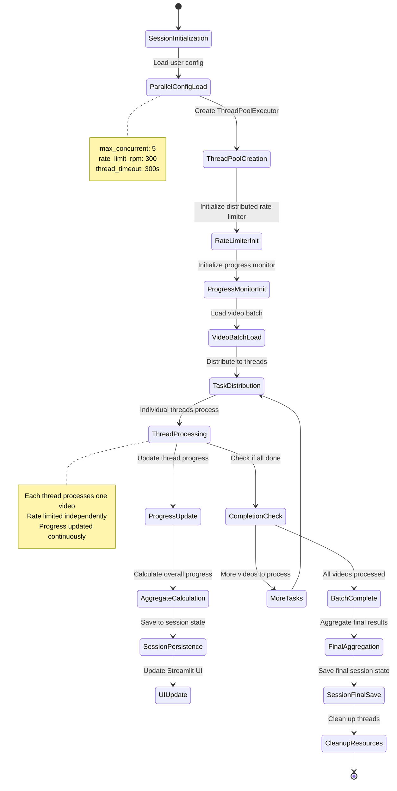
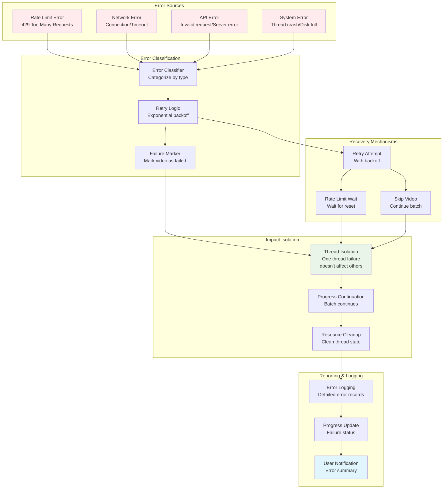
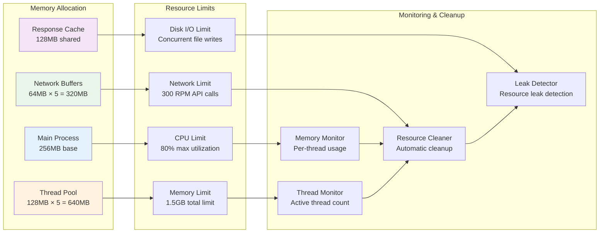
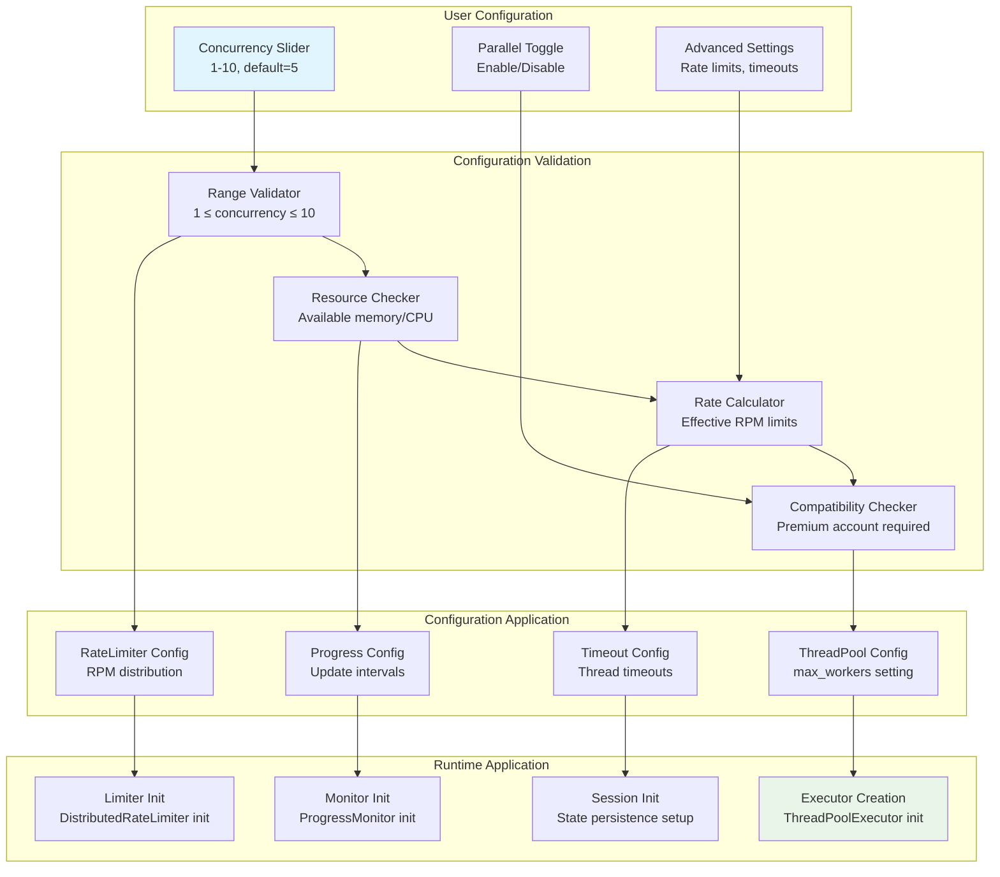

# Parallel Data Flow Diagram

## High-Level Data Flow

```mermaid
flowchart TD
    subgraph "Input Processing"
        UI[User Input<br/>Video URLs + Config]
        CFG[Configuration<br/>max_concurrent=5<br/>rate_limit=300]
        VS[Video Source<br/>CSV/TSV/Text Input]
    end

    subgraph "Queue Management"
        QM[Queue Manager<br/>Distributes videos<br/>to threads]
        PB[Processing Batch<br/>List[VideoItem]]
    end

    subgraph "Parallel Execution Engine"
        TPE[ThreadPoolExecutor<br/>max_workers=5]
        RL[Rate Limiter<br/>Distributed 300 RPM]

        subgraph "Worker Threads"
            W1[Worker 1<br/>Thread-1]
            W2[Worker 2<br/>Thread-2]
            W3[Worker 3<br/>Thread-3]
            W4[Worker 4<br/>Thread-4]
            W5[Worker 5<br/>Thread-5]
        end
    end

    subgraph "Individual Processing Pipeline"
        MD[Metadata Fetch<br/>YouTube API]
        TR[Transcript Request<br/>deAPI Submit]
        POLL[Status Polling<br/>deAPI Check]
        DL[Download Results<br/>deAPI Fetch]
        SAVE[Save Files<br/>Markdown + JSON]
    end

    subgraph "Progress & State Management"
        PM[Progress Monitor<br/>Thread-safe updates]
        SM[Session Manager<br/>Persistence layer]
        DB[Session Database<br/>Manifest + State]
    end

    subgraph "Output & Results"
        LOG[Processing Logs<br/>Detailed status]
        FILES[Output Files<br/>Transcripts + Metadata]
        STATS[Statistics<br/>Success/Failure counts]
    end

    UI --> CFG
    VS --> QM
    CFG --> QM
    QM --> PB
    PB --> TPE

    TPE --> W1
    TPE --> W2
    TPE --> W3
    TPE --> W4
    TPE --> W5

    W1 --> RL
    W2 --> RL
    W3 --> RL
    W4 --> RL
    W5 --> RL

    RL --> MD
    MD --> TR
    TR --> POLL
    POLL --> DL
    DL --> SAVE

    W1 --> PM
    W2 --> PM
    W3 --> PM
    W4 --> PM
    W5 --> PM

    PM --> SM
    SM --> DB

    SAVE --> FILES
    PM --> LOG
    PM --> STATS

    style TPE fill:#e1f5fe
    style RL fill:#fff3e0
    style PM fill:#e8f5e8
```

## Thread-Level Data Flow

```mermaid
flowchart TD
    subgraph "Thread Lifecycle"
        START[Thread Starts<br/>Video assigned]
        RATE_CHECK[Rate Limit Check<br/>acquire_permission()]
        METADATA[Fetch Metadata<br/>YouTube API call]
        SUBMIT[Submit Transcript<br/>deAPI POST request]
        POLL_LOOP{Polling Loop<br/>5-15s intervals}
        DOWNLOAD[Download Result<br/>deAPI GET request]
        SAVE_LOCAL[Save Files<br/>Local filesystem]
        COMPLETE[Mark Complete<br/>Update progress]
    end

    subgraph "Rate Limiting"
        GLOBAL_LIMIT[Global Limit<br/>300 RPM]
        THREAD_ALLOCATION[Per-Thread Limit<br/>300/5 = 60 RPM]
        THREAD_COUNTER[Thread Counter<br/>Requests this minute]
        RESET_TIMER[Reset Timer<br/>Minute boundary]
    end

    subgraph "Progress Updates"
        THREAD_STATE[Thread State<br/>Current status]
        AGGREGATE_STATS[Aggregate Stats<br/>Total progress]
        UI_CALLBACKS[UI Callbacks<br/>Real-time updates]
        SESSION_PERSIST[Session Persistence<br/>Recovery support]
    end

    START --> RATE_CHECK
    RATE_CHECK --> METADATA
    METADATA --> SUBMIT
    SUBMIT --> POLL_LOOP

    POLL_LOOP -->|Job Complete| DOWNLOAD
    POLL_LOOP -->|Still Processing| POLL_LOOP
    POLL_LOOP -->|Job Failed| ERROR_HANDLER

    DOWNLOAD --> SAVE_LOCAL
    SAVE_LOCAL --> COMPLETE

    RATE_CHECK --> GLOBAL_LIMIT
    GLOBAL_LIMIT --> THREAD_ALLOCATION
    THREAD_ALLOCATION --> THREAD_COUNTER
    THREAD_COUNTER --> RESET_TIMER

    METADATA --> THREAD_STATE
    SUBMIT --> THREAD_STATE
    POLL_LOOP --> THREAD_STATE
    DOWNLOAD --> THREAD_STATE
    SAVE_LOCAL --> THREAD_STATE
    COMPLETE --> THREAD_STATE

    THREAD_STATE --> AGGREGATE_STATS
    AGGREGATE_STATS --> UI_CALLBACKS
    AGGREGATE_STATS --> SESSION_PERSIST

    ERROR_HANDLER --> THREAD_STATE
```

## State Management Flow



## Error Handling Data Flow



## Memory and Resource Management



## Configuration Data Flow

