# Parallel Processing System Architecture

## UI-Compatible System Context Diagram


## Class Diagram: Core Components


## Sequence Diagram: Parallel Processing Workflow


## Activity Diagram: Individual Video Processing

```mermaid
stateDiagram-v2
    [*] --> InitializeVideoProcessor
    InitializeVideoProcessor --> CheckRateLimit

    CheckRateLimit --> RateLimitExceeded: rate limit hit
    RateLimitExceeded --> WaitForRateLimitReset
    WaitForRateLimitReset --> CheckRateLimit

    CheckRateLimit --> RateLimitOK: within limits
    RateLimitOK --> FetchMetadata

    FetchMetadata --> MetadataSuccess: metadata retrieved
    MetadataSuccess --> SubmitTranscriptRequest

    FetchMetadata --> MetadataFailed: API error/timeout
    MetadataFailed --> MarkVideoFailed

    SubmitTranscriptRequest --> TranscriptJobSubmitted: job ID received
    TranscriptJobSubmitted --> PollForCompletion

    PollForCompletion --> JobCompleted: transcript ready
    JobCompleted --> DownloadTranscript
    DownloadTranscript --> SaveMarkdownFile
    SaveMarkdownFile --> MarkVideoSuccess

    PollForCompletion --> JobStillProcessing: wait longer
    JobStillProcessing --> PollForCompletion

    PollForCompletion --> JobFailed: permanent failure
    JobFailed --> MarkVideoFailed

    SubmitTranscriptRequest --> SubmitFailed: API error
    SubmitFailed --> MarkVideoFailed

    MarkVideoSuccess --> [*]
    MarkVideoFailed --> [*]

    note right of CheckRateLimit
        Rate Limiter ensures
        < 300 RPM across
        all threads
    end note

    note right of PollForCompletion
        Async processing:
        5-15 second polls
        up to 10 minutes timeout
    end note
```



## Deployment Diagram: Resource Allocation


## Component Interaction Flow

```mermaid
flowchart TD
    A[User Sets Concurrency = 5] --> B[ParallelProcessor.init()]
    B --> C[ThreadPoolExecutor(max_workers=5)]
    C --> D[RateLimiter.init(300 RPM)]
    D --> E[ProgressMonitor.init()]

    F[Video Batch Submitted] --> G[Queue Manager]
    G --> H{For each video}
    H --> I[Submit to ThreadPool]
    I --> J[Thread acquires rate limit]
    J --> K[Process video metadata]
    K --> L[Submit transcript request]
    L --> M[Poll for completion]

    M --> N{Status check}
    N -->|Completed| O[Download & save]
    N -->|Processing| P[Wait & retry]
    N -->|Failed| Q[Mark failed]

    O --> R[Update progress]
    Q --> R
    P --> M

    R --> S[Thread completes]
    S --> T[Aggregate results]
    T --> U[Return to UI]

    style A fill:#e1f5fe
    style F fill:#fff3e0
    style U fill:#e8f5e8
```