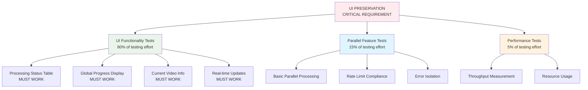

# Testing Strategy: Parallel Processing Implementation

## UI-Focused Testing Pyramid



## UI Validation Testing Strategy (PRIMARY FOCUS)

### 1. Processing Status Table Validation

```python
class TestUIStatusTable:
    def test_status_table_shows_sequential_processing(self):
        """Ensure status table works with sequential processing (baseline)"""
        videos = [create_test_video(i) for i in range(3)]

        # Process sequentially (existing functionality)
        results = process_sequentially(videos)

        # Validate UI elements
        assert status_table_shows_all_videos()
        assert global_progress_updates()
        assert current_video_display_works()

    def test_status_table_shows_parallel_processing(self):
        """Ensure status table works with parallel processing"""
        videos = [create_test_video(i) for i in range(3)]

        # Process with parallel (new functionality)
        results = process_with_parallel(videos, max_concurrent=2)

        # Validate UI elements still work
        assert status_table_shows_all_videos()
        assert global_progress_updates()
        assert current_video_display_works()
        assert parallel_operations_visible()

    def test_ui_fallback_on_parallel_failure(self):
        """Ensure UI works when parallel processing fails"""
        videos = [create_test_video(i) for i in range(3)]

        # Simulate parallel processing failure
        results = process_with_parallel_failure_simulation(videos)

        # Validate UI gracefully handles failure
        assert status_table_shows_error_states()
        assert global_progress_shows_failures()
        assert user_can_fallback_to_sequential()
```

### 2. Global Progress Display Validation

```python
class TestUIGlobalProgress:
    def test_global_progress_sequential(self):
        """Global progress works with sequential processing"""
        # Test existing functionality
        pass

    def test_global_progress_parallel(self):
        """Global progress works with parallel processing"""
        # Test new functionality preserves UI
        pass

    def test_progress_updates_real_time(self):
        """Progress updates in real-time for both modes"""
        # Test timing and update frequency
        pass
```

### 3. Current Video Information Validation

```python
class TestUICurrentVideo:
    def test_current_video_sequential(self):
        """Current video display works sequentially"""
        pass

    def test_current_video_parallel(self):
        """Current video display works with parallel processing"""
        # Challenge: Multiple videos processing simultaneously
        # Solution: Show active videos or most recent
        pass
```

## Unit Testing Strategy (SECONDARY)

```python
class TestDistributedRateLimiter:
    def test_single_thread_rate_limit_compliance(self):
        """Test that individual threads stay within rate limits"""
        limiter = DistributedRateLimiter(total_rpm_limit=300, num_threads=5)

        # Should allow up to 60 requests per minute per thread
        for i in range(60):
            assert limiter.acquire_permission(thread_id=1)

        # Should deny 61st request
        assert not limiter.acquire_permission(thread_id=1)

    def test_minute_reset(self):
        """Test that counters reset after minute boundary"""
        limiter = DistributedRateLimiter(total_rpm_limit=300, num_threads=1)

        # Use up the minute
        for i in range(300):
            limiter.acquire_permission(thread_id=1)

        # Simulate minute passing
        limiter.thread_reset_times[1] -= 61  # Go back in time

        # Should allow new requests
        assert limiter.acquire_permission(thread_id=1)

    def test_thread_isolation(self):
        """Test that threads don't interfere with each other"""
        limiter = DistributedRateLimiter(total_rpm_limit=300, num_threads=2)

        # Thread 1 uses its full allocation
        for i in range(150):  # 300/2 = 150 per thread
            assert limiter.acquire_permission(thread_id=1)

        # Thread 1 should be blocked
        assert not limiter.acquire_permission(thread_id=1)

        # Thread 2 should still work
        assert limiter.acquire_permission(thread_id=2)
```

### 2. Progress Monitor Tests

```python
class TestConcurrentProgressMonitor:
    def test_thread_safe_updates(self):
        """Test that progress updates are thread-safe"""
        monitor = ConcurrentProgressMonitor(total_videos=10, num_threads=5)

        def update_from_thread(thread_id: int):
            for i in range(10):
                monitor.update_thread_progress(
                    thread_id,
                    VideoState(f"video_{i}", "processing", progress=i/10)
                )
                time.sleep(0.01)  # Simulate work

        # Run multiple threads
        threads = []
        for thread_id in range(5):
            t = threading.Thread(target=update_from_thread, args=(thread_id,))
            threads.append(t)
            t.start()

        # Wait for completion
        for t in threads:
            t.join()

        # Check final progress
        progress = monitor.get_aggregate_progress()
        assert progress["completed"] == 0  # No completions in this test
        assert progress["active"] == 5

    def test_eta_calculation(self):
        """Test ETA calculation accuracy"""
        monitor = ConcurrentProgressMonitor(total_videos=100, num_threads=5)

        # Simulate some progress
        start_time = datetime.now()
        monitor.start_time = start_time

        # Mark 50 videos as completed over 30 seconds
        monitor.completed_count = 50
        simulated_elapsed = timedelta(seconds=30)
        monitor.start_time = start_time - simulated_elapsed

        eta = monitor._calculate_eta()
        expected_remaining = timedelta(seconds=30)  # 50 videos in 30s = 1.67 videos/s, 50 remaining = 30s
        assert abs((eta - datetime.now()).total_seconds() - 30) < 5  # Within 5 seconds
```

### 3. Configuration Tests

```python
class TestParallelConfig:
    def test_valid_configuration(self):
        """Test valid configuration acceptance"""
        config = ParallelConfig(
            max_concurrent=5,
            rate_limit_rpm=300,
            thread_timeout=300
        )
        assert config.validate_config()

    def test_invalid_concurrency(self):
        """Test invalid concurrency rejection"""
        with pytest.raises(ValueError):
            ParallelConfig(max_concurrent=15)  # Too high

        with pytest.raises(ValueError):
            ParallelConfig(max_concurrent=0)   # Too low

    def test_rate_limit_calculation(self):
        """Test effective rate limit calculations"""
        config = ParallelConfig(max_concurrent=5, rate_limit_rpm=300)

        # Should distribute 300 RPM across 5 threads = 60 RPM each
        assert config.get_effective_rate_limit() == 60.0
```

## Integration Testing Strategy

### 1. Parallel Processing Integration Tests

```python
class TestParallelProcessingIntegration:
    def test_full_parallel_workflow(self):
        """Test complete parallel processing workflow"""
        # Create test videos
        videos = [create_test_video(i) for i in range(5)]

        # Configure parallel processing
        config = ParallelConfig(max_concurrent=3, enable_parallel=True)

        # Execute parallel processing
        processor = ParallelVideoProcessor(config)
        results = processor.process_batch(videos)

        # Verify results
        assert len(results.successful) + len(results.failed) == 5
        assert results.total_processing_time < 60  # Should complete quickly

    def test_rate_limit_compliance_integration(self):
        """Test rate limit compliance during actual processing"""
        videos = [create_test_video(i) for i in range(10)]

        config = ParallelConfig(max_concurrent=5, rate_limit_rpm=300)
        processor = ParallelVideoProcessor(config)

        start_time = time.time()
        results = processor.process_batch(videos)
        end_time = time.time()

        # Should take at least 2 minutes (300 requests would take 1 minute at 5 RPS)
        # But with processing overhead, expect longer
        duration = end_time - start_time
        assert duration > 60  # At least 1 minute

        # Verify rate compliance through mock API monitoring
        assert get_api_call_count() <= 300  # Should not exceed RPM limit

    def test_error_isolation(self):
        """Test that individual failures don't affect other videos"""
        videos = [
            create_test_video(1, will_fail=True),   # Will fail
            create_test_video(2, will_succeed=True), # Will succeed
            create_test_video(3, will_succeed=True), # Will succeed
        ]

        config = ParallelConfig(max_concurrent=3)
        processor = ParallelVideoProcessor(config)
        results = processor.process_batch(videos)

        # Should have 1 failure and 2 successes
        assert len(results.failed) == 1
        assert len(results.successful) == 2
        assert results.total_videos == 3
```

### 2. Resource Usage Tests

```python
class TestResourceUsage:
    def test_memory_usage_bounds(self):
        """Test that memory usage stays within bounds"""
        videos = [create_test_video(i) for i in range(10)]

        config = ParallelConfig(max_concurrent=5)
        processor = ParallelVideoProcessor(config)

        # Monitor memory before
        initial_memory = get_process_memory_mb()

        # Process videos
        results = processor.process_batch(videos)

        # Check memory after
        final_memory = get_process_memory_mb()
        memory_delta = final_memory - initial_memory

        # Should not exceed 2GB additional memory
        assert memory_delta < 2000

        # Clean up
        processor.shutdown()

    def test_cpu_usage_monitoring(self):
        """Test CPU usage during parallel processing"""
        videos = [create_test_video(i) for i in range(20)]

        config = ParallelConfig(max_concurrent=5)
        processor = ParallelVideoProcessor(config)

        # Start monitoring
        cpu_monitor = CPUMonitor()
        cpu_monitor.start()

        # Process videos
        results = processor.process_batch(videos)

        # Stop monitoring
        avg_cpu = cpu_monitor.stop()

        # Should not exceed 80% average CPU
        assert avg_cpu < 80.0
```

## End-to-End Testing Strategy

### 1. Full Workflow Tests

```python
class TestParallelProcessingE2E:
    def test_streamlit_integration(self):
        """Test full Streamlit UI integration"""
        # This would require Streamlit testing framework
        pass

    def test_session_persistence(self):
        """Test that parallel processing state persists across restarts"""
        # Start processing
        videos = [create_test_video(i) for i in range(10)]
        config = ParallelConfig(max_concurrent=3)

        # Simulate interruption (save state)
        processor = ParallelVideoProcessor(config)
        processor.process_batch_partial(videos[:5])  # Process first 5

        # Save session state
        session_state = processor.get_session_state()

        # Simulate restart
        new_processor = ParallelVideoProcessor.from_session_state(session_state)

        # Continue processing remaining videos
        results = new_processor.process_batch(videos[5:])

        # Verify completion
        assert results.total_videos == 5

    def test_user_configuration_workflow(self):
        """Test user configuration changes affect processing"""
        # Test different concurrency levels
        for concurrency in [1, 3, 5, 10]:
            config = ParallelConfig(max_concurrent=concurrency)
            videos = [create_test_video(i) for i in range(concurrency * 2)]

            processor = ParallelVideoProcessor(config)
            start_time = time.time()
            results = processor.process_batch(videos)
            end_time = time.time()

            # Higher concurrency should generally be faster
            duration = end_time - start_time
            print(f"Concurrency {concurrency}: {duration:.2f}s for {len(videos)} videos")
```

## Performance Testing Strategy

### 1. Throughput Benchmarks

```python
class TestPerformanceBenchmarks:
    def test_throughput_scaling(self):
        """Test how throughput scales with concurrency"""
        results = {}

        for concurrency in [1, 2, 3, 5, 10]:
            videos = [create_test_video(i) for i in range(concurrency * 10)]  # Scale videos with concurrency

            config = ParallelConfig(max_concurrent=concurrency)
            processor = ParallelVideoProcessor(config)

            start_time = time.time()
            result = processor.process_batch(videos)
            end_time = time.time()

            duration = end_time - start_time
            throughput = len(videos) / (duration / 60)  # videos per minute

            results[concurrency] = {
                'duration': duration,
                'throughput': throughput,
                'videos': len(videos)
            }

            processor.shutdown()

        # Analyze scaling efficiency
        sequential_throughput = results[1]['throughput']
        for concurrency, data in results.items():
            if concurrency > 1:
                scaling_efficiency = data['throughput'] / (sequential_throughput * concurrency)
                print(f"Concurrency {concurrency}: {scaling_efficiency:.2f} scaling efficiency")
                # Expect diminishing returns but overall improvement

    def test_rate_limit_efficiency(self):
        """Test how efficiently we utilize rate limits"""
        videos = [create_test_video(i) for i in range(50)]

        config = ParallelConfig(max_concurrent=5, rate_limit_rpm=300)
        processor = ParallelVideoProcessor(config)

        # Mock API to track call timing
        api_call_times = []

        start_time = time.time()
        results = processor.process_batch(videos)
        end_time = time.time()

        total_duration = end_time - start_time

        # Calculate rate limit utilization
        total_api_calls = len(api_call_times)
        expected_max_calls = (300 / 60) * total_duration  # Max calls at 5 RPS

        utilization_rate = total_api_calls / expected_max_calls
        print(f"Rate limit utilization: {utilization_rate:.2f}")

        # Should be high utilization but not exceeding limits
        assert utilization_rate > 0.8  # At least 80% utilization
        assert utilization_rate <= 1.0  # Never exceed limits
```

## Test Automation and CI/CD

### 1. Test Execution Strategy

```yaml
# .github/workflows/parallel-processing-tests.yml
name: Parallel Processing Tests

on:
  push:
    paths:
      - 'src/bulk_transcribe/parallel/**'
      - 'tests/parallel/**'

jobs:
  unit-tests:
    runs-on: ubuntu-latest
    steps:
      - uses: actions/checkout@v3
      - name: Run Unit Tests
        run: pytest tests/parallel/unit/ -v --cov=src/bulk_transcribe/parallel/

  integration-tests:
    runs-on: ubuntu-latest
    needs: unit-tests
    steps:
      - uses: actions/checkout@v3
      - name: Run Integration Tests
        run: pytest tests/parallel/integration/ -v

  performance-tests:
    runs-on: ubuntu-latest
    needs: integration-tests
    steps:
      - uses: actions/checkout@v3
      - name: Run Performance Tests
        run: pytest tests/parallel/performance/ -v --benchmark-only
```

### 2. Test Data Management

```python
class TestDataFactory:
    @staticmethod
    def create_test_video(video_id: int, will_succeed: bool = True) -> VideoItem:
        """Create test video data"""
        return VideoItem(
            url=f"https://youtube.com/watch?v=test_{video_id}",
            title=f"Test Video {video_id}",
            expected_success=will_succeed
        )

    @staticmethod
    def create_test_batch(size: int) -> List[VideoItem]:
        """Create batch of test videos"""
        return [TestDataFactory.create_test_video(i) for i in range(size)]

    @staticmethod
    def mock_api_responses() -> Dict:
        """Create mock API response data"""
        return {
            'success_response': {
                'status': 'completed',
                'transcript': 'Mock transcript text...'
            },
            'rate_limit_response': {
                'error': 'rate_limit_exceeded',
                'retry_after': 60
            },
            'error_response': {
                'error': 'video_unavailable'
            }
        }
```

## Success Metrics and Monitoring

### 1. Test Coverage Metrics
- **Unit Tests:** > 90% coverage for parallel processing code
- **Integration Tests:** All critical user workflows covered
- **Performance Tests:** Benchmarks for all concurrency levels

### 2. Quality Gates
- All unit tests pass
- Integration tests pass on all platforms
- Performance regression < 10%
- Memory leak tests pass

### 3. Continuous Monitoring
- Rate limit compliance monitoring
- Performance regression detection
- Error rate tracking
- User satisfaction metrics

## Risk Mitigation Testing

### 1. Failure Mode Testing

```python
class TestFailureModes:
    def test_network_failure_recovery(self):
        """Test recovery from network failures"""
        # Simulate network failures during processing
        pass

    def test_rate_limit_throttling(self):
        """Test behavior when hitting rate limits"""
        # Force rate limit scenarios
        pass

    def test_thread_crash_recovery(self):
        """Test recovery from thread crashes"""
        # Simulate thread failures
        pass

    def test_resource_exhaustion(self):
        """Test behavior under resource pressure"""
        # Memory and CPU exhaustion scenarios
        pass
```

### 2. Boundary Testing

```python
class TestBoundaries:
    def test_max_concurrency(self):
        """Test maximum supported concurrency"""
        config = ParallelConfig(max_concurrent=10)
        videos = [create_test_video(i) for i in range(100)]

        processor = ParallelVideoProcessor(config)
        results = processor.process_batch(videos)

        # Should handle max concurrency without issues
        assert results.total_videos == 100

    def test_minimum_concurrency(self):
        """Test minimum concurrency (sequential)"""
        config = ParallelConfig(max_concurrent=1)
        videos = [create_test_video(i) for i in range(5)]

        processor = ParallelVideoProcessor(config)
        results = processor.process_batch(videos)

        # Should work like sequential processing
        assert results.total_videos == 5
```

This comprehensive testing strategy ensures the parallel processing implementation is robust, performant, and maintainable.