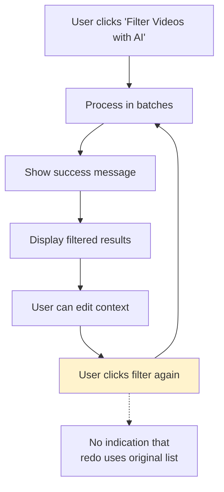
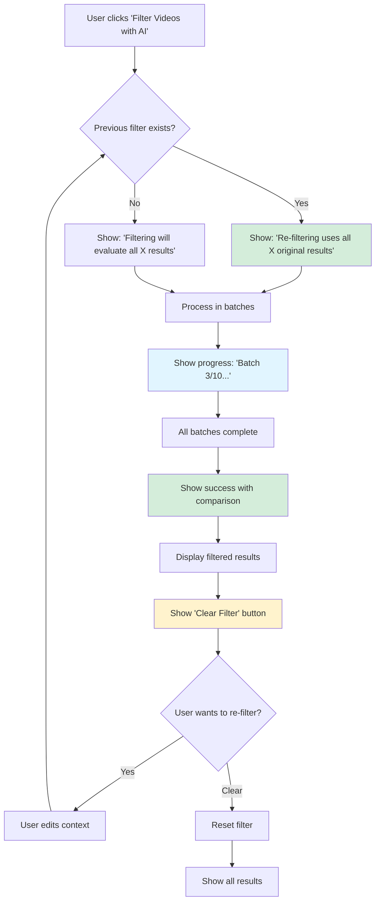

# AI Filter Process Analysis & Optimization Summary

**Created:** 2026-01-26  
**Purpose:** Executive summary of filter process analysis and optimization recommendations  
**Status:** Documentation Complete - Ready for Implementation Review

---

## Priority Override: Parsing Hardening First

**See:** `ai_filter_feedback.md` and `ai_filter_parsing_hardening_plan.md`

Engineering feedback reframes the main risk: **parsing and verification**, not batching or UX. The system currently relies on positional alignment only; there are no video IDs in model output and no validation, so silent misclassification is possible.

**Implementation order:**

1. **P0 — Parsing hardening:** ID-anchored prompt, ID-based output contract, parser validation (Layers 1, 2, 4). Do this first.
2. **P1 — UX/progress:** Redo message, Clear Filter, progress callback — after parsing is robust.

---

## Quick Assessment

### Current State: ✅ **Well-Optimized Core, Needs UX Improvements**

The AI filter implementation is **already efficient and correct** at the architectural level:
- ✅ Batching strategy (10 videos per API call) - **90% cost savings**
- ✅ Always filters from original list (not filtered list) - **Correct behavior**
- ✅ Error handling per batch - **Partial results on failure**
- ✅ Input validation - **API connection test before processing**

**However**, the user experience around redo/retry is unclear and could be improved.

---

## Key Findings

### 1. Redo Logic: Already Correct ✅

**Current Implementation:**
```python
# Line 1205 in 01_YouTube_Search.py
filter_result = filter_videos_by_relevance(
    videos=search_results.items,  # ✅ Always uses ORIGINAL list
    ...
)
```

**Finding:** The code already correctly uses the original unfiltered list (`search_results.items`) for filtering, even when re-filtering. This is the correct behavior.

**Issue:** Users don't know this is happening. No UI indication.

---

### 2. Efficiency: Already Optimized ✅

**Batching Strategy:**
- 10 videos per API call (not 1 per video)
- Cost: ~$0.01-0.02 per 100 videos (vs. $0.10-0.20 per-video)
- **90% cost savings** compared to per-video approach

**Finding:** Current batch size (10) is optimal for:
- Token limits (safety margin)
- Cost efficiency
- Quality (allows relative comparison)

**Recommendation:** Keep batch size at 10. No changes needed.

---

### 3. User Experience: Needs Improvement ⚠️

**Current Issues:**
1. ❌ No clear indication that redo uses original list
2. ❌ No way to clear/reset filter results
3. ❌ No progress feedback during filtering (for large sets)
4. ❌ No comparison view (old vs. new filter results)

**Impact:** Users may be confused about what's being filtered and can't easily manage filter state.

---

## Optimization Recommendations

### Priority 0: UX Clarity (Do First)

**Goal:** Make redo behavior crystal clear.

**Changes:**
1. **Add informational message** before filter button:
   ```
   "ℹ️ Re-filtering will use all [X] original search results, 
   not the current [Y] shortlisted videos."
   ```

2. **Add "Clear Filter" button** to reset filtered results:
   ```
   [Clear Filter] button → Shows all results again
   ```

**Impact:** High (user clarity)  
**Risk:** Low (UI-only changes)  
**Effort:** 30-45 minutes

---

### Priority 1: Progress Feedback (Do Second)

**Goal:** Show users progress during filtering.

**Changes:**
1. **Add progress bar** showing "Processing batch X of Y..."
2. **Add status text** with current batch number
3. **Optional callback parameter** in `filter_videos_by_relevance()`

**Impact:** Medium (better UX for large video sets)  
**Risk:** Low (optional parameter, backward compatible)  
**Effort:** 1-2 hours

---

### Priority 2: Error Recovery (Do Third)

**Goal:** Improve reliability with retry logic.

**Changes:**
1. **Add retry logic** for transient errors (429 rate limit, timeouts)
2. **Exponential backoff** (1s, 2s, 4s delays)
3. **Max 3 retries** per batch

**Impact:** Medium (better reliability)  
**Risk:** Medium (needs API testing)  
**Effort:** 2-3 hours

---

### Priority 3: Filter Comparison (Optional)

**Goal:** Help users compare filter results.

**Changes:**
1. **Show previous filter stats** before re-filtering
2. **Show comparison** in success message (old vs. new)

**Impact:** Low (nice-to-have)  
**Risk:** Low (display only)  
**Effort:** 30-45 minutes

---

## Visual Flow: Current vs. Recommended

### Current Filter Flow



**Issues:**
- ⚠️ No clear message about redo behavior
- ⚠️ No progress indication
- ⚠️ No way to clear filter

---

### Recommended Filter Flow



**Improvements:**
- ✅ Clear message about redo behavior
- ✅ Progress indication during filtering
- ✅ Clear Filter button
- ✅ Comparison view

---

## Implementation Roadmap

### Phase 1: UX Clarity (Week 1)

**Tasks:**
- [ ] Add informational message before filter button
- [ ] Add "Clear Filter" button
- [ ] Test: User understands redo behavior
- [ ] Test: User can clear filter

**Deliverable:** Clear, intuitive filter management

---

### Phase 2: Progress Feedback (Week 1-2)

**Tasks:**
- [ ] Add progress callback parameter to `filter_videos_by_relevance()`
- [ ] Create progress UI in `01_YouTube_Search.py`
- [ ] Test: Progress shows for various video counts
- [ ] Test: Progress clears after completion

**Deliverable:** Real-time progress indication

---

### Phase 3: Error Recovery (Week 2-3)

**Tasks:**
- [ ] Create `_call_openrouter_api_with_retry()` function
- [ ] Update `_filter_video_batch()` to use retry
- [ ] Test: Retry works for 429 errors
- [ ] Test: Retry works for timeouts
- [ ] Test: Permanent errors don't retry

**Deliverable:** Improved reliability

---

### Phase 4: Filter Comparison (Optional)

**Tasks:**
- [ ] Display previous filter stats
- [ ] Show comparison in success message
- [ ] Test: Stats display correctly

**Deliverable:** Comparison view

---

## Cost-Benefit Analysis

### Current Implementation

| Aspect | Status | Notes |
|--------|--------|-------|
| **Cost Efficiency** | ✅ Optimal | 90% savings with batching |
| **Correctness** | ✅ Correct | Always uses original list |
| **Reliability** | ✅ Good | Per-batch error handling |
| **User Clarity** | ⚠️ Unclear | No indication of redo behavior |
| **Progress Feedback** | ⚠️ Missing | No progress for large sets |
| **Error Recovery** | ⚠️ Basic | No retry for transient errors |

### After Recommended Changes

| Aspect | Status | Improvement |
|--------|--------|-------------|
| **Cost Efficiency** | ✅ Optimal | No change (already optimal) |
| **Correctness** | ✅ Correct | No change (already correct) |
| **Reliability** | ✅ Better | Retry logic for transient errors |
| **User Clarity** | ✅ Clear | Informational messages + Clear button |
| **Progress Feedback** | ✅ Present | Progress bar + status text |
| **Error Recovery** | ✅ Improved | Automatic retry with backoff |

---

## Risk Assessment

### Low Risk ✅

- **UX Clarity (Phase 1):** UI-only changes, no logic modifications
- **Progress Feedback (Phase 2):** Optional parameter, backward compatible
- **Filter Comparison (Phase 4):** Display only, no state changes

### Medium Risk ⚠️

- **Error Recovery (Phase 3):** Needs API testing, could mask real errors if misconfigured

### Mitigation

1. **Incremental Implementation:** Test after each phase
2. **Feature Flags:** Could disable retry logic if issues arise
3. **Comprehensive Testing:** Test with real API scenarios
4. **Error Logging:** Log retry attempts for debugging

---

## Success Criteria

### Must Have (Phase 1)

- ✅ Users understand that redo uses original list
- ✅ Users can clear filter and see all results
- ✅ No confusion about what's being filtered

### Should Have (Phase 2)

- ✅ Users see progress during filtering (for 50+ videos)
- ✅ Progress indication is accurate
- ✅ Progress clears after completion

### Nice to Have (Phase 3-4)

- ✅ Transient errors automatically retry
- ✅ Users can compare old vs. new filter results
- ✅ Better error messages for retry scenarios

---

## Documentation Deliverables

### Created Documents

1. **`ai_filter_process_uml.md`** - Comprehensive process documentation
   - Process flow diagrams
   - Efficiency analysis
   - Technical implementation details
   - User experience flow

2. **`ai_filter_optimization_recommendations.md`** - Detailed recommendations
   - Priority matrix
   - Implementation plans
   - Code examples
   - Risk assessment

3. **`ai_filter_analysis_summary.md`** - This document
   - Executive summary
   - Quick assessment
   - Visual flows
   - Implementation roadmap

---

## Next Steps

### Immediate Actions

1. ✅ **Documentation Complete** - All analysis and recommendations documented
2. ⏭️ **Review Recommendations** - Stakeholder review of optimization priorities
3. ⏭️ **Implement Phase 1** - Start with UX clarity (highest impact, lowest risk)

### Decision Points

1. **Priority 2 (Progress):** Should we implement immediately or wait for user feedback?
2. **Priority 3 (Retry):** Do users report transient error issues? If not, may defer.
3. **Priority 4 (Comparison):** Nice-to-have, can be added later if needed.

---

## Conclusion

The AI filter process is **already well-optimized** at the core level. The recommended improvements focus on **user experience clarity** and **reliability enhancements** rather than fundamental architecture changes.

**Recommended Approach:**
1. **Start with Phase 1 (UX Clarity)** - Quick wins, high impact
2. **Then Phase 2 (Progress)** - Better perceived performance
3. **Consider Phase 3 (Retry)** - If users report issues
4. **Optional Phase 4 (Comparison)** - Nice-to-have

**Estimated Total Time:** 4-6 hours for all phases  
**Estimated Risk:** Low to Medium (mostly UI changes)

---

## Questions for Review

1. **Priority:** Should we implement all phases or just Phase 1?
2. **Retry Logic:** Do we have evidence of transient error issues?
3. **Progress:** Is progress feedback needed for typical use cases (10-50 videos)?
4. **Comparison:** Is filter comparison valuable for users?

---

**Status:** ✅ Documentation Complete - Ready for Implementation Review
