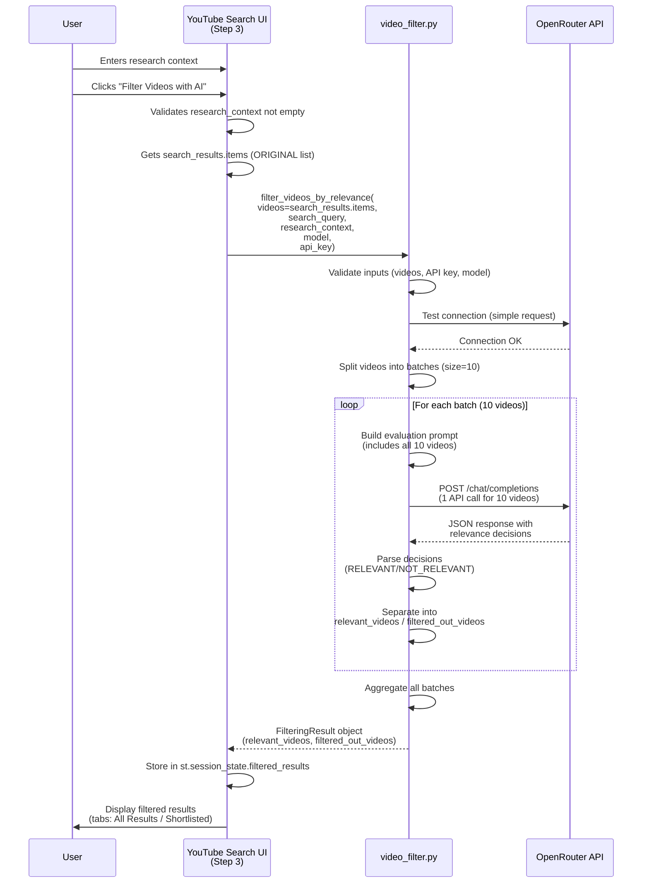
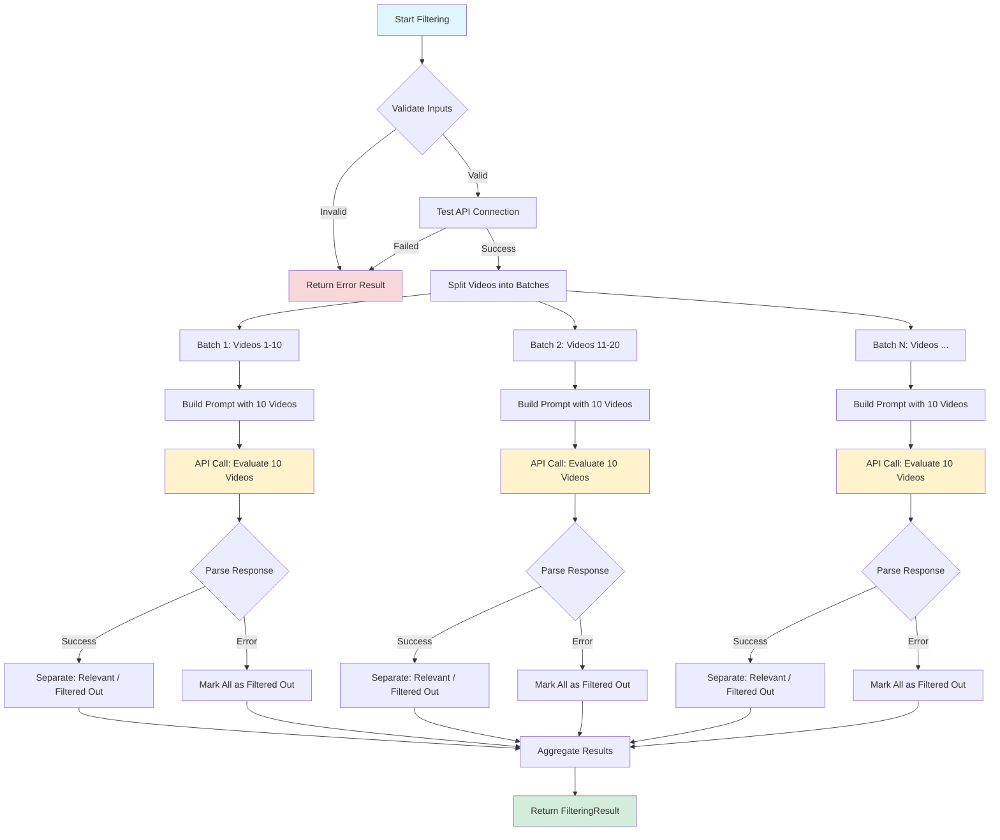
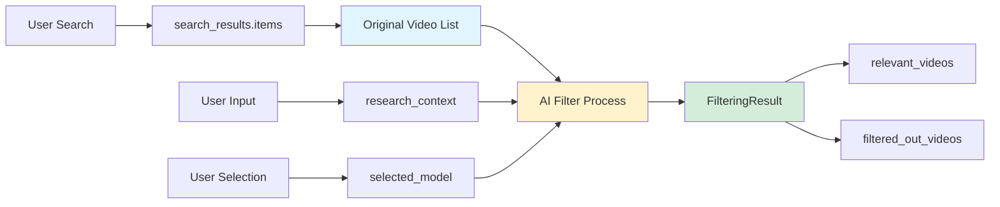
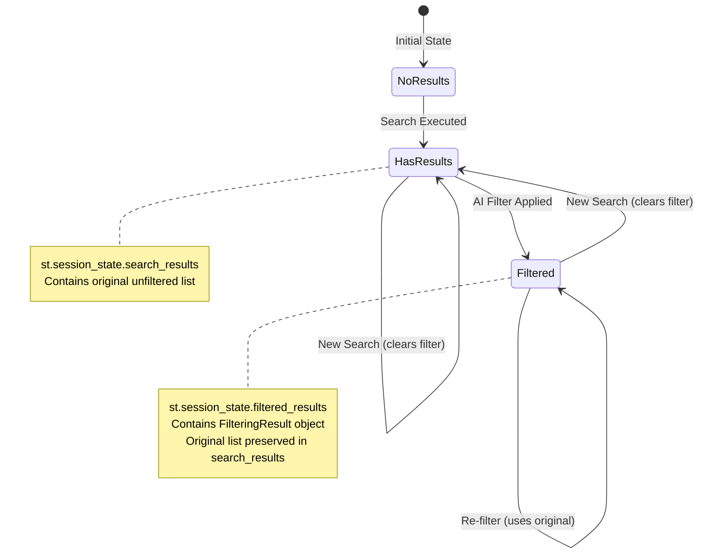
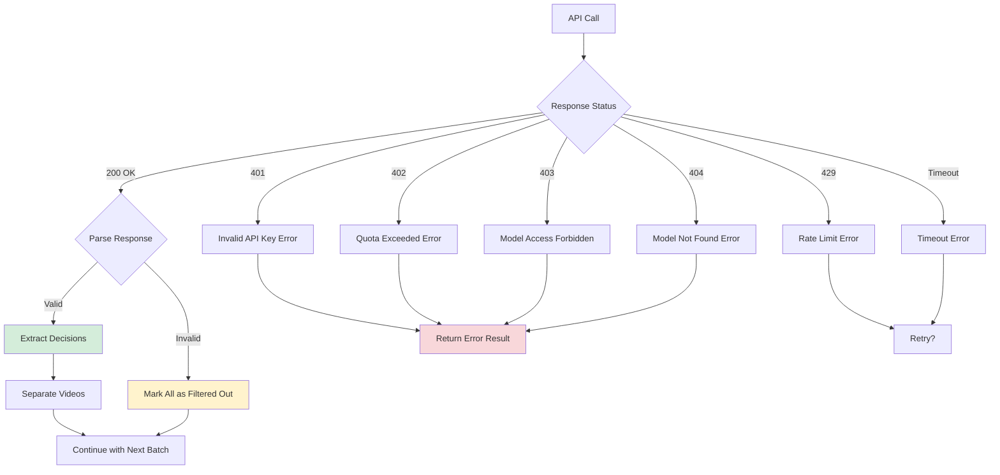
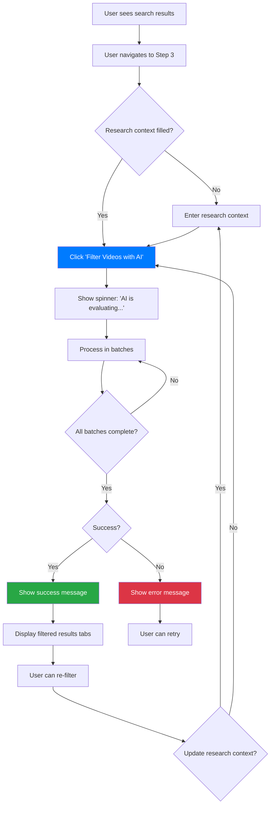

# AI Filter Process Documentation

**Created:** 2026-01-26  
**Purpose:** Comprehensive documentation of the AI-powered video filtering process  
**Related Build Plan:** Build Plan 5 - AI Filter Documentation & Redo Logic

---

## Overview

The AI filter process evaluates YouTube video search results using Large Language Models (LLMs) via the OpenRouter API. Videos are evaluated in batches to optimize cost and efficiency, with each batch making a single API call to evaluate multiple videos simultaneously.

---

## Process Flow Diagram

### High-Level Sequence



### Detailed Batch Processing Flow



---

## Data Flow Architecture

### Input Sources



### Session State Management



---

## Efficiency Analysis

### Cost Optimization: Batching Strategy

**Key Insight:** The filter processes videos in batches of 10, making **1 API call per 10 videos** instead of 1 call per video.

#### Cost Comparison

| Approach | Videos | API Calls | Cost Factor |
|----------|--------|-----------|-------------|
| **Per-Video** (inefficient) | 100 | 100 | 10x |
| **Batched** (current) | 100 | 10 | 1x |

**Example:**
- 50 videos = 5 API calls (not 50)
- 100 videos = 10 API calls (not 100)
- 250 videos = 25 API calls (not 250)

#### Why Batching Works

1. **Token Efficiency:** LLMs can evaluate multiple items in one context window
2. **Cost Reduction:** Fewer API calls = lower cost
3. **Quality Improvement:** Batch evaluation allows relative comparison between videos
4. **Speed:** Fewer network round-trips = faster processing

### Batch Size Considerations

**Current Batch Size: 10 videos**

**Factors Affecting Batch Size:**

1. **Token Limits:**
   - Each video metadata: ~200-300 tokens (title, description, channel)
   - 10 videos: ~2,000-3,000 tokens
   - System prompt + user prompt: ~500 tokens
   - Total: ~2,500-3,500 tokens per batch
   - Max tokens per call: 4,000-8,000 (model dependent)
   - **Safety margin:** 10 is conservative and safe

2. **Quality vs. Speed:**
   - Smaller batches (5): More API calls, but better focus per video
   - Larger batches (20): Fewer calls, but may hit token limits
   - **Current (10):** Good balance

3. **Error Handling:**
   - If one batch fails, others can still succeed
   - Smaller batches = more granular error recovery

**Recommendation:** Keep batch size at 10, but make it configurable for advanced users.

---

## Technical Implementation Details

### API Call Structure

**Endpoint:** `https://openrouter.ai/api/v1/chat/completions`

**Request Format:**
```json
{
  "model": "openai/gpt-4o-mini",
  "messages": [
    {
      "role": "system",
      "content": "You are a video relevance filter..."
    },
    {
      "role": "user",
      "content": "Search Query: [query]\nResearch Context: [context]\n\nVideo 1:\nTitle: [title]\nChannel: [channel]\nDescription: [desc]\n..."
    }
  ],
  "temperature": 0.1,
  "max_tokens": 1000
}
```

**Response Format:**
```
1. RELEVANT - reason text
2. NOT_RELEVANT - reason text
3. RELEVANT - reason text
...
```

### Prompt Engineering

**System Prompt:**
```
You are a video relevance filter. Evaluate YouTube videos based on their metadata 
to determine if they match the user's research goal.
```

**User Prompt Structure:**
1. Search Query (context for what was searched)
2. Research Context (user's goal/criteria)
3. Video List (numbered, with title, channel, description, published date)
4. Response Format Instructions

**Why This Works:**
- Provides context (search query + research goal)
- Includes all videos in one evaluation (enables comparison)
- Clear format instructions (ensures parseable output)

### Error Handling Strategy



**Current Behavior:**
- If batch fails: All videos in that batch marked as "filtered out"
- Other batches continue processing
- Partial results returned (success=False, but some videos processed)

**Potential Improvement:** Implement retry logic for transient errors (429, timeouts)

---

## User Experience Flow

### Filtering Workflow



### Redo/Retry Behavior

**Current Implementation:**
- ✅ Always uses `search_results.items` (original list)
- ✅ User can edit `research_context` and click filter again
- ⚠️ No clear UI indication that redo uses original list
- ⚠️ Previous filtered results remain (could be confusing)

**Recommended Improvements:**
1. Clear UI message: "Filtering will use all [X] original search results"
2. Option to clear previous filter before re-filtering
3. Show comparison: "Previous filter: [Y] relevant, New filter: [Z] relevant"

---

## Performance Characteristics

### Processing Time

**Factors:**
- Number of videos (more = more batches)
- API response time (~2-5 seconds per batch)
- Network latency

**Estimated Times:**
- 10 videos: ~3-5 seconds (1 batch)
- 50 videos: ~15-25 seconds (5 batches)
- 100 videos: ~30-50 seconds (10 batches)
- 250 videos: ~75-125 seconds (25 batches)

**Bottleneck:** API response time (not local processing)

### Resource Usage

- **Memory:** Minimal (processes one batch at a time)
- **CPU:** Minimal (mostly I/O wait)
- **Network:** Moderate (one request per batch)

---

## Quality & Reliability

### Evaluation Quality

**Strengths:**
- Batch evaluation allows relative comparison
- Context-aware (uses search query + research goal)
- Structured output format (reduces parsing errors)

**Limitations:**
- Depends on LLM quality/consistency
- May miss nuanced relevance (binary decision)
- No confidence scores (just relevant/not relevant)

### Reliability Factors

1. **API Availability:** OpenRouter uptime
2. **Model Availability:** Selected model must be accessible
3. **Rate Limiting:** Too many requests = throttling
4. **Token Limits:** Very long descriptions may be truncated
5. **Parsing Accuracy:** Response format must match expected pattern

**Current Safeguards:**
- API connection test before processing
- Model format validation
- Error handling per batch
- Graceful degradation (partial results on error)

---

## Cost Analysis

### Cost Factors

1. **Number of Videos:** Primary factor (determines batch count)
2. **Model Selection:** Different models have different costs
3. **Token Usage:** Longer descriptions = more tokens

### Cost Estimation

**Example with `openai/gpt-4o-mini`:**
- Input tokens: ~3,000 per batch (10 videos)
- Output tokens: ~500 per batch (decisions + reasons)
- Cost per batch: ~$0.001-0.002 (varies by model)

**For 100 videos:**
- 10 batches × $0.001 = **~$0.01-0.02 total**

**Comparison:**
- Per-video approach: 100 calls × $0.001 = **~$0.10-0.20**
- **Savings: ~90%** with batching

---

## Optimization Opportunities

### Current Strengths ✅

1. **Batching:** Already optimized (10 videos per call)
2. **Error Handling:** Per-batch error recovery
3. **Input Validation:** API connection test before processing
4. **Original List Preservation:** Always filters from original, not filtered list

### Potential Improvements 🔧

1. **Progress Indication:**
   - Show "Processing batch 3/10..." during filtering
   - Estimated time remaining
   - Current status per batch

2. **Retry Logic:**
   - Automatic retry for transient errors (429, timeouts)
   - Exponential backoff
   - Max retry attempts

3. **Batch Size Configuration:**
   - Allow users to adjust batch size (advanced settings)
   - Auto-adjust based on model token limits

4. **Partial Results Display:**
   - Show results as batches complete (progressive display)
   - Don't wait for all batches

5. **Filtered Out Visibility:**
   - Option to view filtered-out videos
   - Comparison view: relevant vs. filtered out

6. **Confidence Scores:**
   - Request confidence levels from LLM
   - Show "highly relevant" vs. "marginally relevant"

7. **Caching:**
   - Cache filter results for same videos + context
   - Avoid re-filtering unchanged results

8. **Parallel Batch Processing:**
   - Process multiple batches concurrently (with rate limit respect)
   - Faster for large video sets

---

## Redo/Retry Logic Analysis

### Current State

**Code Location:** `pages/01_YouTube_Search.py` lines 1198-1228

**Current Behavior:**
```python
# Line 1205: Always uses original list ✅
filter_result = filter_videos_by_relevance(
    videos=search_results.items,  # Original list, not filtered list
    ...
)
```

**What Works:**
- ✅ Always filters from original list (`search_results.items`)
- ✅ User can edit `research_context` and re-filter
- ✅ Previous results preserved (can compare)

**What's Missing:**
- ⚠️ No clear UI indication that redo uses original list
- ⚠️ No "Clear Filter" button to reset filtered results
- ⚠️ No comparison view (old vs. new filter results)
- ⚠️ No progress indication during re-filtering

### Recommended Redo Logic

**UI Enhancements:**
1. **Clear Message:** "Filtering will use all [X] original search results"
2. **Clear Filter Button:** Option to reset `filtered_results` to None
3. **Comparison View:** Show previous filter stats when re-filtering
4. **Progress Indicator:** Show batch progress during filtering

**Code Changes:**
- Add UI message before filter button
- Add "Clear Filter" button (optional)
- Show previous filter stats (if exists)
- Add progress tracking (batch X of Y)

---

## Summary

### Key Takeaways

1. **Efficiency:** Batching reduces API calls by 90% (10 videos per call)
2. **Cost:** ~$0.01-0.02 per 100 videos (vs. $0.10-0.20 per-video)
3. **Quality:** Batch evaluation enables relative comparison
4. **Reliability:** Per-batch error handling ensures partial results
5. **Redo:** Already works correctly (uses original list), but needs better UX

### Documentation Status

- ✅ Process flow documented
- ✅ Efficiency analysis complete
- ✅ Technical details explained
- ✅ Optimization opportunities identified
- ✅ Redo logic analyzed

### Next Steps

See `ai_filter_optimization_recommendations.md` for detailed implementation recommendations.
