# Step 2 Auto-fill Component Analysis - UML Extended

## Issue: Auto-fill Not Working in Step 2 Research Context Field

**Status:** 🔴 **FAILING** - Auto-fill logic implemented but not executing properly  
**Updated:** 2026-01-26 - Additional root cause identified: Streamlit widget state preservation

---

## 1. Component Interaction Diagram

```mermaid
sequenceDiagram
    participant User
    participant UI as Streamlit UI
    participant SS as Session State
    participant Step0 as Step 0 Query Planning
    participant Step2 as Step 2 Research Config
    participant TA as TextArea Widget

    Note over User,Step0: Step 0: User enters data
    User->>Step0: Enter research prompt
    Step0->>SS: Store query_planner_prompt
    User->>Step0: Enter optional guidance
    Step0->>SS: Store query_planner_notes
    User->>Step0: Enter required terms
    Step0->>SS: Store required_terms
    
    Note over User,Step2: Step 1: Search execution
    User->>UI: Execute search
    UI->>SS: Set search_results (not None)
    
    Note over User,Step2: Step 2: Auto-fill should trigger
    UI->>Step2: Render Step 2 (search_results exists)
    Step2->>SS: Check research_context.strip()
    SS-->>Step2: Empty string ""
    Step2->>SS: Read query_planner_prompt
    SS-->>Step2: "User's research prompt"
    Step2->>SS: Read query_planner_notes
    SS-->>Step2: "Optional guidance"
    Step2->>SS: Read required_terms
    SS-->>Step2: "Required terms"
    
    Note over Step2,TA: 🔴 PROBLEM AREA
    Step2->>SS: Set research_context = combined
    Step2->>TA: Create text_area(value=research_context)
    TA-->>UI: Render with OLD value (empty)
    
    Note over Step2,TA: Issue: Widget created before state update propagates
    Step2->>SS: Update research_context = text_area value
    SS-->>Step2: Overwrites with empty (from widget)
```



---

## 2. Component Status Map


---

## 3. Data Flow Analysis

```mermaid
flowchart LR
    subgraph "Input Sources"
        I1[query_planner_prompt<br/>✅ Has value]
        I2[query_planner_notes<br/>✅ Has value]
        I3[required_terms<br/>✅ Has value]
    end
    
    subgraph "Auto-fill Logic"
        L1{research_context<br/>empty?} -->|Yes| L2[Build combined string]
        L2 --> L3[Set st.session_state.research_context]
    end
    
    subgraph "Widget Creation"
        W1[text_area created] --> W2[value=research_context]
        W2 --> W3[Widget renders]
    end
    
    subgraph "State Update"
        U1[User edits widget] --> U2[research_context = widget value]
        U2 --> U3[Overwrites auto-filled value]
    end
    
    I1 --> L1
    I2 --> L1
    I3 --> L1
    L3 --> W1
    
    style L1 fill:#ffcccc
    style L3 fill:#ffcccc
    style W2 fill:#ffcccc
    style U3 fill:#ffcccc
```



---

## 4. Root Cause Analysis

### Issue 1: Streamlit Widget Value Binding Timing ⚠️ **PRIMARY ISSUE**
- **Location:** `pages/01_YouTube_Search.py` lines 963, 970, 1023
- **Problem:** 
  - Auto-fill sets `st.session_state.research_context` at line 963
  - TextArea widget is created at line 970 with `value=st.session_state.research_context`
  - Streamlit widgets bind to session state at widget creation time
  - If session state changes in the same render cycle, widget may not reflect the change
  - At line 1023, widget value overwrites session state, potentially with stale empty value

### Issue 2: Missing Rerun Trigger 🔴 **CRITICAL**
- **Location:** After auto-fill logic (line 964)
- **Problem:**
  - Auto-fill updates session state but doesn't trigger `st.rerun()`
  - Widget is created in the same render cycle with old value
  - User sees empty field because widget initialized before state update

### Issue 3: Widget Value Overwrites Auto-fill 🔴 **CRITICAL**
- **Location:** Line 1023
- **Problem:**
  - `st.session_state.research_context = research_context` always executes
  - If widget was created with empty value, it overwrites the auto-filled value
  - Need conditional update: only update if user actually changed the value

### Issue 4: Streamlit Widget State Preservation 🔴 **NEWLY IDENTIFIED**
- **Location:** Widget creation after `st.rerun()`
- **Problem:**
  - When `st.rerun()` is called, Streamlit preserves widget state across reruns
  - Widget may maintain its previous empty value even after session state is updated
  - The `value` parameter is only used for initial widget creation, not on reruns
  - Solution: Use unique `key` parameter that changes when auto-fill occurs to force widget reset

---

## 5. Component Failure Pattern


---

## 6. Remediation Strategy

### Fix 1: Trigger Rerun After Auto-fill ✅ **PRIMARY FIX**
- **Action:** Add `st.rerun()` after setting auto-filled value
- **Location:** After line 964
- **Code:**
  ```python
  if auto_fill_parts:
      st.session_state.research_context = "\n\n".join(auto_fill_parts)
      auto_filled = True
      st.rerun()  # Force re-render with new value
  ```

### Fix 2: Conditional State Update ✅ **SECONDARY FIX**
- **Action:** Only update session state if widget value actually changed
- **Location:** Line 1023
- **Code:**
  ```python
  # Only update if user actually changed the value
  if research_context != st.session_state.research_context:
      st.session_state.research_context = research_context
  ```

### Fix 3: Use Key Parameter for Widget Reset ✅ **IMPLEMENTED**
- **Action:** Use widget key that changes when auto-fill occurs to force widget recreation
- **Location:** Line 974-980
- **Implementation:**
  ```python
  # Track auto-fill key suffix in session state
  auto_fill_key_suffix = st.session_state.get('_auto_fill_key_suffix', 0)
  
  if auto_fill_parts:
      st.session_state.research_context = "\n\n".join(auto_fill_parts)
      st.session_state._auto_fill_key_suffix = auto_fill_key_suffix + 1  # Increment key
      st.rerun()
  
  # Use unique key that changes on auto-fill
  research_context = st.text_area(
      "Research Context/Goal:",
      value=st.session_state.research_context,
      key=f"research_context_{auto_fill_key_suffix}",  # Forces widget reset
      ...
  )
  ```
- **Why this works:** Changing the widget key forces Streamlit to create a new widget instance, ignoring preserved widget state

---

## 7. Implementation Priority & Status

1. **🔴 CRITICAL:** Fix 1 - Add rerun after auto-fill ✅ **IMPLEMENTED**
2. **🟡 HIGH:** Fix 2 - Conditional state update ✅ **IMPLEMENTED**
3. **🔴 CRITICAL:** Fix 3 - Widget key management ✅ **IMPLEMENTED** (Addresses Issue 4)

**All fixes implemented. Testing required to verify resolution.**

---

## 8. Testing Checklist

- [ ] Auto-fill triggers when Step 0 data exists and research_context is empty
- [ ] Auto-filled value appears in text_area immediately
- [ ] User can edit auto-filled value
- [ ] Edited value persists on rerun
- [ ] Auto-fill doesn't trigger if research_context already has content
- [ ] Required terms are included in auto-filled text
- [ ] Optional guidance is included in auto-filled text
- [ ] Research prompt is included in auto-filled text
- [ ] Info message appears when auto-fill occurs
- [ ] No console errors during auto-fill

---

## 9. Expected Behavior After Fix

```mermaid
sequenceDiagram
    participant User
    participant UI
    participant SS as Session State
    participant Step2

    User->>Step2: Step 2 renders (search_results exists)
    Step2->>SS: Check research_context
    SS-->>Step2: Empty
    Step2->>SS: Read Step 0 data
    Step2->>SS: Set research_context = combined
    Step2->>UI: st.rerun()
    UI->>Step2: Re-render Step 2
    Step2->>SS: Read research_context
    SS-->>Step2: Combined value
    Step2->>UI: Create text_area with new value
    UI-->>User: ✅ Shows auto-filled content
```



---

## 10. Risk Assessment

| Component | Risk Level | Impact | Mitigation |
|-----------|-----------|--------|------------|
| Auto-fill logic | 🟢 Low | Already correct | None needed |
| Rerun trigger | 🔴 High | Auto-fill doesn't show | Add st.rerun() |
| State overwrite | 🟡 Medium | User edits lost | Conditional update |
| Widget binding | 🔴 High | Timing issues + state preservation | Rerun + unique key fixes this |
| Widget state preservation | 🔴 High | Widget maintains old value across reruns | Unique key forces widget reset |

---

## 11. Additional Investigation: Step 3 Interference

**User Hypothesis:** Step 3 (table creation) might be interfering with auto-fill.

**Analysis:**
- Step 3 renders after Step 2 in the script execution order
- Step 3 does not modify `research_context` session state
- Step 3 only reads `research_context` for AI filtering (line 1194)
- **Conclusion:** Step 3 is unlikely to interfere with Step 2 auto-fill

**Potential Interference Points:**
1. **Multiple reruns:** If Step 1 search execution calls `st.rerun()` (line 807), and Step 2 auto-fill also calls `st.rerun()` (line 968), there might be a race condition
2. **Widget state preservation:** Streamlit preserves widget state across reruns, which is addressed by Fix 3 (unique key)
3. **Session state initialization:** Line 441 creates a local variable that's never used - not an issue but could be confusing

**Next Steps:** 
1. ✅ All fixes implemented (rerun + conditional update + unique widget key)
2. ⏳ **TESTING REQUIRED:** Verify auto-fill works with the unique key approach
3. If still failing, investigate Streamlit widget state preservation in more detail
4. Consider using `st.session_state` directly as widget key value source
