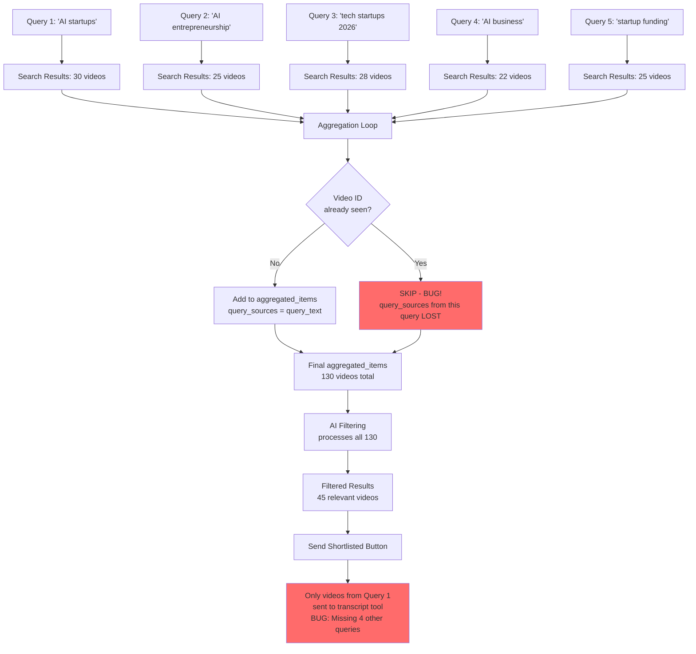

# Bug Visualization: Query Source Loss During Aggregation

## Current (Broken) Flow



## Problem: Deduplication Without Merging

### Example Scenario

**Query 1 finds:**
- Video A (ID: abc123) with `query_sources=["AI startups"]`
- Video B (ID: def456) with `query_sources=["AI startups"]`

**Query 2 finds:**
- Video A (ID: abc123) with `query_sources=["AI entrepreneurship"]` ← DUPLICATE
- Video C (ID: ghi789) with `query_sources=["AI entrepreneurship"]`

**Current Behavior (BROKEN):**
```
After Query 1:
  aggregated_items = [
    Video A (query_sources=["AI startups"]),
    Video B (query_sources=["AI startups"])
  ]
  seen_video_ids = {"abc123", "def456"}

After Query 2:
  Video A (abc123) → Already in seen_video_ids → SKIPPED ❌
  Video C (ghi789) → Not seen → ADDED ✅
  
  Final aggregated_items = [
    Video A (query_sources=["AI startups"]),  ← Lost "AI entrepreneurship"!
    Video B (query_sources=["AI startups"]),
    Video C (query_sources=["AI entrepreneurship"])
  ]
```

**Expected Behavior (FIXED):**
```
After Query 2:
  Video A (abc123) → Already seen → MERGE query_sources ✅
  Video C (ghi789) → Not seen → ADD ✅
  
  Final aggregated_items = [
    Video A (query_sources=["AI startups", "AI entrepreneurship"]),  ← Merged!
    Video B (query_sources=["AI startups"]),
    Video C (query_sources=["AI entrepreneurship"])
  ]
```

## Impact on "Send Shortlisted"

### Scenario: 5 Queries, 130 Videos, 45 Shortlisted

**If Query 1 contributed 30 videos and Query 2-5 contributed 100 videos:**

**Current (Broken):**
- Aggregation may lose query source info for videos found by multiple queries
- Filtering processes all 130 videos correctly
- But if filtering somehow filters based on incomplete query_sources, or if there's another bug, only Query 1's videos might be in filtered results
- "Send Shortlisted" sends only those videos

**Fixed:**
- All query sources preserved during aggregation
- Filtering processes all 130 videos with complete metadata
- Filtered results contain videos from all 5 queries
- "Send Shortlisted" sends all 45 videos regardless of which query found them

## Data Flow Comparison

### Current (Broken) Flow
```
Query 1 → [Video A: sources=["Q1"]]
Query 2 → [Video A: sources=["Q2"]] ← Duplicate, SKIPPED
Query 3 → [Video B: sources=["Q3"]]
Query 4 → [Video A: sources=["Q4"]] ← Duplicate, SKIPPED
Query 5 → [Video C: sources=["Q5"]]

Aggregated: [
  Video A: sources=["Q1"] ← Lost Q2, Q4!
  Video B: sources=["Q3"]
  Video C: sources=["Q5"]
]

Filtering → May only process videos with Q1 sources
Send → Only Q1 videos sent ❌
```

### Fixed Flow
```
Query 1 → [Video A: sources=["Q1"]]
Query 2 → [Video A: sources=["Q2"]] ← Duplicate, MERGE
Query 3 → [Video B: sources=["Q3"]]
Query 4 → [Video A: sources=["Q4"]] ← Duplicate, MERGE
Query 5 → [Video C: sources=["Q5"]]

Aggregated: [
  Video A: sources=["Q1", "Q2", "Q4"] ← All preserved!
  Video B: sources=["Q3"]
  Video C: sources=["Q5"]
]

Filtering → Processes all videos with complete metadata
Send → All filtered videos sent ✅
```
