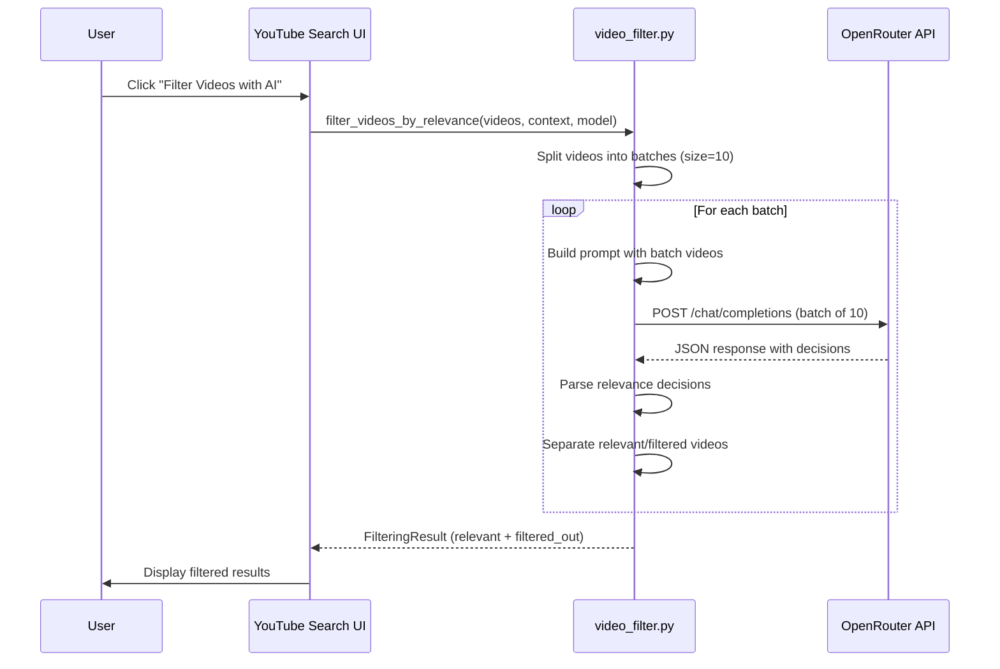

# Build Plan 4: AI Filter Process Documentation & Redo Logic

**Status:** Pending  
**Estimated Complexity:** Medium-High  
**Dependencies:** None (but integrates with Build Plan 3)  
**Related Feedback Items:** #6, #9

## Objective

1. Document the AI filter process flow with UML diagrams
2. Implement redo/retry logic for AI filtering (filter original unfiltered list, not already-filtered list)

## Current Issues

1. **Unclear process:** User doesn't know how AI filtering works (per video vs. bulk)
2. **No redo logic:** After filtering, user can't easily redo with different prompt
3. **Unclear behavior:** Does redo filter the filtered list or original list? (Should be original)

## Implementation Tasks

### Task 4.1: Create UML Documentation
- [ ] Create UML sequence diagram showing AI filter process
- [ ] Document:
  - How videos are batched (batch_size = 10)
  - How API calls are made (one call per batch, not per video)
  - Cost implications
  - Quality/reliability considerations
- [ ] Include explanation of efficiency optimizations
- [ ] File location: `tasks/20260124_083300_youtube_search_improvements/ai_filter_process_uml.md`

### Task 4.2: Implement Redo/Retry Logic
- [ ] After AI filtering completes, allow user to:
  - Update the filter prompt
  - Click "Filter Videos with AI" again
- [ ] **Critical:** Always filter from `st.session_state.search_results.items` (original unfiltered list)
- [ ] Never filter from `st.session_state.filtered_results.relevant_videos` (already filtered)
- [ ] Clear previous filtered results when starting new filter
- [ ] Show clear UI: "Filtering will use the original search results, not the current filtered list"

### Task 4.3: Add Redo UI Elements
- [ ] After filtering, show option to "Update filter prompt and redo"
- [ ] Or: Allow editing research context in Step 2, then re-filter
- [ ] Clear visual indication that redo uses original results
- [ ] Consider: "Reset filter" button to clear filtered results

### Task 4.4: Preserve Original Results
- [ ] Ensure `st.session_state.search_results` is never modified by filtering
- [ ] Filtering creates new `st.session_state.filtered_results` object
- [ ] Original results remain available for re-filtering

## Code Locations

**File:** `pages/01_YouTube_Search.py`

- **AI filter button:** Lines ~1101-1132
- **Filtered results display:** Lines ~1020-1042
- **Filter function call:** Lines ~1107-1113

**File:** `src/bulk_transcribe/video_filter.py`

- **Main filter function:** `filter_videos_by_relevance()` (Lines ~24-105)
- **Batch processing:** `_filter_video_batch()` (Lines ~108-152)
- **API call:** `_call_openrouter_api()` (Lines ~249-293)

## Implementation Details

### Redo Logic
```python
# When "Filter Videos with AI" is clicked
if st.button("Filter Videos with AI", ...):
    # ALWAYS use original search results, never filtered results
    source_videos = st.session_state.search_results.items
    
    # Clear previous filtered results (optional, or keep for comparison)
    # st.session_state.filtered_results = None  # Uncomment to clear on redo
    
    filter_result = filter_videos_by_relevance(
        videos=source_videos,  # Always original list
        search_query=st.session_state.search_query,
        research_context=st.session_state.research_context.strip(),
        model=st.session_state.selected_model,
        api_key=OPENROUTER_API_KEY,
    )
    st.session_state.filtered_results = filter_result
```

### UML Diagram Structure


## Testing Checklist

- [ ] UML diagram created and explains the process clearly
- [ ] Documentation explains batching, API calls, costs
- [ ] Redo filtering always uses original search results
- [ ] User can update prompt and re-filter
- [ ] Previous filtered results are cleared or preserved (based on design)
- [ ] No filtering of already-filtered lists
- [ ] UI clearly indicates redo behavior

## Success Criteria

- Clear documentation of AI filter process
- Users understand efficiency (batching, not per-video)
- Redo functionality works correctly (always uses original list)
- No confusion about what list is being filtered

## Documentation Requirements

### UML Document Should Include:

1. **Process Flow Diagram**
   - Sequence diagram showing API calls
   - Batch processing visualization
   - Error handling flow

2. **Efficiency Analysis**
   - Cost: ~1 API call per 10 videos (not 1 per video)
   - Quality: Batch evaluation allows context comparison
   - Reliability: Error handling per batch
   - Optimization: Batch size tuning (currently 10)

3. **Technical Details**
   - Batch size: 10 videos per API call
   - API endpoint: OpenRouter `/chat/completions`
   - Model requirements: Must support structured output
   - Token limits: ~1000 max_tokens per call

4. **User-Facing Explanation**
   - How it works in simple terms
   - Why it's efficient (batching)
   - What affects cost (number of videos, not queries)

## Notes

- Current batch size (10) is a good balance, but could be configurable
- Error handling: If one batch fails, others can still succeed
- Consider showing progress: "Filtering batch 1/5..." for large result sets
- Redo should be intuitive: "I want to filter again with different criteria"
