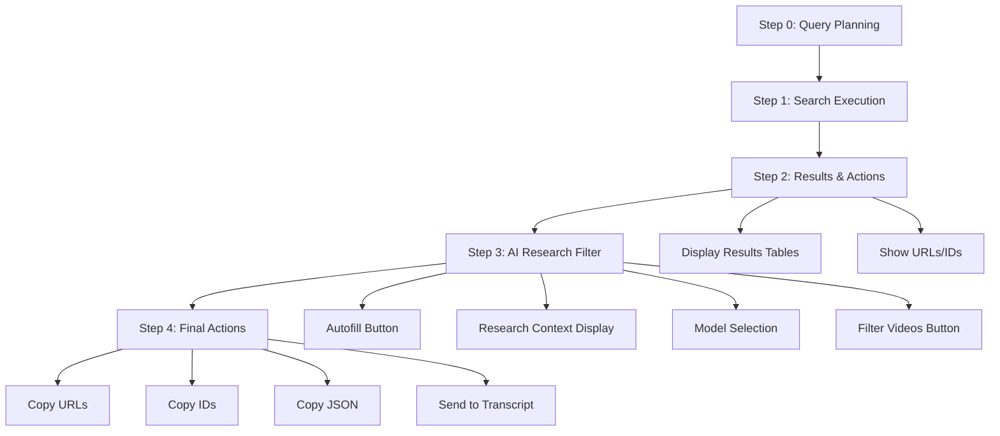

# Build Plan 4: Step 2/3 Workflow Restructure & Autofill Fix

**Status:** Ready for Implementation  
**Estimated Complexity:** High  
**Dependencies:** Build Plan 1 (for required_terms field)  
**Related Feedback Items:** #3, #5, Autofill not working  
**Replaces:** Build Plan 3 (Step 2 Simplification & Auto-fill)

## Objective

Restructure the workflow to fix autofill issues and improve UX by:
1. Moving Research Context Filter to AFTER Results & Actions (where tables/URLs are shown)
2. Replacing "Enable AI Filtering" checkbox with a button-triggered Autofill action
3. Creating a new final step for Copy and "Send transcript" buttons
4. Fixing autofill functionality with a cleaner approach

## Current Issues

1. **Autofill not working:** Multiple attempts to fix autofill have failed due to Streamlit widget state preservation
2. **Poor workflow timing:** Research context is asked before users see results
3. **Redundant UI:** "Enable AI Filtering" checkbox is redundant when autofill button exists
4. **Scattered actions:** Copy and Send buttons are mixed with filtering logic

## New Workflow Structure



## Implementation Tasks

### Task 4.1: Remove Current Step 2 Section
- [ ] Remove Step 2 section (lines ~942-1054 in `01_YouTube_Search.py`)
- [ ] Keep session state initialization for `research_context`, `ai_filtering_enabled`, `selected_model`
- [ ] Remove the expander and all Step 2 UI elements
- [ ] Remove placeholder messages for when no videos are loaded

### Task 4.2: Restructure Step 3 (Current Results Section)
- [ ] Rename current "Step 3: Results & Actions" to "Step 2: Results & Actions"
- [ ] Keep all results table display logic
- [ ] Remove "Filter Videos with AI" button from this section (move to new Step 3)
- [ ] Remove Copy/Send buttons from this section (move to new Step 4)
- [ ] Keep pagination controls
- [ ] Keep selection checkboxes and Select All/Clear All buttons

### Task 4.3: Create New Step 3 (AI Research Filter)
- [ ] Add new section header: "Step 3: AI Research Filter (Optional)"
- [ ] Create autofill button: "Autofill Research Context from Step 0"
- [ ] Button should:
  - Combine `query_planner_prompt`, `query_planner_notes`, and `required_terms`
  - Set `research_context` session state
  - Display the combined text in a read-only or editable text area
  - Show success message when autofill completes
- [ ] Display research context in a text area (editable after autofill)
- [ ] Add model selection (presets + custom option)
- [ ] Add "Filter Videos with AI" button (only enabled when research_context has content)
- [ ] Show filtered results status after filtering

### Task 4.4: Create New Step 4 (Final Actions)
- [ ] Add new section header: "Step 4: Final Actions"
- [ ] Move Copy URLs button here
- [ ] Move Copy IDs button here
- [ ] Move Copy JSON button here
- [ ] Move "Send to Transcript Tool" button here
- [ ] Organize buttons in a clean grid layout
- [ ] Add clear labels indicating what will be copied/sent (All/Selected/Shortlisted)

### Task 4.5: Implement Autofill Button Logic
- [ ] Create autofill function that combines Step 0 data:
  ```python
  def _autofill_research_context():
      parts = []
      if st.session_state.query_planner_prompt.strip():
          parts.append(st.session_state.query_planner_prompt.strip())
      if st.session_state.query_planner_notes.strip():
          parts.append(f"Additional guidance: {st.session_state.query_planner_notes.strip()}")
      if st.session_state.required_terms.strip():
          parts.append(f"Required terms in title/description: {st.session_state.required_terms.strip()}")
      if parts:
          return "\n\n".join(parts)
      return None
  ```
- [ ] Button click handler:
  - Call autofill function
  - Set `st.session_state.research_context`
  - Show success message
  - Trigger `st.rerun()` to update UI
- [ ] Display autofilled content in text area (allow editing)
- [ ] Show indicator if content was autofilled

### Task 4.6: Update Session State Management
- [ ] Ensure `research_context` is initialized (already done at line 389)
- [ ] Ensure `ai_filtering_enabled` is initialized (already done at line 391)
- [ ] Ensure `selected_model` is initialized (already done at line 393)
- [ ] Clear `filtered_results` when new search is executed (already done at lines 803, 927)
- [ ] Clear `research_context` when starting new search (optional - preserve user edits)

### Task 4.7: Update Conditional Rendering
- [ ] Step 2 (Results) shows when `search_results is not None`
- [ ] Step 3 (AI Filter) shows when `search_results is not None`
- [ ] Step 4 (Final Actions) shows when `search_results is not None`
- [ ] Remove old Step 2 conditional checks

## Code Locations

**File:** `pages/01_YouTube_Search.py`

### Current Structure
- **Step 2 (to be removed):** Lines ~942-1054
- **Step 3 (to be restructured):** Lines ~1057-1368
- **Copy/Send buttons:** Lines ~1222-1325

### New Structure
- **Step 2 (Results):** Lines ~1057-1220 (keep table display, remove filter/copy buttons)
- **Step 3 (AI Filter):** New section after Step 2
- **Step 4 (Final Actions):** New section after Step 3

## Implementation Details

### Autofill Button Implementation
```python
# In new Step 3 section
st.header("Step 3: AI Research Filter (Optional)")

col1, col2 = st.columns([2, 1])
with col1:
    autofill_button = st.button(
        "Autofill Research Context from Step 0",
        type="secondary",
        use_container_width=True,
        help="Combine research prompt, guidance, and required terms from Step 0"
    )
with col2:
    if st.session_state.research_context.strip():
        st.success("✓ Research context ready")
    else:
        st.info("Click autofill or enter manually")

if autofill_button:
    autofilled = _autofill_research_context()
    if autofilled:
        st.session_state.research_context = autofilled
        st.success("Research context autofilled from Step 0 data")
        st.rerun()
    else:
        st.warning("No Step 0 data available to autofill")

# Display research context (editable)
research_context = st.text_area(
    "Research Context/Goal:",
    value=st.session_state.research_context,
    height=100,
    placeholder="Describe your research goal or context...",
    help="This context helps the AI understand what you're researching"
)
st.session_state.research_context = research_context

# Model selection
with st.expander("AI Model Settings", expanded=False):
    # Model selection UI (same as current)
    ...

# Filter button
if st.button("Filter Videos with AI", type="primary", use_container_width=True, 
             disabled=not st.session_state.research_context.strip()):
    # Filter logic (same as current)
    ...
```

### Step 4 Final Actions
```python
st.header("Step 4: Final Actions")

# Determine action source
if st.session_state.filtered_results and st.session_state.filtered_results.success:
    action_videos = st.session_state.filtered_results.relevant_videos
    action_label = "Shortlisted"
elif st.session_state.selected_video_ids:
    action_videos = [item for item in search_results.items 
                     if item.video_id in st.session_state.selected_video_ids]
    action_label = "Selected"
else:
    action_videos = search_results.items
    action_label = "All"

st.info(f"Actions will apply to {len(action_videos)} {action_label.lower()} video(s)")

col1, col2, col3, col4 = st.columns(4)
with col1:
    # Copy URLs button
with col2:
    # Copy IDs button
with col3:
    # Copy JSON button
with col4:
    # Send to Transcript button
```

## Testing Checklist

- [ ] Step 2 (Results) displays correctly after search
- [ ] Step 3 (AI Filter) appears after Step 2
- [ ] Autofill button combines Step 0 data correctly
- [ ] Autofilled content appears in text area immediately
- [ ] User can edit autofilled content
- [ ] Model selection works correctly
- [ ] "Filter Videos with AI" button only enabled when research_context has content
- [ ] Filtering works and shows results
- [ ] Step 4 (Final Actions) appears after Step 3
- [ ] Copy buttons work correctly (URLs, IDs, JSON)
- [ ] Send to Transcript button works correctly
- [ ] Action labels show correct source (All/Selected/Shortlisted)
- [ ] No console errors
- [ ] Session state persists correctly
- [ ] Workflow feels natural and logical

## Success Criteria

- [ ] Research context autofill works reliably (button-triggered approach)
- [ ] Workflow order makes sense: See results → Configure filter → Take actions
- [ ] No redundant UI elements (checkbox removed)
- [ ] Clear separation of concerns: Results → Filter → Actions
- [ ] All existing functionality preserved
- [ ] Better UX with logical step progression

## Migration Notes

### Session State Variables (No Changes Needed)
- `research_context` - Still used, initialized at line 389
- `ai_filtering_enabled` - Can be removed (redundant with button)
- `selected_model` - Still used for model selection
- `filtered_results` - Still used for filtered results

### Breaking Changes
- **None** - All functionality preserved, just reorganized
- UI structure changes but data flow remains the same

### Backward Compatibility
- Session state keys remain the same
- No API changes
- Existing saved states will work

## Risk Assessment

| Component | Risk Level | Impact | Mitigation |
|-----------|-----------|--------|------------|
| Autofill button logic | 🟢 Low | Simple string concatenation | Test with various Step 0 inputs |
| Workflow restructuring | 🟡 Medium | UI reorganization | Test each step independently |
| Session state management | 🟢 Low | Already initialized | Verify state persistence |
| Button placement | 🟢 Low | UI layout only | Test user flow |
| Filter logic | 🟢 Low | No changes to filter function | Existing tests should pass |

## Notes

- **Why button-triggered autofill?** Avoids Streamlit widget state preservation issues. User explicitly triggers autofill, so we control when it happens.
- **Why remove checkbox?** "Enable AI Filtering" is redundant - if user clicks "Filter Videos with AI", filtering is enabled. The button itself is the toggle.
- **Why separate Step 4?** Clear separation: View results → Filter → Take actions. Makes workflow more intuitive.
- **Autofill timing:** User sees results first, then decides if they want to filter. Better UX than asking before seeing results.

## Related Build Plans

- **Build Plan 1:** Provides `required_terms` field used in autofill
- **Build Plan 2:** Step 1 execution mode logic (no changes needed)
- **Build Plan 3:** **REPLACED BY THIS PLAN** - This plan addresses all Step 2/3 issues
- **Build Plan 4 (old):** AI Filter Documentation (may need updates after this)
- **Build Plan 5:** Model Configuration (no changes needed)
- **Build Plan 6:** Copy Button Functionality (buttons moved to Step 4, may need updates)
