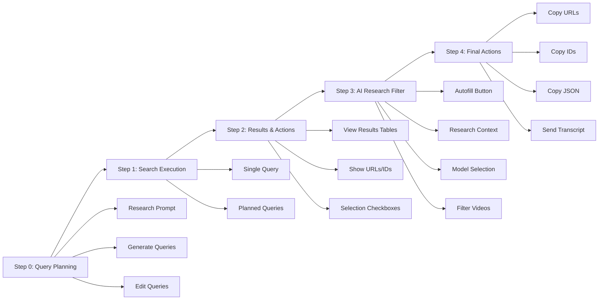

# Agent Instructions: YouTube Search Improvements Build Plans

**Purpose:** This document provides essential context and guidelines for AI agents working on build plans in this task workspace. Include this file in the context when working on any individual build plan.

**Last Updated:** 2026-01-26  
**Task Workspace:** `tasks/20260124_083300_youtube_search_improvements/`  
**Source Feedback:** `raw notes/bulk_feedback_20260126_173727.md`

---

## Core Operating Framework

### Primary Rules Source
- **Repository Core Rules:** `.cursor\rules\00-core.mdc` (authoritative)
- **Repository Agent Rules:** `AGENT.md` (repo-root)
- **Project Documentation:** `CLAUDE.md` (repo-root)

### Task-Centric Work Principles
- **ALL meaningful work** belongs to task workspaces under `tasks\`
- **NO ad-hoc work** in repo root
- **Specs are source of truth:** `docs\specs\` defines expected behavior
- **Never use emojis in code** (only in UI text/messages)
- **Python development guardrails:** Syntax validation, indentation checks, import standards

### Build Plan Execution Rules

1. **Work within ONE build plan at a time** - Complete and test before moving to next
2. **Follow the build plan file** - Each plan has specific tasks, code locations, and success criteria
3. **Test after implementation** - Use the testing checklist in each build plan
4. **Update specs if behavior changes** - Document changes in `specs_impact_assessment.md`
5. **No breaking changes** - All changes must be backward compatible

---

## Project Architecture Context

### Entry Point
- **YouTube Search Page:** `pages/01_YouTube_Search.py` (1308 lines)
  - This is the PRIMARY file you will modify
  - Streamlit-based UI with multi-step workflow

### Core Modules Used

#### Query Planning
- **`src/bulk_transcribe/query_planner.py`**
  - `plan_search_queries()` - Generates distinct search queries via OpenRouter
  - Returns `QueryPlanResult` with list of queries

#### Video Filtering
- **`src/bulk_transcribe/video_filter.py`**
  - `filter_videos_by_relevance()` - Main filtering function
  - Processes videos in batches (default: 10 per API call)
  - Returns `FilteringResult` with relevant/filtered videos
  - Uses OpenRouter API for LLM-based relevance evaluation

#### YouTube Search
- **`src/bulk_transcribe/youtube_search.py`**
  - `search_youtube()` - Executes YouTube Data API v3 searches
  - Returns `SearchResult` with `VideoSearchItem` objects
  - Handles pagination via `page_token`

#### Metadata Transfer
- **`src/bulk_transcribe/metadata_transfer.py`**
  - `video_search_item_to_dict()` - Converts to dict for transcript tool
  - `validate_metadata_list()` - Validates metadata before transfer

### Data Structures

#### VideoSearchItem
```python
class VideoSearchItem:
    video_id: str
    title: str
    channel_title: str
    published_at: str
    video_url: str
    description: str
    query_sources: List[str]  # Which queries found this video
```

#### SearchResult
```python
class SearchResult:
    items: List[VideoSearchItem]
    total_results: int
    results_per_page: int
    next_page_token: Optional[str]
    prev_page_token: Optional[str]
```

#### FilteringResult
```python
class FilteringResult:
    relevant_videos: List[VideoSearchItem]
    filtered_out_videos: List[VideoSearchItem]
    total_processed: int
    success: bool
    error_message: Optional[str]
```

---

## Session State Management

### Critical Session State Variables

**Query Planning (Step 0):**
- `st.session_state.query_planner_prompt` - Research prompt text
- `st.session_state.query_planner_notes` - Optional guidance
- `st.session_state.required_terms` - **NEW** (from Build Plan 1) - Required terms in title/description
- `st.session_state.planned_queries` - List of query strings
- `st.session_state.planned_queries_text` - Text area content (one per line)
- `st.session_state.planned_queries_to_run` - Number of queries to execute
- `st.session_state.query_planner_model` - Model for query generation
- `st.session_state.query_plan_max_queries` - Max queries to generate

**Search Execution (Step 1):**
- `st.session_state.input_mode` - "search" or "direct"
- `st.session_state.search_execution_mode` - "single" or "planned"
- `st.session_state.search_query` - Single query text
- `st.session_state.max_results_per_page` - Results per API request (1-50)
- `st.session_state.max_pages_per_query` - Pagination limit (1-10)
- `st.session_state.search_results` - `SearchResult` object (or None)
- `st.session_state.search_filters` - Filter dictionary

**AI Research Filter (Step 3):**
- `st.session_state.research_context` - Research goal/context text
- `st.session_state.ai_filtering_enabled` - Boolean toggle (may be removed in Build Plan 4)
- `st.session_state.selected_model` - OpenRouter model identifier
- `st.session_state.filtered_results` - `FilteringResult` object (or None)

**Results & Actions (Step 2):**
- `st.session_state.selected_video_ids` - Set of selected video IDs
- `st.session_state.selection_update_counter` - Counter for UI updates
- `st.session_state.planned_query_runs` - List of run data for planned queries

### Session State Best Practices

1. **Always initialize** - Check if key exists before accessing
2. **Clear on new search** - Reset `filtered_results` and `selected_video_ids` when new search starts
3. **Preserve user edits** - Don't overwrite user-modified values on rerun
4. **Use defaults** - Initialize with sensible defaults from constants

---

## YouTube Search Workflow

### Current 5-Step Workflow (Updated 2026-01-26)



### Step 0: Query Planning (Optional)
- **Location:** Lines ~456-576 in `01_YouTube_Search.py`
- **Purpose:** Generate diverse search queries from research prompt
- **Key UI Elements:**
  - Research prompt text area
  - Optional guidance text area
  - Query planning settings (model, max queries)
  - Generate queries button
  - Planned queries text area (editable)
  - Queries to run number input
  - Clear planned queries button (to be removed in Build Plan 1)

### Step 1: Search Execution
- **Location:** Lines ~578-891 in `01_YouTube_Search.py`
- **Purpose:** Execute single query or planned queries
- **Key UI Elements:**
  - Input mode selection (Search YouTube / Direct Input)
  - Search configuration (results per page, max pages)
  - Search execution mode radio (Single query / Planned queries)
  - Search query input (for single mode)
  - Search YouTube button (for single mode)
  - Run planned queries button (for planned mode)

### Step 2: Results & Actions (UPDATED STRUCTURE)
- **Location:** Lines ~1057-1220 in `01_YouTube_Search.py` (after Build Plan 4)
- **Purpose:** Display search results in tables
- **Key UI Elements:**
  - Results tables (with tabs for planned queries)
  - Selection checkboxes (Select All/Clear All)
  - Pagination controls
- **Note:** Filter and Copy buttons moved to later steps (Build Plan 4)

### Step 3: AI Research Filter (NEW STRUCTURE - MOVED FROM OLD STEP 2)
- **Location:** New section after Step 2 (Build Plan 4)
- **Purpose:** Configure and execute AI filtering
- **Key UI Elements:**
  - "Autofill Research Context from Step 0" button (button-triggered, fixes autofill)
  - Research context text area (editable after autofill)
  - Model selection (presets or custom)
  - "Filter Videos with AI" button (enabled when research_context has content)
- **Note:** Replaces old Step 2, moved after results are shown (Build Plan 4)

### Step 4: Final Actions (NEW STEP)
- **Location:** New section after Step 3 (Build Plan 4)
- **Purpose:** Copy data and send to transcript tool
- **Key UI Elements:**
  - Copy URLs button
  - Copy IDs button
  - Copy JSON button
  - Send to Transcript Tool button
- **Note:** Buttons moved from old Step 3, organized in dedicated step (Build Plan 4)

---

## Code Quality Standards

### Import Organization
Follow `docs/standards/import_standards.md`:
```python
# 1. Standard library
import os
from datetime import datetime

# 2. Third-party
import streamlit as st
import pandas as pd

# 3. Local imports
from src.bulk_transcribe.youtube_search import search_youtube
from src.bulk_transcribe.video_filter import filter_videos_by_relevance
```

### Syntax Validation (MANDATORY)
After ANY code changes:
```powershell
# Test compilation
python -m py_compile pages/01_YouTube_Search.py

# Test AST parsing
python -c "import ast; ast.parse(open('pages/01_YouTube_Search.py').read())"
```

### Indentation Discipline
- Always use 4 spaces (never tabs)
- Verify indentation after control flow changes
- Test compilation after structural changes

### Error Handling
- Wrap API calls in try/except blocks
- Show user-friendly error messages via `st.error()`
- Log actual error types, not generic messages
- Handle missing session state gracefully

---

## Testing Requirements

### Before Marking Build Plan Complete

1. **Syntax Validation**
   - [ ] Run `python -m py_compile` on modified files
   - [ ] No syntax errors

2. **Import Testing**
   - [ ] All imports resolve correctly
   - [ ] No circular dependencies

3. **Functional Testing**
   - [ ] Follow testing checklist in build plan file
   - [ ] Test both "single query" and "planned queries" modes
   - [ ] Test with and without AI filtering
   - [ ] Verify session state persistence

4. **Regression Testing**
   - [ ] Existing functionality still works
   - [ ] No console errors
   - [ ] UI renders correctly

5. **User Experience**
   - [ ] Changes match build plan objectives
   - [ ] UI/UX improvements are visible and helpful
   - [ ] Error messages are clear

### Running the Application

```powershell
# Quick start
.\run_app.ps1

# Or manually
.\.venv\Scripts\Activate.ps1
streamlit run app.py
```

---

## Environment Variables

Required API keys (in `.env` file):
- `YOUTUBE_DATA_API_KEY` - YouTube Data API v3 key
- `OPENROUTER_API_KEY` - OpenRouter API key for LLM calls
- `OPENROUTER_DEFAULT_MODEL` - Default model (optional, defaults to "openai/gpt-4o-mini")

---

## Build Plan Execution Guidelines

### When Starting a Build Plan

1. **Read the build plan file completely**
   - Understand objectives and current issues
   - Review implementation tasks
   - Note code locations and line numbers

2. **Read this instruction file** (you're doing it now!)

3. **Review related code sections**
   - Read the relevant sections of `01_YouTube_Search.py`
   - Understand current implementation
   - Identify dependencies

4. **Plan your changes**
   - Break down into small, testable steps
   - Consider edge cases
   - Think about backward compatibility

### During Implementation

1. **Make incremental changes**
   - Test after each significant change
   - Don't change multiple unrelated things at once

2. **Preserve existing functionality**
   - Don't break what already works
   - Add new features without removing old ones (unless explicitly required)

3. **Follow code style**
   - Match existing code style
   - Use existing patterns and conventions
   - Maintain consistency

4. **Update session state carefully**
   - Initialize new keys properly
   - Don't break existing state management
   - Clear state when appropriate (e.g., new search)

### After Implementation

1. **Run syntax checks** (mandatory)
2. **Test functionality** (use build plan checklist)
3. **Update documentation** if behavior changes
4. **Report completion** with:
   - Files modified
   - Changes made
   - Testing results
   - Any issues encountered

---

## Common Patterns & Code Snippets

### Conditional UI Rendering
```python
if st.session_state.search_execution_mode == "planned":
    # Show planned query UI
    planned_search_button = st.button("Run planned queries", ...)
else:
    # Show single query UI
    search_query = st.text_input("Search Query:", ...)
    search_button = st.button("Search YouTube", ...)
```

### Session State Initialization
```python
if 'new_key' not in st.session_state:
    st.session_state.new_key = default_value
```

### Error Handling Pattern
```python
try:
    result = some_function()
    if result.success:
        st.success("Operation completed")
        st.session_state.data = result.data
        st.rerun()
    else:
        st.error(f"Operation failed: {result.error_message}")
except Exception as e:
    st.error(f"Error: {str(e)}")
    # Log for debugging
```

### Button Click Handler
```python
if st.button("Action", key="unique_key"):
    # Clear previous state if needed
    st.session_state.filtered_results = None
    
    # Perform action
    with st.spinner("Processing..."):
        result = perform_action()
    
    # Update state
    st.session_state.result = result
    st.rerun()
```

---

## Troubleshooting

### Common Issues

1. **Session state not persisting**
   - Check if key is initialized before first use
   - Verify `st.rerun()` is called after state changes

2. **UI not updating**
   - Ensure `st.rerun()` is called after state changes
   - Check if conditional rendering logic is correct

3. **Import errors**
   - Verify import paths match file structure
   - Check if module exists in `src/bulk_transcribe/`

4. **API errors**
   - Verify API keys are set in `.env`
   - Check API key format and validity
   - Handle rate limiting gracefully

---

## File Locations Reference

### Primary Files
- **Main page:** `pages/01_YouTube_Search.py` (1308 lines)
- **Query planner:** `src/bulk_transcribe/query_planner.py`
- **Video filter:** `src/bulk_transcribe/video_filter.py`
- **YouTube search:** `src/bulk_transcribe/youtube_search.py`
- **Metadata transfer:** `src/bulk_transcribe/metadata_transfer.py`

### Documentation
- **Specs:** `docs/specs/youtube_search_workflow.md`
- **Standards:** `docs/standards/import_standards.md`
- **Task workspace:** `tasks/20260124_083300_youtube_search_improvements/`

### Build Plans
- **Master plan:** `build plans/MASTER_BUILD_PLAN.md`
- **Individual plans:** `build plans/01_*.md` through `07_*.md`
- **Current Priority:** Build Plan 4 (Step 2/3 Restructure) - fixes autofill and workflow
- **Obsolete:** Build Plan 3 (replaced by Build Plan 4)

---

## Success Criteria Summary

After completing ALL build plans:
- [ ] All UI/UX issues from feedback addressed
- [ ] No regressions in existing functionality
- [ ] Improved user experience throughout workflow
- [ ] Clear documentation of AI filter process
- [ ] All code passes syntax validation
- [ ] All functionality tested and working

---

## Important Reminders

1. **Never work outside build plan scope** - Stick to the tasks in your assigned build plan
2. **Test incrementally** - Don't wait until the end to test
3. **Preserve backward compatibility** - Don't break existing features
4. **Update specs if behavior changes** - Document in `specs_impact_assessment.md`
5. **Follow repository standards** - Import organization, code quality, etc.
6. **No emojis in code** - Only in UI text/messages

---

**End of Agent Instructions**

When working on a build plan, reference this file for context, but follow the specific tasks and requirements in the individual build plan file.
