# Master Build Plan: YouTube Search UI/UX Improvements

**Date Created:** 2026-01-26  
**Source Feedback:** `raw notes/bulk_feedback_20260126_173727.md`  
**Objective:** Improve user experience and fix issues in the YouTube Search workflow based on user feedback

## Overview

This master plan organizes 6 independent build plans that address UI/UX issues, workflow logic, and functionality improvements in the YouTube Search tool. Each build plan is designed to be executed and tested independently to avoid complex debugging loops.

## Build Plan Structure

```mermaid
graph TD
    A[Master Build Plan] --> B[Build Plan 1: Step 0 UI/UX]
    A --> C[Build Plan 2: Step 1 Execution Mode]
    A --> D[Build Plan 3: Step 2 Simplification]
    A --> E[Build Plan 4: AI Filter Documentation & Logic]
    A --> F[Build Plan 5: Model Configuration]
    A --> G[Build Plan 6: Copy Button Functionality]
    
    B --> B1[Add user tip]
    B --> B2[Remove Clear button]
    B --> B3[Add required terms field]
    B --> B4[Reorganize queries section]
    
    C --> C1[Auto-select planned mode]
    C --> C2[Hide irrelevant options]
    
    D --> D1[Autofill filter prompt]
    D --> D2[Consider Step 2 removal]
    
    E --> E1[Create UML doc]
    E --> E2[Implement redo logic]
    
    F --> F1[Fix custom model syntax]
    F --> F2[Update model presets]
    
    G --> G1[Immediate copy on click]
    G --> G2[Success feedback]
```

## Build Plan Execution Order

**Recommended execution order** (can be done in parallel if no dependencies):

1. **Build Plan 1: Step 0 UI/UX Improvements** - Foundation UI changes
2. **Build Plan 2: Step 1 Search Execution Mode Logic** - Workflow logic improvements
3. **Build Plan 3: Step 2 Simplification & Auto-fill** - Depends on understanding Step 0 structure
4. **Build Plan 4: AI Filter Process Documentation & Logic** - Independent documentation + logic
5. **Build Plan 5: Model Configuration Fixes** - Independent bug fix
6. **Build Plan 6: Copy Button Functionality** - Independent UX improvement

## Key Principles

1. **Each build plan is independent** - Can be tested and validated on its own
2. **No build plan should break existing functionality** - All changes must be backward compatible
3. **Test after each build plan** - Validate before moving to the next
4. **Document changes** - Update specs if behavior changes

## Current Workflow Understanding

### Step 0: Query Planning (Optional)
- User enters research prompt and optional guidance
- Generates distinct search queries via OpenRouter
- User can review/edit queries in text area
- Shows "queries to run" number input and "Clear planned queries" button

### Step 1: Search Execution
- User chooses input method (Search YouTube / Direct Input)
- For search mode: chooses execution mode (Single query / Planned queries)
- Single query: shows search input field + "Search YouTube" button
- Planned queries: shows info message + "Run planned queries" button

### Step 2: AI Research Configuration
- User can enter research context
- Enable/disable AI filtering
- Select AI model (presets or custom)
- Currently shows even when research prompt already provided in Step 0

### Step 3: Results & Actions
- Display search results in tables
- AI filtering button (if enabled)
- Copy buttons (URLs, IDs, JSON) - currently requires two clicks
- Send to transcript tool

## Success Criteria

- All build plans completed and tested
- No regressions in existing functionality
- Improved user experience based on feedback
- Clear documentation of AI filter process
- All UI/UX issues from feedback addressed

## Related Files

- **Source Feedback:** `raw notes/bulk_feedback_20260126_173727.md`
- **Main Page:** `pages/01_YouTube_Search.py`
- **AI Filter Module:** `src/bulk_transcribe/video_filter.py`
- **Specs:** `docs/specs/youtube_search_workflow.md`

## Agent Instructions

**CRITICAL:** Before working on any build plan, read `AGENT_INSTRUCTIONS.md` in this directory. This file provides:
- Repository conventions and standards
- Project architecture context
- Session state management guidelines
- Code quality requirements
- Testing procedures
- Common patterns and troubleshooting

Include `AGENT_INSTRUCTIONS.md` in the context when working on any individual build plan.
