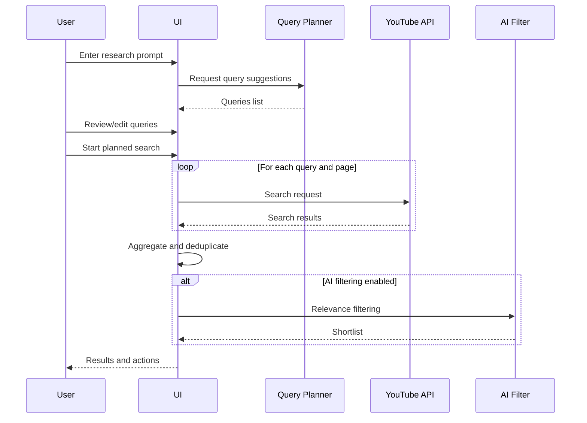

# Design Notes: YouTube Search Workflow

## Overview
This document captures the revised linear workflow for query planning and multi-query YouTube search execution.

## Data Flow Diagram (Mermaid)
```mermaid
flowchart TD
    A[User enters research prompt] --> B[Query planner (OpenRouter)]
    B --> C[Planned queries list]
    C --> D[Search configuration
    results per request
    max pages per query]
    D --> E[Sequential YouTube searches]
    E --> F[Aggregate and deduplicate results]
    F --> G[Optional AI filtering]
    G --> H[Bulk Transcribe (Proxy) input]
```

## Sequence Diagram (Mermaid)


## UX Notes
- Step 0 is a fixed form section, not a sticky chat widget.
- Planned query execution shows progress for each page queried.
- Aggregated results feed the existing AI filtering and bulk transcript handoff.
