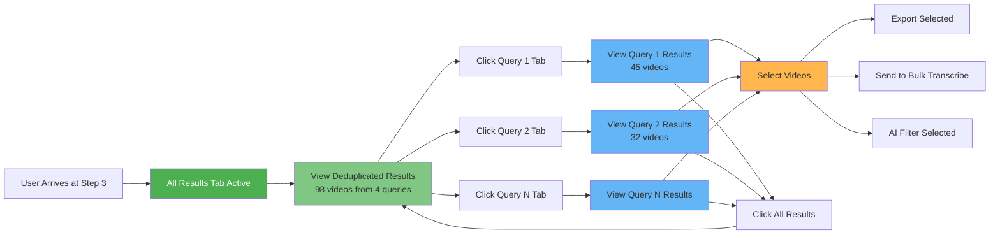
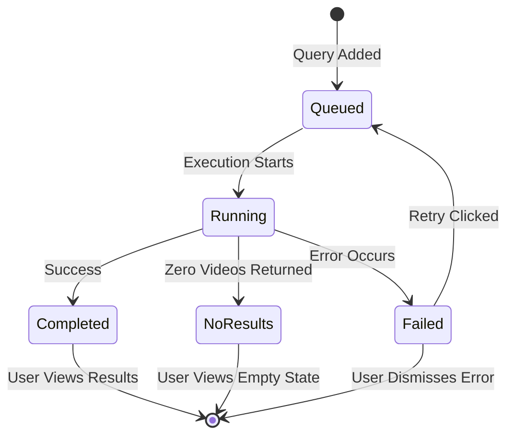
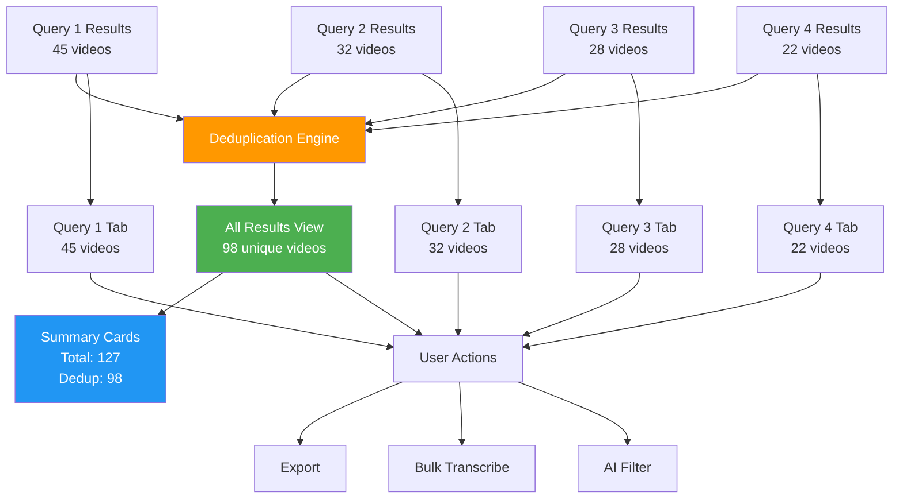
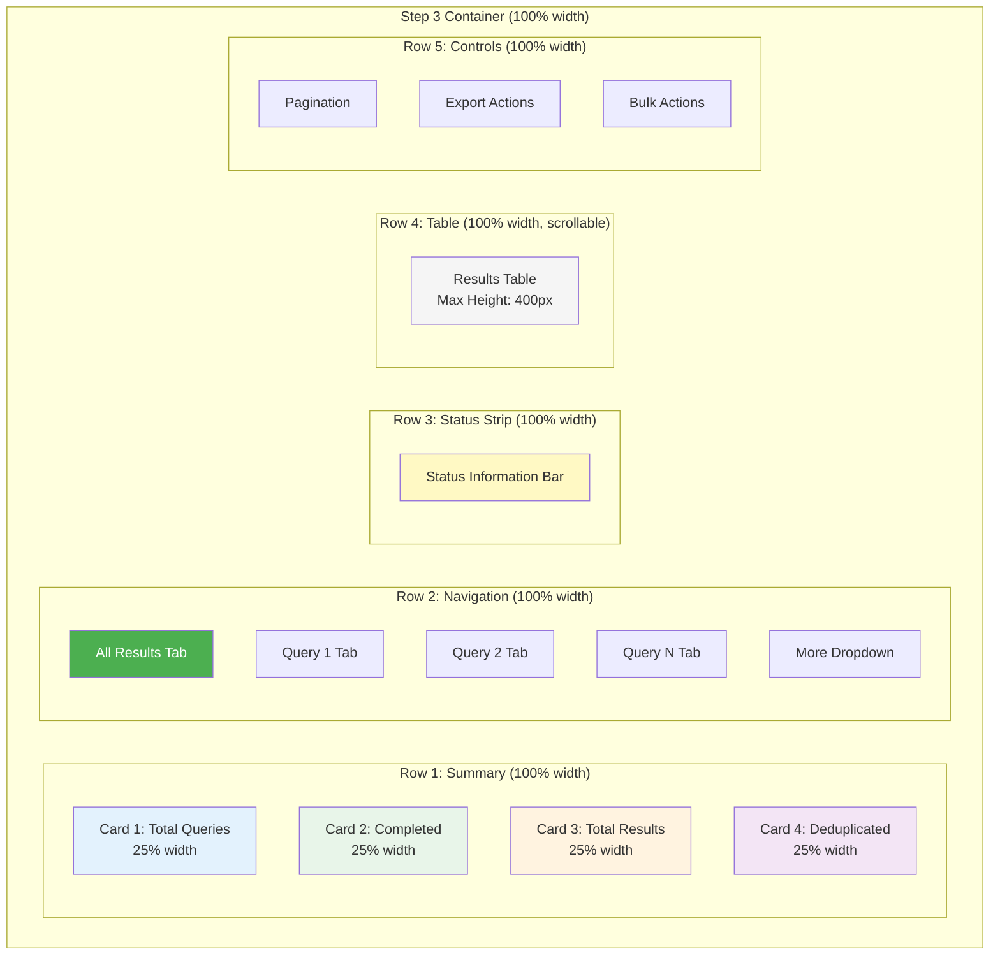
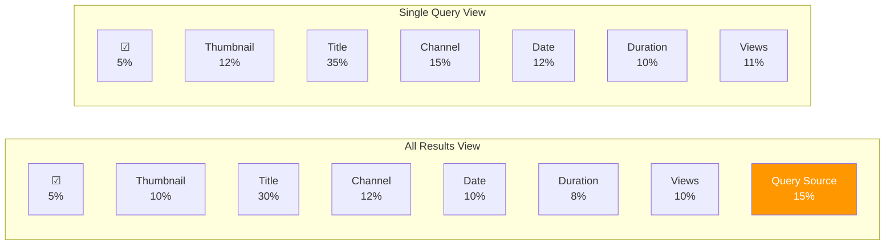
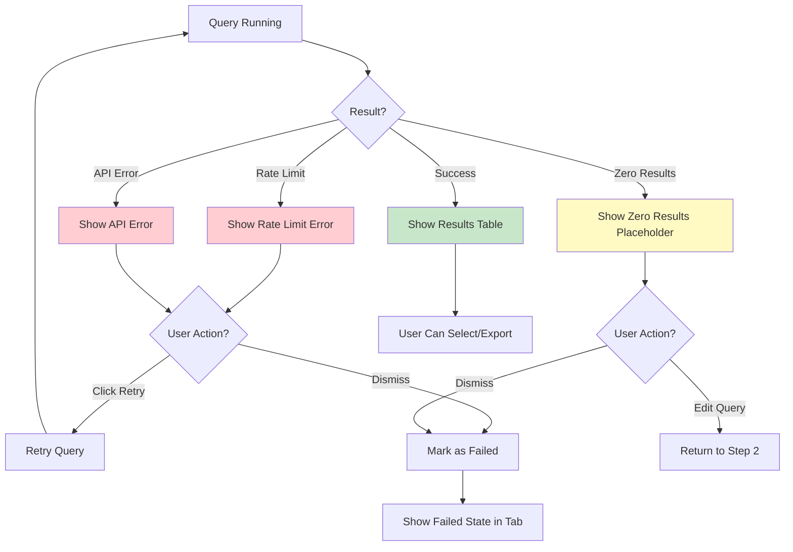

# Mermaid Diagrams: Step 3 Layout Structure

## Component Hierarchy

```mermaid
graph TD
    A[Step 3: Planned Query Results] --> B[Run Summary Section]
    A --> C[Query Navigation Section]
    A --> D[Status Strip Section]
    A --> E[Results Table Section]
    A --> F[Pagination & Controls Section]
    
    B --> B1[Total Queries Card]
    B --> B2[Completed Card]
    B --> B3[Total Results Card]
    B --> B4[Deduplicated Card]
    B --> B5[Status Breakdown]
    B --> B6[Last Updated]
    
    C --> C1[All Results Tab]
    C --> C2[Query 1 Tab]
    C --> C3[Query 2 Tab]
    C --> C4[Query N Tab]
    C --> C5[More Queries Dropdown]
    
    D --> D1[Query Name]
    D --> D2[Status Badge]
    D --> D3[Results Count]
    D --> D4[Pages Count]
    D --> D5[Error/Warning Messages]
    D --> D6[Retry Button]
    
    E --> E1[Selection Controls]
    E --> E2[Table Header]
    E --> E3[Table Rows]
    E --> E4[Scroll Container]
    
    E2 --> E2A[Checkbox Column]
    E2 --> E2B[Thumbnail Column]
    E2 --> E2C[Title Column]
    E2 --> E2D[Channel Column]
    E2 --> E2E[Date Column]
    E2 --> E2F[Duration Column]
    E2 --> E2G[Views Column]
    E2 --> E2H[Query Source Column - All Results Only]
    
    F --> F1[Pagination Controls]
    F --> F2[Export Actions]
    F --> F3[Bulk Actions]
    F --> F4[Cap Warning]
    
    style A fill:#e1f5ff
    style B fill:#fff4e1
    style C fill:#e8f5e9
    style D fill:#f3e5f5
    style E fill:#fff9c4
    style F fill:#e0f2f1
```

## User Flow: Tab Navigation

## State Machine: Query Status Transitions

## Data Flow: Results Aggregation

## Layout Grid Structure

## Table Column Layout Comparison

## Error State Flow

