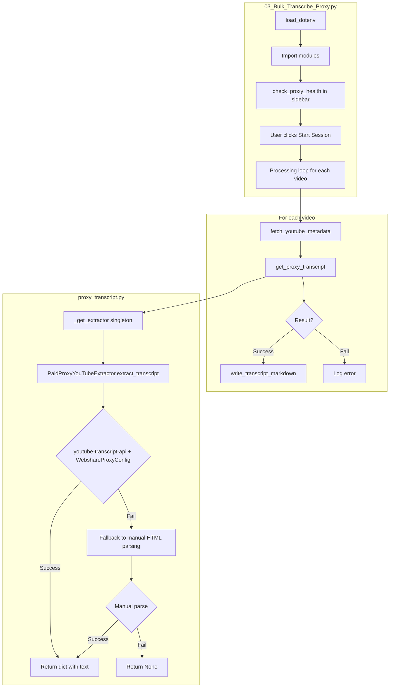
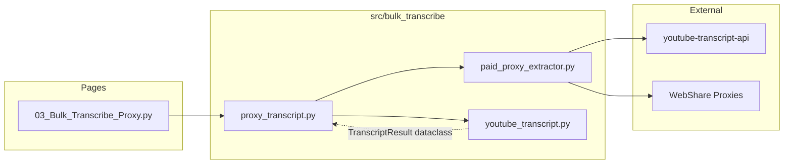

# Troubleshooting: Proxy Transcript Integration (Resolved)

## Current Status

- Proxy-based extraction works in both command line tests and the Streamlit page.
- The earlier Streamlit failure was traced to an outdated `youtube-transcript-api` version in the virtualenv.
- The extractor now prefers `youtube-transcript-api` with Webshare proxy configuration and falls back to manual HTML parsing if needed.

## Investigation Results (Historical)

### Diagnostic Test (2026-01-24 17:36)

All tests PASSED from command line:
- Health check: 100 proxies loaded
- Video RE_NqKDKmqM: 11,522 chars extracted
- Video SYddTshkgZk (from user's failed list): 663 chars extracted

This proves:
1. The extractor code works correctly
2. The proxy configuration is valid
3. The videos DO have captions

### Root Cause (Confirmed)

- `.venv` used `youtube-transcript-api` 0.6.x, which lacks the `proxies.WebshareProxyConfig` integration.
- Streamlit used the virtualenv, so proxy extraction failed at import time and fell back to manual parsing.
- Updating `requirements.txt` to `youtube-transcript-api>=1.0.0` resolved the mismatch.

## Debug Output Added

Added `[PROXY_DEBUG]` and `[EXTRACTOR_DEBUG]` print statements to:
- `src/bulk_transcribe/proxy_transcript.py`
- `src/bulk_transcribe/paid_proxy_extractor.py`

These will print to the Streamlit console (terminal where `streamlit run` is executed).

## Operational Notes

1. Ensure `WEBSHARE_PROXY_FILE` points to a valid WebShare credential file.
2. Run `streamlit run app.py` and open the **Bulk Transcribe (Proxy)** page.
3. Optional: keep `[PROXY_DEBUG]` / `[EXTRACTOR_DEBUG]` logging enabled for diagnostics.

## Data Flow Diagram

## File Relationships

