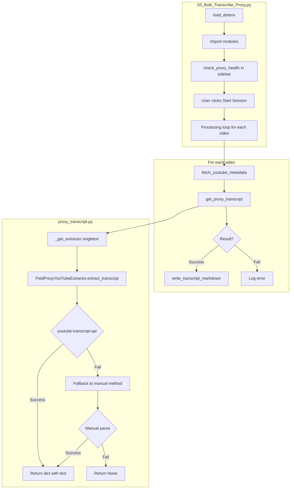
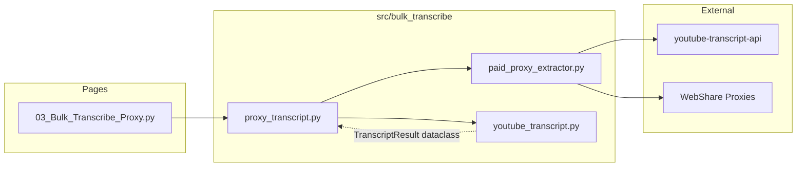

# Troubleshooting: Proxy Transcript Integration Failure

## Problem Statement

- Quick test script: **WORKS** (11,522 chars extracted)
- Streamlit page integration: **FAILS** (0/14 success, "No captions available")
- Same videos, same extractor code, different results

## Investigation Results

### Diagnostic Test (2026-01-24 17:36)

All tests PASSED from command line:
- Health check: 100 proxies loaded
- Video RE_NqKDKmqM: 11,522 chars extracted
- Video SYddTshkgZk (from user's failed list): 663 chars extracted

This proves:
1. The extractor code works correctly
2. The proxy configuration is valid
3. The videos DO have captions

### Root Cause Hypothesis

The Streamlit context has some difference that causes extraction to fail. Possible causes:

1. **Working Directory Issue**
   - Command line: Explicitly `os.chdir(project_root)`
   - Streamlit: May run from different CWD

2. **Environment Variable Timing**
   - The singleton might be created before .env is loaded

3. **Module State Corruption**
   - The singleton extractor might get into a bad state

## Debug Output Added

Added `[PROXY_DEBUG]` and `[EXTRACTOR_DEBUG]` print statements to:
- `src/bulk_transcribe/proxy_transcript.py`
- `src/bulk_transcribe/paid_proxy_extractor.py`

These will print to the Streamlit console (terminal where `streamlit run` is executed).

## Next Steps for User

1. Restart Streamlit (`streamlit run app.py`)
2. Navigate to "Bulk Transcribe Proxy" page
3. Run a test with 1-2 videos
4. Check the terminal output for `[PROXY_DEBUG]` and `[EXTRACTOR_DEBUG]` lines
5. Share the terminal output to identify the failure point

## Data Flow Diagram

## File Relationships

