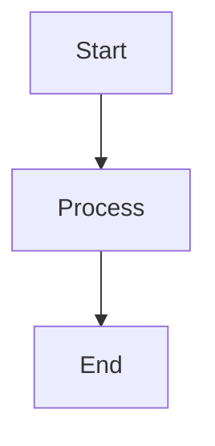
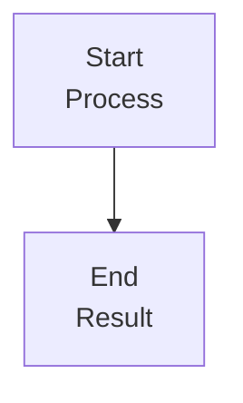
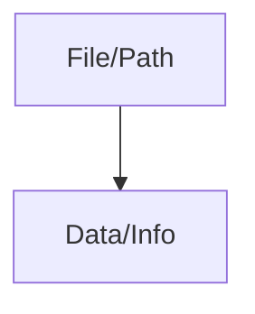
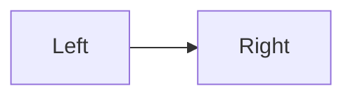
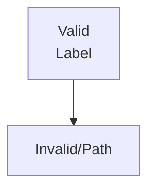

# Example Markdown with Mermaid Errors

This file contains intentional Mermaid syntax errors to demonstrate the validation tool.

## Working Diagram (No Errors)



## Diagram with HTML Tags (Error)



## Diagram with Unquoted Special Characters (Warning)



## Diagram with Wrong Orientation (Warning)



## Diagram with Nested Quotes (Error)

```mermaid
graph TD
    A["Start "with quotes" here"] --> B["End "also with quotes" here"]
```

## Complex Class Syntax (Warning)

```mermaid
classDiagram
    A ||--|| B : relationship
```

## Diamond Shape Syntax Error (Error)

```mermaid
graph TD
    A[Start] --> B{Jinja2 Parser Encounters }
    B --> C[Resolve Include Path]
```

## Mixed Valid/Invalid Content

Regular markdown content here...



End of example file.


